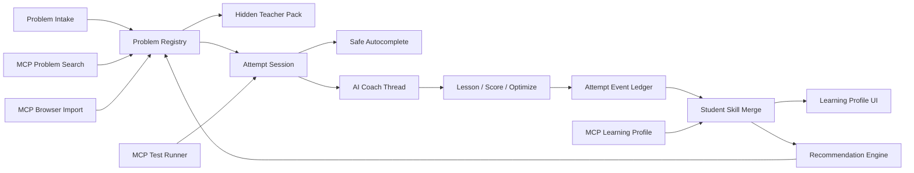

# Student Autocomplete Lab Beta 0.2 Requirements Design

Date: 2026-05-10

Status: design target after the `0.1.0-beta.1` candidate. This document is for project planning, not a public release note.

## 0. Executive Summary

Beta 0.2 should move the project from "a usable VS Code algorithm coach prototype" to "a real beta platform that can be repeatedly tested, compared, and extended." The core product promise stays the same:

- autocomplete is narrow and safe;
- AI coaching is explicit, contextual, and remembers the current problem session;
- Student Skill is local, inspectable, correctable, and rollbackable;
- recommendations are driven by pain points, difficulty, and transfer evidence;
- internal testing can spend millions of tokens, but only behind gated experiments.

The 0.2 design intentionally copies concepts, not code, from mature open-source and public systems:

- Continue: role-based model configuration, autocomplete context discipline, and explicit chat/edit/autocomplete surfaces.
- Tabby: self-hosted/autocomplete-friendly provider lane and low-latency completion assumptions.
- Sourcegraph Cody: context retrieval as a first-class product surface.
- vscode-leetcode and Competitive Companion: problem import, test-case normalization, workspace file generation, and problem tree ergonomics.
- MCP ecosystem: tools/resources/prompts as explicit contracts for problem search, browser import, test running, and learning-profile inspection.
- AI competitive-programming research such as AlphaCode/CodeT: generated tests and sample-based filtering are useful, but the plugin must never pretend generated tests equal official OJ coverage.

0.2 is not a full OJ, not an automatic submitter, and not a hidden answer machine. It should feel like an algorithm coach with receipts.

## 1. Cleanup Baseline

Before writing this design, the current repository was backed up locally:

- backup commit: `3017f3c chore: backup before beta 0.2 cleanup`;
- backup branch: `codex/backup-before-beta-0.2-cleanup-20260510`.

Ignored build/runtime garbage was removed from the workspace:

- `.runtime/`;
- `dist/`;
- `.student-autocomplete-smoke/`;
- `extension/`;
- `practice/`;
- `fixtures/practice/self-evolution/`;
- `test/aaa.py`;
- `test/test.py`.

Kept on purpose:

- `node_modules/`: local dependency cache, cheap but useful;
- `secrets/`: ignored local credentials, must not be deleted by automated cleanup.

## 2. Source Inspiration Map

The goal is "concept borrowing" from open projects and official docs. No source code should be copied without license review.

| Source | What to Borrow Conceptually | What Not to Borrow |
| --- | --- | --- |
| Continue docs and repo | Separate model roles for autocomplete/chat/edit, configurable providers, context providers, small prompt surfaces | Do not become a general vibe-coding IDE |
| Tabby | Fast autocomplete path, self-hosted provider option, completion-specialized route | Do not require users to host a server |
| Sourcegraph Cody | Context picker/retrieval mental model, evidence-backed answer surface | Do not index the whole workspace or send unrelated files |
| vscode-leetcode | Problem tree, generated solution files, status filters, workspace organization | Do not promise stable LeetCode API support in beta |
| Competitive Companion | Standardized parsed problem schema and local sample testcases | Do not rely on browser extension import as the only path |
| MCP official spec | Tools/resources/prompts boundary, user-mediated tool calls, server composability | Do not expose secrets or raw student records to arbitrary MCP tools |
| Playwright MCP | Browser-driven import and UI smoke checks with structured snapshots | Do not make browser automation mandatory for normal use |
| GitHub MCP | Repository issue/release automation as optional project plumbing | Do not require GitHub login for local learning |
| AlphaCode/CodeT-style testing | Generate small counterexamples and rank suspicious fixes | Do not call AI-generated checks "OJ proof" |

Reference links used for orientation:

- [Continue](https://github.com/continuedev/continue)
- [Continue docs](https://docs.continue.dev/)
- [Tabby](https://github.com/TabbyML/tabby)
- [Sourcegraph Cody](https://sourcegraph.com/docs/cody)
- [vscode-leetcode](https://github.com/LeetCode-OpenSource/vscode-leetcode)
- [Competitive Companion](https://github.com/jmerle/competitive-companion)
- [Model Context Protocol](https://modelcontextprotocol.io/)
- [MCP TypeScript SDK](https://github.com/modelcontextprotocol/typescript-sdk)
- [Playwright MCP](https://github.com/microsoft/playwright-mcp)
- [GitHub MCP Server](https://github.com/github/github-mcp-server)
- [AlphaCode paper](https://www.science.org/doi/10.1126/science.abq1158)
- [CodeT paper](https://arxiv.org/abs/2207.10397)

Deep research follow-up: [deep-research-agent-teaching-framework.md](deep-research-agent-teaching-framework.md) refines this source map into a concrete teaching-agent architecture. Its main conclusion is that beta 0.2 should not embed a generic multi-agent runtime. Instead, it should implement a TypeScript-native deterministic `TeachingWorkflow` with role-specific prompts, strict context policies, persistent `AttemptSession` state, Student Skill knowledge tracing, and MCP only as a tool boundary.

Second deep research follow-up: [deep-research-teaching-eval-observability-batch-2.md](deep-research-teaching-eval-observability-batch-2.md) adds the learning-system layer. Its main conclusion is that beta 0.2 should add local teaching traces, scenario replay, spaced retrieval practice, micro-drills, and stricter MCP/context guardrails before expanding more autonomous-agent behavior.

Third deep research follow-up: [deep-research-learning-records-eval-ui-batch-3.md](deep-research-learning-records-eval-ui-batch-3.md) adds the implementation discipline: xAPI/Caliper-inspired local learning events, eval/red-team harnesses, interpretable knowledge tracing, and Playwright screenshot gates for real UI regression testing.

Fourth deep research follow-up: [deep-research-skill-distillation-and-self-improvement.md](deep-research-skill-distillation-and-self-improvement.md) studies local superpowers skills, colleague/dot-skill, Nuwa skill, and self-improving skill systems. Its main conclusion is that Student Skill should become a small, testable, user-correctable skill model: observations promote to candidates, candidates promote to active skills only with evidence, disabled skills never silently reactivate, and transfer probes are required before claiming real learning.

## 3. Product Definition

### 3.1 User Story

The student opens VS Code, imports or writes a programming problem, creates a source file, writes code, gets short autocomplete that does not know the answer, asks for a hint when stuck, receives one focused teaching intervention, and after AC/WA/RE/TLE/abandon, the system updates a visible learning profile and recommends the next problem.

### 3.2 Primary Personas

| Persona | Need | 0.2 Response |
| --- | --- | --- |
| Beginner contest learner | Avoid wasting time on syntax/I/O mistakes without being spoiled | Hint ladder, Markdown import, starter file, basic sample runner |
| Intermediate learner | Learn algorithm patterns, not just pass tests | learning score, complexity gap, transfer evidence |
| Friend beta tester | Use a private build and give useful feedback | internal lane with local metrics and exportable summary |
| Maintainer | Prove the product is improving | 5M-token evaluation harness, mismatch summaries, package hygiene |

### 3.3 Non-Goals

- No CAPTCHA bypass, login bypass, rate-limit evasion, or unofficial mass scraping.
- No automatic official OJ submission in beta 0.2.
- No bundled full Luogu/LeetCode statement dump.
- No cloud sync of Student Skill.
- No hidden telemetry upload.
- No claim that AI judging is official judging.
- No full-solution autocomplete.

## 4. Version Lanes

0.2 keeps the three-lane rule from 0.1, but makes it stricter.

| Lane | Version Name | Package ID | Purpose | Publish Rule |
| --- | --- | --- | --- | --- |
| Beta Dev | `0.2.0-beta.dev` | `student-autocomplete-lab` | Full local development build with docs/scripts/tests | Local only |
| Beta Release | `0.2.0-beta.1` | `student-autocomplete-lab-beta-release` | Clean public candidate | Can publish after hygiene gate |
| Beta Internal | `0.2.0-beta.1-internal` | `student-autocomplete-lab-internal` | Friend testing with local records and debug panels | Never publish |

Rules:

- Release and internal package IDs must remain different.
- Internal panels and strings must be absent from the release staging tree.
- Release package must not include `docs/`, `scripts/`, `test/`, `fixtures/`, `src/`, source maps, `.runtime/`, `secrets/`, or local learning records.
- Internal build can record more, but all records remain local.

## 5. Architecture Overview



### 5.1 Core Runtime Modules

| Module | Responsibility |
| --- | --- |
| `problemBank` | problem metadata, Markdown parser, source adapter policy |
| `attempt` | one problem-session context, code snapshots, OJ/self-check status |
| `autocomplete` | safe prompt builder, trigger gate, output filter, cache |
| `teaching` | diagnosis, lesson report, scoring, optimization, Student Skill |
| `recommendation` | rule engine, problem graph, transfer evidence |
| `mcp` | local MCP servers and tool/resource contracts |
| `sidebar` | user-facing state machine and webview UI |
| `internalTesting` | private local metrics only |
| `release` | package-lane stripping and no-op internal modules |

### 5.2 Data Boundaries

| Data | Autocomplete | Coach | Recommendation | Release Package |
| --- | --- | --- | --- | --- |
| Student code window | yes | yes | summarized | no |
| Problem statement | no | yes | summarized | no cache |
| Teacher Pack | no | yes | yes, summarized | no raw cache |
| Standard answer | no | gated lesson only | no | no |
| Student Skill code habits | yes | yes | yes | no user data |
| Student Skill pain points | no by default | yes | yes | no user data |
| Internal raw logs | no | no | no | never |

## 6. AI Provider and Model Router

0.2 should treat AI as a routed service, not scattered fetch calls.

### 6.1 Model Roles

| Role | Typical Request | Default Kind | Latency Target | Can Read Problem? |
| --- | --- | --- | ---: | --- |
| autocomplete | FIM/code continuation | small completion model | < 800 ms ideal | no |
| coach chat | follow-up and explanation | chat model | < 8 s | yes |
| diagnosis | pain point and next step | stronger chat model | < 15 s | yes |
| teacher pack | hidden reference generation | stronger chat model | background | yes |
| judge estimate | AI-estimated result | stronger chat model | < 20 s | yes |
| optimizer | post-archive improvement | chat model | < 20 s | yes |
| recommender | next problem reason | chat/rerank/rules | < 5 s | summarized |

### 6.2 Provider Modes

Required:

- OpenAI official;
- OpenAI-compatible;
- Anthropic native;
- local/self-hosted compatible route, including Tabby-like autocomplete if the user runs one.

Configuration must support separate models for:

- autocomplete;
- analysis/coach;
- teacher pack;
- judge/score;
- recommendation.

0.1 already supports separate autocomplete and chat models. 0.2 should turn that into a typed `ModelRouter` with one call path and consistent error reporting.

### 6.3 Cache Design

Cache where it creates learning value:

- problem summary hash to Teacher Pack;
- attempt session ID to coach thread;
- autocomplete prefix/suffix hash to short completion;
- Student Skill revision to recommendation result;
- model list per provider/base URL.

Never cache:

- API keys;
- raw hidden standard answers in release package;
- private internal logs outside local storage;
- stale diagnosis after code snapshot changes.

## 7. Problem Intake 0.2

### 7.1 Manual Markdown v2

Manual import becomes the most reliable path. It should support:

- Chinese and English headings;
- problem title, difficulty, tags;
- statement, input, output, examples, constraints, notes;
- optional reference answer hidden block;
- optional source/license metadata;
- optional expected algorithm and complexity;
- optional "allow brute force" field.

The current `docs/ai-problem-writing-standard.md` should become the contract for both human-written and AI-written problems.

### 7.2 Competitive Companion Import

Add an optional local HTTP listener compatible with Competitive Companion-style payloads:

- accepts parsed title, URL, time limit, memory limit, statement, input/output, examples;
- stores samples as local testcases;
- creates a source file through the same template path as manual import.

This is a high-value "concept copy" because it lets browser-based OJ pages become local structured problems without platform-specific scraping logic inside the extension.

### 7.3 Luogu Adapter

Keep Luogu import best-effort:

- problem by ID;
- problem set/training metadata;
- keyword/tag search;
- source policy labels: imported metadata, cached statement, manual fallback.

Do not build evasion logic. If an endpoint fails, UI should tell the user to use Markdown import.

### 7.4 LeetCode Adapter

For 0.2:

- support manual Markdown import as the stable path;
- optionally support copied LeetCode examples through Markdown parser;
- postpone GraphQL automation unless a stable and user-authenticated route is explicitly chosen.

## 8. MCP Server Matrix

0.2 can make MCP the extension's "tool layer" without turning every feature into an MCP call.

### 8.1 `student-problem-search-mcp`

Purpose: let AI systems search/import candidate problems.

Tools:

- `search_problems(query, tags, difficultyRange, source)`;
- `get_problem_metadata(problemId)`;
- `get_recommendation_candidates(skillId, painPoints, difficultyBand)`;
- `import_problem_reference(source, idOrUrl)`.

Resources:

- `problem://{source}/{id}/metadata`;
- `training://luogu/{id}/metadata`.

No API keys. No personal student data.

### 8.2 `student-attempt-mcp`

Purpose: expose current attempt state to an approved local assistant without leaking hidden answers.

Tools:

- `get_current_attempt_summary()`;
- `get_student_code_snapshot(rangePolicy)`;
- `run_sample_tests(language, code, samples)`;
- `record_oj_result(status, confidence, notes)`.

Forbidden:

- returning Teacher Pack unless the caller is the built-in coach route;
- returning API keys or raw internal logs.

### 8.3 `student-skill-mcp`

Purpose: make the learning profile inspectable and debuggable.

Tools:

- `list_skills(status)`;
- `get_skill_evidence(skillId)`;
- `mark_diagnosis_wrong(skillId, evidenceId, note)`;
- `disable_skill(skillId)`;
- `rollback_skill_revision(revisionId)`.

This MCP server is local-only and should require explicit enablement.

### 8.4 `student-eval-mcp`

Purpose: support the 5M-token evaluation program.

Tools:

- `next_fixture_batch(batchSize, focusArea)`;
- `record_model_result(sampleId, report)`;
- `summarize_mismatches(kind)`;
- `estimate_batch_cost(provider, model, samples)`.

This must never ship in `beta release`.

### 8.5 `student-browser-import-mcp`

Purpose: optional browser-assisted import and UI testing.

Tools:

- `open_problem_page(url)`;
- `extract_visible_problem_markdown()`;
- `screenshot_sidebar_state()`;
- `click_ui_action(actionId)`.

This can be inspired by Playwright MCP, but should stay optional.

## 9. UI 0.2 Requirements

0.2 should stop being a long scroll and become a task surface.

### 9.1 Main Layout

Top-level tabs remain:

- `AI 教练 / AI Coach`;
- `题目 / Problems`;
- `学习画像 / Learning Profile`.

But each tab gets a clearer state machine.

### 9.2 AI Coach

Required sections:

1. Current problem header: title, source, status, difficulty, tags.
2. Current code status: file path, language, last snapshot time, sample status.
3. Coach thread: persistent per-problem conversation, not a new stateless request each time.
4. Primary action row:
   - `给点提示`;
   - `再具体点`;
   - `问 AI`;
   - `我已完成`;
   - `我放弃了`.
5. Secondary action row:
   - `交题自检`;
   - `学习评分`;
   - `优化算法`;
   - `推荐下一题`;
   - `删除题目`.
6. Result cards:
   - hint;
   - lesson report;
   - score;
   - optimization;
   - recommendation.

Rules:

- "问 AI" must always be sendable and may support casual follow-up.
- "再具体点" deepens the current hint; it must not become a giant solution dump.
- After archive, the user can still ask optimization and review questions.
- Delete removes a broken/imported duplicate problem without archiving.

### 9.3 Problems

Default collapsed:

- Luogu ID import;
- problem-set import;
- search/import adapters.

Default expanded:

- Markdown file import;
- problem preview;
- create source file.

Manual paste should be replaced by file-based Markdown import in release UI, but internal/debug builds may keep paste for quick testing.

### 9.4 Learning Profile

Cards:

- active skills;
- candidate skills;
- observed pain points;
- disabled judgments;
- transfer evidence;
- correction log;
- rollback snapshots.

Each card shows:

- name;
- status;
- confidence;
- evidence count;
- last problem;
- why it affects AI;
- operations: helpful, not accurate, disable, view evidence.

### 9.5 English Support

0.2 must keep English as beta-level but functional:

- all primary actions translated;
- problem import headings parsed;
- AI output can be requested in English;
- release README explains Chinese is still the most complete path.

## 10. Teaching Loop 0.2

### 10.1 Attempt Session

Every problem creates an `AttemptSession`:

- `attemptId`;
- `problemId`;
- `sourceFile`;
- `language`;
- `createdAt`;
- `codeSnapshots`;
- `coachThread`;
- `hintCount`;
- `followUpCount`;
- `ojLikeEvents`;
- `archiveStatus`;
- `studentSkillRevisionAtStart`;
- `studentSkillRevisionAtEnd`.

The coach thread is the key 0.2 correction: AI must remember the local conversation for this problem.

### 10.2 Hint Ladder

Levels:

1. Nudge: one symptom and one next check.
2. Concrete: one failing condition or minimal counterexample.
3. Guided repair: what code region to inspect and why.
4. Lesson: only after abandon or explicit reveal.

The model may ask a clarifying question if the code snapshot is too incomplete.

### 10.3 Completion/Archive Review

When the user clicks `我已完成`, the system should:

1. collect current problem, code, hint history, OJ/self-check result, and coach thread;
2. ask AI to summarize what likely improved and what remains shaky;
3. generate a `studentSkillPatch`;
4. show the patch as a reviewable learning-profile update;
5. archive the attempt.

This is different from 0.1, where completion often felt like a terminal state.

### 10.4 AI Judge

AI judge is allowed only as:

- "AI 估计";
- confidence-scored;
- sample/counterexample-backed when possible;
- never presented as official OJ.

### 10.5 Teaching Trace and Pedagogy Policy

Every AI teaching action should create a local `TeachingTrace` span:

- route: hint, follow-up, lesson, score, optimize, recommendation;
- attempt ID and current Student Skill revision;
- provider, model, latency, token usage, parser retries;
- context summary and forbidden-context check result;
- output schema version;
- user feedback, if any.

The trace is not telemetry upload. It exists so internal testing can replay cases and so the UI can explain "why this hint" without exposing hidden Teacher Pack content.

The coach should also follow a small pedagogy policy:

- prefer retrieval and self-explanation over rereading;
- after abandon, schedule a micro-repair or retrieval probe;
- after AC, schedule transfer evidence before raising difficulty;
- if the user says an answer is too hard, lower reading level and reduce the next task size;
- if the user says an answer is too vague, keep the same pain point and add one concrete clue or counterexample.

### 10.6 Learning Event Ledger

Beta 0.2 should add a local learning-event ledger inspired by xAPI and Caliper, without implementing a full external LRS:

```text
actor did verb to object with result in context at timestamp
```

Minimum event fields:

- `eventId`;
- `schemaVersion`;
- `actor`;
- `verb`;
- `objectType`;
- `objectId`;
- `result`;
- `context.attemptId`;
- `context.problemId`;
- `context.skillIds`;
- `context.traceId`;
- `createdAt`.

This ledger is the evidence base for Student Skill, recommendation, replay, and internal testing.

## 11. Autocomplete 0.2

Autocomplete must be boring, fast, and safe.

### 11.1 Prompt Inputs

Allowed:

- current file prefix/suffix around cursor;
- language;
- local indentation/context;
- safe code habits from Student Skill;
- optionally imported names or function signatures.

Forbidden:

- full problem statement;
- Teacher Pack;
- standard answer;
- hidden lesson report;
- archived full solutions from same problem.

### 11.2 Provider Support

Support:

- OpenAI-compatible completions;
- OpenAI-compatible chat;
- Anthropic messages;
- local FIM/self-hosted completion endpoint when compatible.

0.2 should add a `AutocompleteAdapter` abstraction so Tabby-like or FIM-style backends do not get squeezed through one chat prompt forever.

### 11.3 Output Filters

Filters:

- max line count;
- no markdown fences;
- no explanatory prose;
- no full `solve()` replacement unless context requests it and size limit allows;
- no printing prompts like `请输入`;
- no obvious answer leakage markers.

### 11.4 Acceptance Metrics

Internal build should record locally:

- request count;
- latency;
- accepted / dismissed;
- lines inserted;
- model;
- language;
- whether completion came from cache.

No code content should be included in public telemetry. Internal records are local-only.

## 12. Recommendation Engine 0.2

Recommendation becomes a rules-plus-AI system.

### 12.1 Inputs

- active/candidate skills;
- recent attempts;
- failed/abandoned topics;
- archived/completed problem IDs;
- transfer evidence;
- target difficulty;
- source preferences;
- current language.

### 12.2 Rule Order

1. Exclude current and recently archived problems.
2. Pick primary target skill from active weakness or transfer probe.
3. Choose difficulty:
   - lower/narrower after repeated failure;
   - same level after one success;
   - higher only after transfer pass or repeated low-hint success.
4. Prefer public problems.
5. Use synthetic micro-drills only for 3-minute focused repair.
6. Require reason fields for every recommendation.

### 12.3 Output Contract

Every recommendation returns:

- `problemId`;
- `source`;
- `title`;
- `targetSkill`;
- `matchedPainPoints`;
- `difficultyChange`;
- `transferEvidenceStatus`;
- `reason`;
- `isSynthetic`;
- `whyNotHarder`;
- `whyNotRepeat`.

### 12.4 Practice Queue

Recommendation 0.2 is not only "next problem." It should also maintain a practice queue:

- retrieval probe due now;
- transfer probe needed;
- micro-drill after failure;
- later spaced review;
- blocked item needing user correction.

Difficulty can rise only after transfer evidence or repeated low-hint success. If a retrieval probe fails, the next recommendation should become narrower and closer to the same pain point.

## 13. Student Skill 0.2

Student Skill should feel like an editable teaching memory, not a black-box profile.

### 13.1 Layers

| Layer | Name | Used By |
| --- | --- | --- |
| 0 | hard rules | all routes |
| 1 | code habits | autocomplete |
| 2 | capability map | recommendation |
| 3 | error model | diagnosis |
| 4 | teaching preference | coach |
| 5 | transfer evidence | recommendation and promotion |
| 6 | correction log | merge and rollback |
| 7 | version snapshots | UI rollback |

### 13.2 Merge Rules

- Append evidence first.
- Promote only after enough evidence or transfer pass.
- Downgrade on user correction.
- Disabled means disabled; model patches cannot silently reactivate.
- Conflicting patches create a conflict note instead of overwriting.

### 13.3 Student Distillation

0.2 can introduce "Student Skill Pack" export:

- `student-skill.json`;
- `student-skill.md`;
- `evidence-summary.jsonl`;
- no raw code unless user opts in.

This is useful for debugging and for letting a stronger model review the teaching memory without exposing entire local history.

### 13.4 Practice State

Student Skill should remain inspectable, but gain a compatible practice-state layer:

- `dueAt`;
- `intervalDays`;
- `lastProbeType`;
- `lastProbeResult`;
- `transferEvidenceCount`;
- `retrievalSuccessStreak`;
- `recentHintBurden`;
- `promotionBlockedReason`.

This is the bridge from "the model noticed a pain point" to "the system can test whether the student retained and transferred it."

### 13.5 Knowledge Tracing Boundary

0.2 should stay interpretable:

- use mastery estimates, evidence counts, retrieval passes, transfer passes, failures, and correction logs;
- do not train or ship neural knowledge tracing yet;
- revisit Bayesian/deep knowledge tracing only after thousands of real local events and a stable skill taxonomy.

## 14. Internal Testing and 5M Token Program

The 5M token target should be a controlled evaluation budget, not waste.

### 14.1 Token Budget

| Phase | Purpose | Approx Tokens |
| --- | --- | ---: |
| Source study and product synthesis | compare Continue/Tabby/Cody/MCP/OJ tools and update spec | 300,000 |
| 200-problem fixture expansion | generate and review problem taxonomy and wrong-code families | 700,000 |
| Teacher Pack generation | hidden references for 200 problems | 800,000 |
| 1,000 diagnosis calibrations | live or replayed coach diagnosis across staged attempts | 1,800,000 |
| 500 follow-up conversations | test persistent thread, "too hard", casual question, and archive review | 700,000 |
| Recommendation transfer probes | unseen same-skill recommendation and promotion/demotion checks | 400,000 |
| UI review loops | screenshot-driven review, accessibility, Chinese/English copy passes | 300,000 |
| Mismatch analysis and patch planning | summarize misses and generate targeted fixes | 300,000 |
| Contingency | parser retries, provider drift, reruns | 700,000 |
| Total | gated 0.2 internal program | 6,000,000 max cap, with 5,000,000 target spend |

The program should stop early if metrics plateau or regress. Spending tokens is only justified when it produces mismatch evidence, not vibes.

### 14.2 Fixture Matrix

Target:

- 200 problems;
- 1,000 code samples;
- 8 algorithm bands:
  - input/output and formatting;
  - loops and arrays;
  - strings and simulation;
  - enumeration and complexity;
  - recursion/search;
  - binary trees;
  - graph/set/heap basics;
  - greedy/DP/binary search.

Every sample includes:

- problem ID;
- stage;
- code;
- expected OJ-like status;
- primary pain point;
- secondary pain points;
- expected skill;
- minimal counterexample;
- allow-bruteforce flag;
- reasonable recommendation range.

### 14.3 Live Calibration

Runs:

- dry run: 1,000 fixtures, no model;
- live smoke: 50 calls;
- live calibration: 200 calls;
- live batch: 1,000 calls if metrics and cost are acceptable;
- regression replay after each prompt/taxonomy change.

Metrics:

- parser crash rate: 0;
- pain-point accuracy: >= 0.92;
- primary pain-point accuracy: >= 0.90;
- skill-candidate accuracy: >= 0.92;
- recommendation quality: >= 0.85;
- optimization verdict accuracy: >= 0.92;
- transfer promotion correctness: >= 0.80;
- autocomplete leakage tests: 100% pass;
- release hygiene: 100% pass.

### 14.4 Mismatch Reports

Every run outputs:

- top skill mismatch pairs;
- top primary pain-point mismatch pairs;
- JSON retry/error count;
- provider error count by model;
- token usage by route;
- cost estimate by route;
- examples worth reading manually.

### 14.5 Scenario Replay and Trace Gates

AI-related changes should be tested with scenario replay, not only fresh live calls. A replay scenario contains:

- problem summary;
- code snapshot;
- OJ-like feedback;
- current Student Skill;
- previous coach turns;
- expected primary pain point;
- expected skill patch;
- expected recommendation or practice action.

Additional gates:

- trace completeness: 100% of AI routes create a span;
- forbidden context violation: 0;
- answer leakage in hint route: 0;
- schema replay stability: >= 0.95;
- hint actionability: >= 0.85;
- "too hard" repair success: >= 0.80;
- initial retrieval probe pass rate after lesson: >= 0.70.

### 14.6 Playwright UI Gates

Playwright is now a dev dependency for source snapshots and UI regression testing. Internal gates should cover:

- extension sidebar loads without "no data provider";
- AI Coach tab is the first useful screen;
- manual Markdown import is reachable;
- Ask AI sends custom content;
- skill action buttons work;
- rollback button works;
- primary controls fit at narrow sidebar widths;
- no overlapping text in Chinese or English;
- no duplicate entrances for the same main action.

Screenshots and research snapshots live under `.runtime/` and must not enter git or release packages.

## 15. Privacy, Safety, and Open-Source Hygiene

### 15.1 Local Data

Local-only:

- API keys;
- raw code snapshots;
- internal testing records;
- personal learning ledgers;
- full downloaded statement caches;
- provider usage logs with local paths.

### 15.2 Public Data

Allowed in public repo:

- source code;
- tests;
- docs;
- synthetic fixtures without personal data;
- summarized experiment metrics;
- package scripts;
- release README.

### 15.3 MCP Security

MCP tools must declare:

- data returned;
- whether student code is exposed;
- whether Teacher Pack is exposed;
- whether local files are read;
- whether network is used;
- whether user confirmation is required.

Default: read-only, local-only, no secrets.

## 16. Implementation Roadmap

### Phase 0: Stabilize 0.1 as Baseline

Exit criteria:

- compile/test pass;
- package all three lanes;
- hygiene gate pass;
- current internal VSIX installable;
- this design committed.

### Phase 1: Attempt Session and Coach Thread

Build:

- `AttemptSession` store;
- per-problem coach thread;
- "Ask AI" route that actually sends free-form follow-up;
- post-archive chat.
- route-level `TeachingContextPolicy`;
- local `TeachingTrace` spans for every AI/tool action;
- feedback actions for `too hard`, `too vague`, `helpful`, and `not accurate`.

Exit criteria:

- user can ask follow-up after hint and after archive;
- tests prove context stays tied to one problem.

### Phase 2: Model Router 0.2

Build:

- typed model roles;
- provider adapter abstraction;
- `/models` refresh per provider;
- health check and model fallback suggestion;
- provider error normalization.

Exit criteria:

- autocomplete and analysis models can differ;
- provider tests cover OpenAI, compatible, Anthropic, and local-compatible shape.

### Phase 2.5: Teaching Workflow Core

Build:

- `TeachingWorkflow` as the deterministic orchestrator for hint, follow-up, abandon, completion review, scoring, optimization, recommendation, and deletion;
- role-specific prompt modules: diagnosis, hint, follow-up, lesson, completion review, skill patch, recommendation;
- output validators for every model route;
- a single place where allowed and forbidden context is enforced.

Exit criteria:

- autocomplete route cannot access full problem, Teacher Pack, standard answer, or coach thread;
- coach routes can show a "context used" summary;
- every model response is attached to the current `AttemptSession` instead of becoming a stateless one-off card.

### Phase 3: Problem Intake v2

Build:

- Markdown v2 schema;
- file import UX;
- Competitive Companion listener;
- source/license metadata;
- sample runner integration.

Exit criteria:

- Chinese and English Markdown import stable;
- copied OJ problem can become a source file plus local sample tests.

### Phase 4: Student Skill 0.2 UI and Merge

Build:

- evidence timeline;
- conflict-aware merge;
- disable/rollback UX;
- Student Skill export.

Exit criteria:

- user correction changes future diagnosis;
- disabled skill cannot reactivate silently.

### Phase 5: Recommendation Rule Engine

Build:

- explicit recommendation contract;
- difficulty state machine;
- transfer evidence gate;
- public-problem-first retrieval.

Exit criteria:

- archived problem not repeated;
- no blind difficulty jump without evidence;
- every recommendation has a visible reason.

### Phase 6: MCP Suite

Build:

- problem search MCP;
- attempt MCP;
- skill MCP;
- eval MCP internal only;
- browser import MCP optional.

Exit criteria:

- MCP tool tests pass;
- release package does not include internal eval MCP;
- tools expose no secrets.

### Phase 7: 5M Token Internal Program

Build:

- fixture generator;
- resumable live runner;
- mismatch reports;
- cost ledger;
- screenshot/UI audit loop.

Exit criteria:

- 1,000 fixture dry run passes;
- 200 live calls pass with target metrics;
- full run only if budget and metrics justify it.

## 17. Acceptance Criteria for 0.2 Beta Release

### Product

- First screen is useful without reading docs.
- Problem import works through Markdown file path and at least one online source adapter.
- AI Coach supports hint, follow-up, abandon lesson, completion review, score, optimization, and recommendation.
- Student Skill is viewable, correctable, disable-able, and rollbackable.
- Autocomplete stays short and cannot read hidden solution context.
- English path is usable for the main flow.

### Engineering

- `npm run compile` passes.
- `npm test` passes.
- `npm run trial:longitudinal-self-evolution -- --provider fixture --limit 1000 --no-write` passes.
- `npm run package:beta`, `npm run package:beta-release`, and `npm run package:internal` pass.
- `npm run check:hygiene` passes after beta-release packaging.
- Release VSIX contains no docs/scripts/tests/source maps/internal strings/secrets.
- Internal VSIX is visibly marked "DO NOT PUBLISH".

### Evaluation

- 200-call live calibration without parser crash.
- `primaryPainPointAccuracy >= 0.90`.
- `skillCandidateAccuracy >= 0.92`.
- `recommendationQuality >= 0.85`.
- `optimizationVerdictAccuracy >= 0.92`.
- `transferPromotionCorrectness >= 0.80`.
- token usage recorded for provider routes that return usage.

## 18. Immediate Next Design-to-Implementation Plan

The next plan should be split into independent implementation tracks:

1. `attempt-session-coach-thread`: fix "Ask AI" and post-archive follow-up for good.
2. `model-router-0.2`: make provider/model roles real and testable.
3. `problem-intake-v2`: Markdown file import, Competitive Companion listener, sample runner.
4. `recommendation-rule-engine`: no repeat, no blind difficulty jump, visible reason contract.
5. `student-skill-0.2`: evidence timeline, export, correction merge hardening.
6. `mcp-suite-0.2`: problem search/attempt/skill/eval/browser import servers.
7. `internal-5m-eval`: resumable runs, token ledger, mismatch reports.
8. `playwright-ui-gates`: screenshot-driven UI smoke and regression checks.
9. `learning-event-ledger-v3`: local learning records for replay and Student Skill evidence.

Batch 2 adjusts the order: build `TeachingTrace` and context-policy spans before expanding more UI or model routes. Trace first makes every later failure cheaper to diagnose.

Batch 3 adds one more ordering rule: build the local learning-event ledger before claiming self-evolution improvements, and use Playwright gates before calling UI work done.

These tracks can be parallelized later because their write scopes are separable. The first implementation should start with track 1 and 2, because the user-visible pain is still "AI chat/follow-up feels stateless" and "model configuration must be real."
