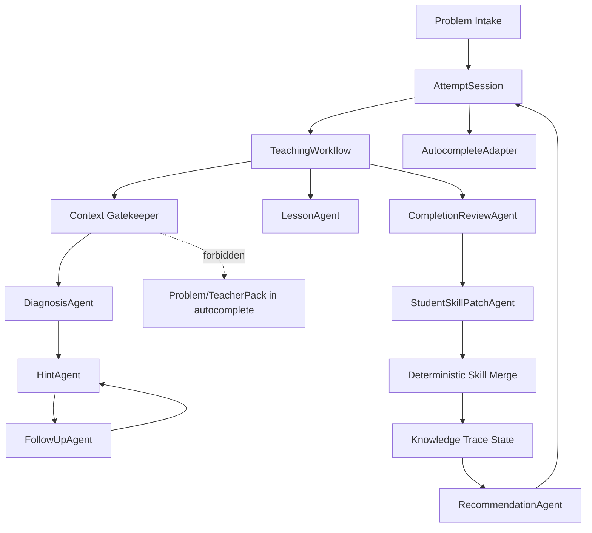

# Deep Research: Agent Frameworks for Teaching-Oriented Beta 0.2

Date: 2026-05-10

Status: research-backed framework refinement for `docs/beta-0.2-requirements-design.md`.

## 0. Summary

This research pass looked at agent frameworks, AI coding assistants, MCP tooling, competitive-programming import tools, and AI/programming-education research. The conclusion is deliberately conservative:

Student Autocomplete Lab should not embed a general multi-agent framework as its runtime. The extension should implement a small TypeScript-native teaching workflow engine that borrows the useful parts of agent frameworks:

- durable state;
- explicit roles;
- sessions;
- guarded tools;
- structured outputs;
- traces;
- human correction;
- evaluation loops.

The "agent" in beta 0.2 should be a teaching workflow, not a free-running autonomous worker.

The strongest product change from this research is:

> Treat every problem as a persistent `AttemptSession`, and route all AI actions through a stateful `TeachingWorkflow` with explicit stages: intake, diagnosis, hint, follow-up, abandon lesson, completion review, Student Skill patch, transfer check, and recommendation.

## 1. Research Sources

### Agent and Workflow Frameworks

- LangGraph: <https://docs.langchain.com/oss/python/langgraph/overview>
- Microsoft AutoGen AgentChat: <https://microsoft.github.io/autogen/stable/user-guide/agentchat-user-guide/index.html>
- CrewAI: <https://docs.crewai.com/en/introduction>
- OpenAI Agents SDK: <https://openai.github.io/openai-agents-python/>
- LlamaIndex agents: <https://developers.llamaindex.ai/python/framework/understanding/agent/>
- Microsoft Semantic Kernel Agent Framework: <https://learn.microsoft.com/en-us/semantic-kernel/frameworks/agent/>
- Promptfoo: <https://www.promptfoo.dev/docs/intro/>

### Coding Assistant and Problem-Import Tools

- Continue autocomplete docs: <https://docs.continue.dev/customize/deep-dives/autocomplete>
- Continue autocomplete role docs: <https://docs.continue.dev/customize/model-roles/autocomplete>
- Tabby: <https://github.com/TabbyML/tabby>
- Sourcegraph Cody: <https://sourcegraph.com/docs/cody>
- vscode-leetcode: <https://github.com/LeetCode-OpenSource/vscode-leetcode>
- Competitive Companion: <https://github.com/jmerle/competitive-companion>

### MCP

- MCP tools specification: <https://modelcontextprotocol.io/specification/2025-06-18/server/tools>
- MCP resources specification: <https://modelcontextprotocol.io/specification/2025-06-18/server/resources>
- Playwright MCP: <https://github.com/microsoft/playwright-mcp>
- GitHub MCP server: <https://github.com/github/github-mcp-server>

### AI Teaching and Programming Education

- CodeAid, CHI 2024: <https://arxiv.org/abs/2401.11314>
- CodeHelp, 2023: <https://arxiv.org/abs/2308.06921>
- Next-Step Hint Generation for Introductory Programming Using LLMs, ACE 2024: <https://arxiv.org/abs/2312.10055>
- Howzat? Expert Judgement for Human and AI Next-Step Hints, 2024: <https://arxiv.org/abs/2411.18151>
- Deep Knowledge Tracing, NeurIPS 2015: <https://papers.nips.cc/paper/5654-deep-knowledge-tracing>
- OpenAI Study Mode: <https://openai.com/index/chatgpt-study-mode/>

## 2. What To Borrow From Agent Frameworks

### 2.1 LangGraph: State Graph, Not Framework Dependency

LangGraph's useful lesson is not "install LangGraph." It is the architecture: long-running stateful workflows, persistence, memory, human-in-the-loop inspection, and traceable state transitions.

For this project:

- represent a problem attempt as a graph-like state machine;
- checkpoint after every visible teaching action;
- allow rollback of Student Skill and lesson outputs;
- keep a readable trace of why the workflow chose the next action.

Do not:

- run a Python LangGraph service inside the VS Code extension;
- let LLMs choose arbitrary next nodes;
- make the UI wait on a multi-agent runtime.

### 2.2 AutoGen and CrewAI: Role Decomposition

AutoGen and CrewAI show that multi-agent systems become understandable when each agent has a role, handoff boundary, memory, and termination condition.

For this project, use roles as internal prompt modules:

- `ProblemIntakeAgent`;
- `TeacherPackAgent`;
- `DiagnosisAgent`;
- `HintAgent`;
- `SocraticFollowUpAgent`;
- `CompletionReviewAgent`;
- `SkillMergeAgent`;
- `RecommendationAgent`;
- `EvalSupervisorAgent`.

But these should be orchestrated by deterministic TypeScript code. The model should not decide the whole workflow.

### 2.3 OpenAI Agents SDK: Few Primitives, Guardrails, Sessions, Tracing

The Agents SDK's most useful primitive set maps well to this plugin:

- agent instructions -> route-specific prompts;
- handoffs -> deterministic route calls;
- guardrails -> input/output validators;
- sessions -> `AttemptSession`;
- tracing -> internal JSONL spans;
- MCP tools -> local problem/search/test/profile tools.

0.2 should add a `TeachingTrace` layer with spans:

- `problem.intake`;
- `teacher_pack.generate`;
- `coach.diagnose`;
- `coach.hint`;
- `coach.follow_up`;
- `attempt.complete_review`;
- `skill.patch`;
- `skill.merge`;
- `recommendation.rank`;
- `autocomplete.request`.

### 2.4 LlamaIndex and Cody: Retrieval Needs Explicit Context

LlamaIndex and Cody reinforce a point already visible in the current product: context is a product surface. Users must be able to see what context is included.

For this project:

- problem text is context for coach only;
- code snapshot is context for coach and autocomplete;
- Teacher Pack is hidden coach context;
- Student Skill is summarized coach/recommendation context;
- autocomplete can only read code habits and local file context.

UI should eventually show a "Context Used" disclosure for each AI answer.

### 2.5 Continue and Tabby: Autocomplete Is Its Own Species

Continue explicitly separates autocomplete as a model role and points out that FIM-style models are better suited to inline completion than general chat models. Tabby shows the product value of self-hosted/local code assistant routes.

For this project:

- keep autocomplete separate from teaching models;
- add `AutocompleteAdapter` for FIM/local-compatible routes;
- default to short completions, low latency, and small context windows;
- do not use large reasoning models for every keystroke;
- measure accept/dismiss locally in internal builds.

## 3. What To Borrow From Teaching Research

### 3.1 CodeAid and CodeHelp: Guardrails and Student Control

CodeAid and CodeHelp both target the same risk as this plugin: AI can help, but direct code answers can harm learning. They emphasize:

- conceptual help;
- pseudocode or annotations instead of full code;
- avoiding direct solution reveal;
- transparency and control;
- simplifying the student's query formulation while preserving cognitive engagement.

0.2 implication:

- "Ask AI" can be conversational, but must default to teaching mode;
- "Show standard answer" remains gated under abandon/lesson flow;
- free-form question does not mean free-form answer leakage;
- every answer should have a visible "too hard / too easy / not accurate" feedback path.

### 3.2 Next-Step Hint Work: Hint Level Matters

The next-step hint papers support the product's current direction but sharpen it:

- next-step hints should be one concrete move, personalized to the student's current code;
- they can be misleading near the end of a task, so validation matters;
- multi-stage prompt generation tends to perform better;
- expert-judged good hints in Howzat were often 80-160 words and readable at about US grade 9 or below;
- alternative solution approaches in a hint are usually bad for novices.

0.2 implication:

- `给点提示` should target 80-160 Chinese characters or 80-160 English words depending language, unless the user asks for detail;
- `再具体点` should deepen the same issue, not branch to another algorithm;
- "too hard" should lower reading level and introduce a smaller subgoal;
- "too vague" should add one counterexample or one code-location clue;
- hints must not offer multiple algorithm alternatives by default.

### 3.3 Knowledge Tracing: Do Not Overclaim, But Use the Shape

Bayesian/Deep Knowledge Tracing model learner mastery over time from interaction sequences. This project does not yet have enough real data for a neural KT model, but the structure is useful.

0.2 should implement interpretable lightweight knowledge tracing:

```text
skillState = {
  mastery: 0..1,
  evidenceCount,
  recentFailures,
  recentLowHintSuccesses,
  transferPasses,
  lastUpdated,
  confidence,
  disabled
}
```

Promotion rules:

- candidate -> learning: repeated evidence or user confirmation;
- learning -> ready: low-hint success on same family;
- ready -> transfer-confirmed: unseen same-family success;
- any -> downgraded: user marks diagnosis wrong or repeated failure.

This is not "real KT" yet, but it gives a testable bridge toward it.

### 3.4 Study Mode: Socratic, Scaffolded, Progress Checks

OpenAI's Study Mode is relevant because it frames the UI as a learning experience, not an answer bot:

- Socratic questioning;
- step-by-step guidance;
- scaffolded response sections;
- self-reflection;
- progress checks.

0.2 implication:

- add a `StudyModePolicy` for coach responses;
- after a hint, ask one optional check question;
- after completion, ask the student to label what changed;
- after repeated failure, recommend a narrower micro-drill instead of a harder problem.

## 4. Revised 0.2 Teaching Agent Framework

### 4.1 Architecture



### 4.2 Deterministic Orchestrator

Add a TypeScript-native `TeachingWorkflow`:

```ts
type TeachingAction =
  | "hint"
  | "more_specific"
  | "ask_ai"
  | "too_hard"
  | "abandon"
  | "complete"
  | "judge"
  | "score"
  | "optimize"
  | "recommend"
  | "delete_problem";
```

The orchestrator owns:

- what context may be used;
- what model role is called;
- what output schema is expected;
- how results update `AttemptSession`;
- which trace spans are recorded;
- which user feedback actions are available.

The model owns:

- diagnosis phrasing;
- one pain point;
- one next step;
- lesson explanation;
- skill patch proposal;
- recommendation reason.

The model does not own:

- whether it can read hidden answers;
- whether a disabled skill reactivates;
- whether a problem is archived;
- whether AI judge is treated as official.

### 4.3 Agent Roles

| Role | Input | Output | Can Read Teacher Pack? | Can Write Skill? |
| --- | --- | --- | --- | --- |
| `ProblemIntakeAgent` | Markdown / adapter metadata | normalized problem summary | no | no |
| `TeacherPackAgent` | full problem | hidden reference pack | yes | no |
| `DiagnosisAgent` | problem summary, Teacher Pack, code, OJ feedback, Student Skill | one primary pain point | yes | patch proposal only |
| `HintAgent` | diagnosis and code excerpt | next-step hint | yes | no |
| `FollowUpAgent` | attempt thread, latest student question | answer or one question | yes | no |
| `LessonAgent` | abandoned attempt | lesson report with gated answer | yes | patch proposal only |
| `CompletionReviewAgent` | current code, thread, OJ/self result | learning review | yes | patch proposal only |
| `SkillMergeAgent` | model patch, correction log, existing skill | validated merge diff | no raw problem | yes through deterministic merge |
| `RecommendationAgent` | skill state, archive, candidate problems | ranked recommendation | summary only | no |
| `EvalSupervisorAgent` | fixtures and outputs | mismatch report | fixture only | no |

### 4.4 Context Gatekeeper

Every route must declare a context policy:

```ts
interface TeachingContextPolicy {
  route: string;
  allowedInputs: Array<
    | "code_window"
    | "problem_summary"
    | "full_problem"
    | "teacher_pack"
    | "standard_answer"
    | "student_skill_summary"
    | "correction_log"
    | "coach_thread"
    | "oj_feedback"
    | "samples"
  >;
  forbiddenInputs: string[];
  outputSchema: string;
  modelRole: string;
}
```

Required policies:

- autocomplete: code window, language, code habits only;
- hint: problem summary, Teacher Pack, code, OJ feedback, Student Skill summary;
- follow-up: same as hint plus coach thread;
- abandon lesson: Teacher Pack plus code/thread, answer gated in output;
- completion review: code/thread/OJ, no automatic standard answer;
- recommendation: summarized Student Skill and problem metadata only.

### 4.5 Teaching Response Contract

For hints:

```ts
interface HintResponse {
  action: "hint" | "more_specific" | "too_hard";
  primaryPainPoint: string;
  studentFacingHint: string;
  nextStudentAction: string;
  optionalCheckQuestion?: string;
  hiddenTeacherNotes?: string;
  confidence: number;
}
```

Rules:

- one pain point;
- one next action;
- no full solution;
- no alternative algorithm list;
- keep default hint short;
- `too_hard` reduces abstraction and adds a smaller step;
- `more_specific` adds a local counterexample or code-location clue.

For completion:

```ts
interface CompletionReview {
  ojLikeStatus: "AC" | "WA" | "RE" | "TLE" | "unknown";
  learningScore: number;
  learnedSkillEvidence: string[];
  unresolvedPainPoints: string[];
  skillPatch: StudentSkillPatch;
  recommendNextAction: "archive" | "micro_drill" | "same_level_problem" | "transfer_probe";
}
```

## 5. Revised MCP Plan

MCP should be a local integration surface, not the core runtime.

### 5.1 Public-ish Local MCPs

`student-problem-search-mcp`

- search public metadata;
- return problem candidates;
- no student data.

`student-attempt-mcp`

- expose current attempt summary;
- run local samples;
- never expose Teacher Pack by default.

`student-skill-mcp`

- inspect skills;
- mark diagnosis wrong/helpful;
- disable skill;
- rollback skill.

### 5.2 Internal-Only MCPs

`student-eval-mcp`

- fixture batches;
- live calibration runs;
- mismatch summaries;
- token/cost ledger.

`student-ui-audit-mcp`

- Playwright-style screenshots;
- sidebar action checks;
- accessibility snapshot.

### 5.3 MCP Safety

Borrow directly from MCP security guidance:

- show tools exposed to the model;
- ask confirmation for sensitive operations;
- validate tool inputs and outputs;
- time out every tool call;
- log tool usage locally;
- treat tool descriptions and annotations as untrusted unless server is trusted;
- never expose API keys or raw internal logs.

## 6. Revised Evaluation Plan

0.2 should add a prompt/eval discipline closer to promptfoo than ad hoc trial scripts.

### 6.1 Evaluation Layers

| Layer | Evaluates | Tooling |
| --- | --- | --- |
| schema | parser and structured output survival | Vitest |
| route policy | context leakage and forbidden input checks | Vitest |
| fixture | 1,000 dry-run samples | existing longitudinal harness |
| hint quality | shortness, one next step, no answer reveal | rule checks + sampled human review |
| model calibration | live 50/200 call runs | internal eval CLI |
| conversation | follow-up, too hard, too vague, archive review | internal scenario replay |
| UI | screenshots, clickability, duplicate entries | Playwright-style local runner |
| release hygiene | no internal/research artifacts | `check:hygiene` |

### 6.2 New Metrics

Add to current metrics:

- `hintLengthPassRate`;
- `singleNextStepRate`;
- `answerLeakageRate`;
- `tooHardRecoveryRate`;
- `followUpContinuityRate`;
- `completionReviewPatchAccuracy`;
- `recommendationNoRepeatRate`;
- `contextPolicyViolationCount`;
- `toolSafetyViolationCount`.

### 6.3 5M Token Budget Reallocation

The previous 5M plan should be sharpened:

| Route | Target Tokens | Why |
| --- | ---: | --- |
| Teacher Pack generation | 700k | hidden references for fixture coverage |
| Diagnosis calibration | 1.2M | pain-point and skill accuracy |
| Hint ladder calibration | 900k | hint quality, too hard/too vague variants |
| Follow-up conversation replay | 800k | per-problem memory and continuity |
| Completion review and skill patch | 700k | Student Skill evolution quality |
| Recommendation transfer probes | 400k | difficulty and no-repeat rules |
| UI audit summarization | 200k | screenshot-driven usability fixes |
| Mismatch analysis | 300k | targeted prompt/taxonomy patches |
| Buffer | 800k | retry, provider drift, reruns |

Total target: 5M-6M tokens, gated by early-stop rules.

Early stop if:

- parser crash rate exceeds 1%;
- answer leakage appears in two consecutive batches;
- context policy violation appears once in autocomplete;
- metric deltas plateau for two prompt iterations;
- provider cost or latency exceeds configured budget.

## 7. Concrete Changes To Beta 0.2 Design

### 7.1 Promote AttemptSession To Phase 1

Current top priority remains correct:

1. `AttemptSession`;
2. persistent coach thread;
3. free-form Ask AI that actually sends;
4. post-archive follow-up.

But now it should also include:

- trace span recording;
- context policy for every action;
- "too hard" and "too vague" feedback actions.

### 7.2 Add TeachingWorkflow

Create a deterministic workflow module before adding more UI:

- it receives `TeachingAction`;
- resolves `AttemptSession`;
- applies `TeachingContextPolicy`;
- calls `ModelRouter`;
- validates output;
- updates session, ledger, and UI view model.

### 7.3 Add KnowledgeTraceState

Student Skill should include a lightweight KT-like state:

- `mastery`;
- `recentFailureCount`;
- `lowHintSuccessCount`;
- `transferPassCount`;
- `confidence`;
- `status`.

Do not train a neural model in beta 0.2.

### 7.4 Revise Hint Prompt Rules

Default hint target:

- Chinese: short paragraph plus one action;
- English: 80-160 words, grade 9-ish wording;
- one pain point;
- one next action;
- no alternative algorithms;
- no full code.

### 7.5 Build UI Around Feedback, Not Buttons Alone

Every AI card should expose:

- `有帮助 / Helpful`;
- `不准确 / Not accurate`;
- `太难 / Too hard`;
- `太泛 / Too vague`;
- `继续追问 / Follow up`.

This makes self-evolution observable and correctable.

## 8. Implementation Tracks After Research

### Track A: TeachingWorkflow and AttemptSession

Files likely touched:

- `src/teaching/attemptSession.ts`;
- `src/teaching/teachingWorkflow.ts`;
- `src/teaching/contextPolicy.ts`;
- `src/sidebar/ProblemBankViewProvider.ts`;
- tests for state transitions and context policy.

### Track B: Hint Ladder and Follow-Up

Files likely touched:

- `src/teaching/coachFollowUp.ts`;
- `src/teaching/teachingPrompt.ts`;
- new `src/teaching/hintLadder.ts`;
- webview actions for too hard/too vague.

### Track C: Model Router 0.2

Files likely touched:

- `src/models/modelRouter.ts`;
- `src/models/providerModelsClient.ts`;
- `src/config/vscodeModelEnv.ts`;
- `src/models/chatCompletionsClient.ts`;
- `src/models/completionsClient.ts`.

### Track D: KnowledgeTraceState

Files likely touched:

- `src/teaching/studentSkill.ts`;
- `src/teaching/studentSkillStore.ts`;
- `src/teaching/transferValidation.ts`;
- recommendation tests.

### Track E: MCP Safety Contracts

Files likely touched:

- `src/mcp/problemSearchTools.ts`;
- `src/mcp/problemSearchServer.ts`;
- new `src/mcp/attemptTools.ts`;
- new `src/mcp/skillTools.ts`;
- release packaging tests.

### Track F: Evaluation Harness 0.2

Files likely touched:

- `src/cli/longitudinalSelfEvolution.ts`;
- new `src/cli/teachingWorkflowEval.ts`;
- `docs/internal-testing.md`;
- mismatch summary JSON schema.

## 9. Final Recommendation

For beta 0.2, the best framework is:

```text
TypeScript-native deterministic workflow
+ role-specific model prompts
+ strict context policies
+ local attempt sessions
+ Student Skill knowledge tracing
+ MCP only as tool boundary
+ promptfoo-like internal eval discipline
```

Do not add:

- a Python LangGraph service;
- autonomous multi-agent loops inside the extension;
- hidden telemetry;
- official-OJ-like claims from AI judge;
- full-answer chat as the default.

This gives the project the parts of agent frameworks that matter for teaching while keeping the extension debuggable, shippable, and safe.
