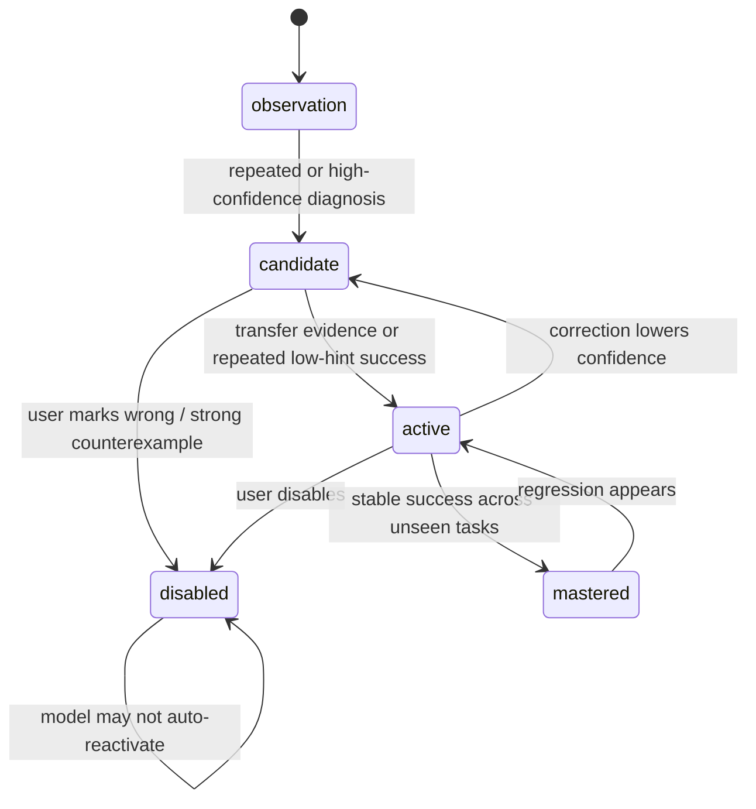

# Skill Distillation and Self-Improvement Research

Date: 2026-05-10

Status: research note for beta 0.2 planning. This document is for maintainers and internal design, not a public release note.

## 1. Why This Matters

Student Autocomplete Lab already has the rough shape of a learning system: a hidden Teacher Pack, an explicit AI coach, a visible Student Skill profile, correction logs, rollback, and longitudinal evals. The missing step is making the "self-evolving skill" idea disciplined enough that it does not become a pile of vague labels.

The useful frame from this research is:

> A skill is not a memory entry. A skill is a tested, reusable operating pattern with evidence, limits, and promotion rules.

For this project, the "person" being distilled is not a colleague or public thinker. It is the student's learning state: how they misunderstand problems, how they recover, which hints work, which recommendations transfer, and where the system must stay humble.

## 2. Sources Reviewed

### 2.1 Local Installed Skills

Local skills already installed on this machine include the superpowers family:

- `using-superpowers`
- `writing-skills`
- `test-driven-development`
- `systematic-debugging`
- `verification-before-completion`
- `dispatching-parallel-agents`
- `subagent-driven-development`
- `writing-plans`

Key lesson from `writing-skills`: skill creation should be treated like test-driven development for process documentation. A good skill needs pressure scenarios, a failing baseline, a minimal instruction change, and verification that future agents behave differently.

This maps directly to Student Skill:

- do not promote a student skill from one vague AI diagnosis;
- create a pressure scenario, such as an unseen same-topic problem;
- only mark the skill as active when later behavior improves or the same pain point repeats under controlled conditions;
- keep disabled/corrected skills from silently returning.

### 2.2 `titanwings/colleague-skill`

Source: [titanwings/colleague-skill](https://github.com/titanwings/colleague-skill)

Useful design patterns:

- two-layer output: Work Skill plus Persona;
- data intake from multiple sources, with manual paste as a fallback;
- explicit correction layer: when the user says "this is not how they would act", append correction instead of overwriting history;
- version snapshots and rollback;
- generated skill is a self-contained folder with prompts, references, and helper tools;
- evolution mode is incremental, not a full rewrite.

Mapping to Student Autocomplete Lab:

| Colleague Skill Pattern | Student Autocomplete Mapping |
| --- | --- |
| Work Skill | Student's operational habits: I/O, naming, loop discipline, debugging habits |
| Persona | Student-facing teaching preferences: concise vs detailed, Chinese/English, examples vs abstractions |
| Correction layer | `diagnosis_wrong`, `diagnosis_helpful`, `manual_note` |
| Append new files | New attempts, OJ results, code snapshots, user feedback |
| Rollback | Learning profile version restore |
| Evolution mode | Skill patch merge after attempt completion |

The strongest product idea here is that corrections are first-class data. "This diagnosis is wrong" should not delete a card; it should create an explicit counterexample that blocks quiet reactivation.

### 2.3 `alchaincyf/nuwa-skill`

Source: [alchaincyf/nuwa-skill](https://github.com/alchaincyf/nuwa-skill)

Nuwa is especially relevant because it focuses less on "what someone said" and more on "how someone thinks". Its core extraction checklist is useful:

- mental models;
- decision heuristics;
- expression DNA;
- anti-patterns;
- honest boundaries;
- source appendix.

Its research flow also has several product-grade moves:

- split direct requests from vague needs;
- create the skill directory before research so all evidence remains self-contained;
- use parallel research lanes;
- pause at review checkpoints before synthesis;
- use a three-part verification for mental models: cross-domain recurrence, generative power, and distinctiveness;
- mark low-information areas honestly instead of hallucinating confidence;
- run independent validation before delivery;
- cap refinement loops to avoid endless polishing.

Mapping to Student Autocomplete Lab:

| Nuwa Pattern | Student Autocomplete Mapping |
| --- | --- |
| Mental model | Stable misconception or stable capability, such as "array boundary reasoning" |
| Decision heuristic | Teaching rule, such as "show one counterexample before solution sketch" |
| Expression DNA | Preferred explanation style and language |
| Anti-pattern | Hints that do not work for this student |
| Honest boundary | "Only observed in two array problems, not verified for strings" |
| Source appendix | Attempt evidence and user corrections |
| Threefold verification | repeated evidence, transfer power, specificity |

The most important transplant is the distinction between a weak observation and a real model. For example, "forgot base case once" is a pain point. It becomes a Student Skill only after it repeats, transfers, or predicts behavior on a new recursion/tree task.

### 2.4 Self-Improvement and Skill-Evolution Systems

Sources:

- [OpenClaw self-improving-agent skill](https://github.com/openclaw/skills/blob/main/skills/pskoett/self-improving-agent/SKILL.md)
- [EvoSkill](https://github.com/sentient-agi/EvoSkill)
- [EvoSkills](https://evoskills.net/)
- [SkillWeaver](https://github.com/OSU-NLP-Group/SkillWeaver)
- [SkillWeaver paper](https://arxiv.org/abs/2504.07079)
- [Reflexion](https://arxiv.org/abs/2303.11366)
- [Voyager](https://voyager.minedojo.org/)
- [ExpeL](https://arxiv.org/abs/2308.10144)
- [Self-Refine](https://arxiv.org/abs/2303.17651)
- [SELF](https://arxiv.org/abs/2310.00533)

Common pattern across these systems:

1. collect experience;
2. summarize failure or success into language;
3. store it in an external memory or skill library;
4. retrieve it for related future tasks;
5. evaluate whether it helped;
6. promote, refine, or discard.

What differs is the verification strength:

- simple self-improvement skills log errors and promote recurring lessons;
- Reflexion stores verbal reflections without updating weights;
- ExpeL extracts natural-language insights from experience;
- Voyager keeps an executable skill library and retrieves top relevant skills;
- SkillWeaver synthesizes reusable APIs after environment exploration;
- EvoSkill/EvoSkills add benchmark or surrogate-verifier loops so skill changes compete against held-out tasks.

For this project, the safest version is not model self-training. It is local, auditable skill evolution:

- no model weights are changed;
- no private logs are uploaded;
- generated skill patches must be inspectable;
- promotion requires evidence;
- release builds must not include internal logs.

## 3. Product Interpretation

### 3.1 Student Skill Should Have Two Layers

Borrow the Work + Persona idea, but make it educational:

| Layer | Contents | Used By |
| --- | --- | --- |
| Learning Skill | pain points, mastered concepts, transfer evidence, recommended next topics | diagnosis, scoring, recommendation |
| Teaching Persona | language preference, explanation depth, examples that worked, hints that failed | AI coach chat, lesson report |

This avoids mixing "student cannot parse tree depth" with "student prefers Chinese concise explanations". Both matter, but they should not be merged into one label.

### 3.2 Candidate Skill Promotion Rule

Proposed lifecycle:



Promotion requirements:

- `observation`: one attempt can create this, but it should not affect future prompts strongly.
- `candidate`: at least two evidence points, or one strong teacher-pack-backed diagnosis plus user confirmation.
- `active`: must have transfer evidence or repeated success under low hint count.
- `mastered`: multiple related tasks solved with low hints and no repeated correction.
- `disabled`: only user action or hard contradiction should set this; model cannot auto-undo it.

### 3.3 Threefold Verification for Student Skills

Adapt Nuwa's mental-model verification:

| Verification | Student Skill Meaning | Example |
| --- | --- | --- |
| Recurrence | appears across at least two attempts or languages | off-by-one in arrays and strings |
| Generative power | predicts next helpful hint or likely mistake | before tree depth problems, remind base case and child indexing |
| Specificity | not just a generic label every beginner gets | `binary-tree-depth-numbered-children` beats `recursion-base-case-pattern` |

If a finding only passes recurrence, keep it as a pain point. If it passes recurrence plus generative power, it can become a candidate skill. If it passes all three, it may become active.

## 4. Concrete Beta 0.2 Mechanisms

### 4.1 Skill Distillation Ledger

Add a local ledger, separate from raw internal logs:

```ts
type SkillDistillationEvent = {
  id: string;
  timestamp: string;
  problemId: string;
  attemptId: string;
  eventType:
    | 'observation_created'
    | 'candidate_promoted'
    | 'skill_activated'
    | 'skill_mastered'
    | 'user_correction'
    | 'skill_disabled'
    | 'rollback';
  skillId: string;
  evidenceIds: string[];
  confidenceBefore?: number;
  confidenceAfter?: number;
  reason: string;
};
```

This should be local-only and excluded from release packages. The visible Learning Profile can show a compressed version.

### 4.2 Evidence Card Format

Each visible skill card should be backed by evidence:

```ts
type StudentSkillEvidence = {
  id: string;
  problemId: string;
  problemTitle: string;
  topic: string;
  difficulty: number;
  attemptResult: 'AC' | 'WA' | 'RE' | 'TLE' | 'abandoned' | 'manual';
  hintCount: number;
  diagnosisSummary: string;
  userFeedback?: 'helpful' | 'wrong' | 'manual_note';
  counterexample?: string;
  transferStatus?: 'not_tested' | 'passed' | 'failed';
};
```

The important UI implication: "查看证据" should not be decorative. It must open these cards.

### 4.3 Skill Patch Contract

Do not let the model mutate the full profile freely. Ask for a patch:

```ts
type StudentSkillPatch = {
  candidateAdds: SkillPatchItem[];
  candidateUpdates: SkillPatchItem[];
  disables: { skillId: string; reason: string; evidenceIds: string[] }[];
  corrections: { skillId: string; reason: string; evidenceIds: string[] }[];
  promotionRequests: { skillId: string; reason: string; evidenceIds: string[] }[];
  teachingPreferenceUpdates: {
    preferenceId: string;
    reason: string;
    evidenceIds: string[];
  }[];
};
```

Then deterministic TypeScript code applies rules:

- disabled skills cannot be reactivated by model output;
- candidate-to-active promotion requires evidence thresholds;
- vague skill IDs are normalized to specific taxonomy when problem context supports it;
- user corrections have higher priority than model confidence.

### 4.4 Transfer Probe

Borrow Voyager and SkillWeaver's idea of applying learned skills to unseen situations:

1. detect an active candidate skill;
2. recommend a related but unseen public problem;
3. mark the recommendation as a transfer probe;
4. compare hint count, pain point recurrence, and result;
5. update skill state.

This is the key difference between "the model remembered a label" and "the student is improving".

### 4.5 Surrogate Verifier for AI Patches

Borrow EvoSkills' generator-verifier separation in a small local form:

- generator: teaching model proposes diagnosis and skill patch;
- verifier: separate prompt, no generator reasoning, checks whether the patch is supported by the evidence;
- deterministic merge: TypeScript applies only verified changes.

In beta 0.2 this can be optional and used in internal tests first, because it costs more tokens.

## 5. What Not To Copy

- Do not copy private-person distillation into this product. Student Skill should model learning behavior, not imitate a person.
- Do not auto-collect chat/email/social data. Our evidence should come from problem attempts, code snapshots, OJ-like feedback, and explicit user notes.
- Do not turn corrections into vibe prompts. Corrections must become structured evidence.
- Do not let the model rewrite the whole learning profile each time.
- Do not call a one-shot diagnosis "self-evolution".
- Do not use internal-test logging in beta release.

## 6. Implementation Roadmap

### Phase A: Documentation and Schema

- Add `SkillDistillationEvent`.
- Add evidence-card schema.
- Split Student Skill docs into Learning Skill and Teaching Persona.
- Add lifecycle statuses: `observation`, `candidate`, `active`, `mastered`, `disabled`.

### Phase B: Deterministic Merge Rules

- Implement patch validator.
- Enforce disabled-skill no-reactivation.
- Normalize vague skills with problem-aware taxonomy.
- Add confidence decay after `diagnosis_wrong`.

### Phase C: UI

- Learning Profile shows:
  - active skills;
  - candidate observations;
  - mastered skills;
  - teaching preferences;
  - disabled/corrected judgments;
  - evidence drawer.
- Every skill card includes why it affects future AI prompts.

### Phase D: Evaluation

- Add fixture cases where the model proposes overbroad skills.
- Add transfer probes after a skill becomes active.
- Add mismatch summaries:
  - expected skill vs actual skill;
  - expected primary pain point vs actual primary pain point;
  - recommendation target vs actual target.
- Add one internal live run that uses generator plus verifier on 100 samples.

## 7. Acceptance Criteria

Beta 0.2 should not claim self-evolution unless these are true:

- user correction changes the next merge result;
- disabled skills never auto-reactivate;
- at least one skill can move from observation to candidate to active through evidence;
- at least one active skill can be tested by transfer probe;
- recommendation reason names the target skill and evidence status;
- internal report shows promotion, correction, and transfer counts;
- beta release package contains no raw student ledger, internal logs, or research drafts.

## 8. Short Design Slogan

For Student Autocomplete Lab:

> Do not make the AI "remember the student" as a blob of text. Make it maintain a small, testable, user-correctable skill model.

