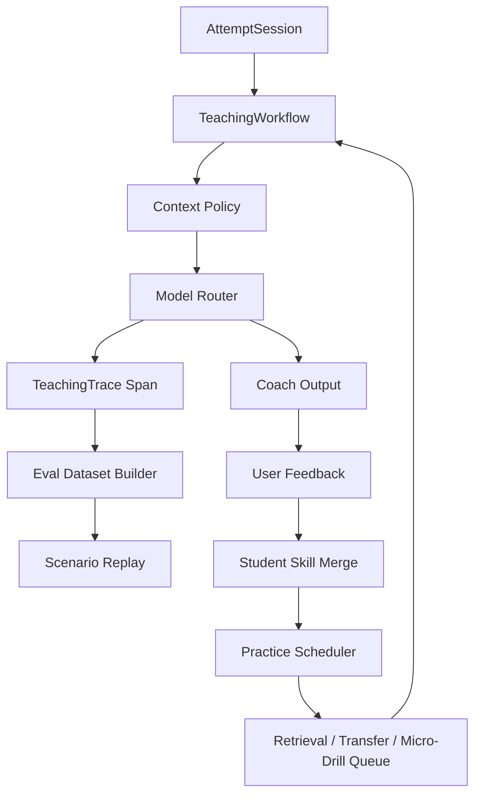

# Deep Research Batch 2: Teaching Eval, Observability, and Practice Design

Date: 2026-05-10

Status: second research pass after `deep-research-agent-teaching-framework.md`.

## 0. Summary

The first research pass answered the runtime question: do not embed a generic multi-agent framework in the VS Code extension. Build a deterministic TypeScript `TeachingWorkflow` instead.

This second pass answers the learning-system question: how should the product prove that self-evolution is useful, and how should it teach better than a hint bot?

The answer is:

- add local trace and eval primitives before adding more AI features;
- treat practice as a spaced, retrieval-based queue, not just "recommend next problem";
- turn generated micro-drills into narrow repair tasks, not full synthetic problem replacement;
- measure every coach route with replayable datasets, mismatch summaries, and policy-violation checks;
- keep MCP and external problem search behind strict context and permission boundaries.

The most important beta 0.2 correction is:

> Student Skill should not only store pain points. It should schedule retrieval, transfer, and micro-repair events that can prove whether a skill actually improved.

## 1. Second-Batch Sources

### Agent and Runtime Frameworks

- Mastra: <https://mastra.ai/ai-agent-framework>
- Agno agents: <https://docs.agno.com/agents/overview>
- Hugging Face smolagents: <https://huggingface.co/docs/smolagents/reference/agents>
- BeeAI Framework memory: <https://framework.beeai.dev/modules/memory>

### Observability and Evaluation

- Braintrust evaluation docs: <https://www.braintrust.dev/docs/evaluate>
- Langfuse docs: <https://langfuse.com/docs>
- Arize Phoenix docs: <https://arize.com/docs/phoenix>
- OpenTelemetry GenAI semantic conventions: <https://opentelemetry.io/docs/specs/semconv/gen-ai/>

### Learning Science

- Roediger and Karpicke, testing effect: <https://journals.sagepub.com/doi/10.1111/j.1745-6916.2006.00012.x>
- Cepeda et al., distributed practice review: <https://augmentingcognition.com/assets/Cepeda2006.pdf>
- Parsons problems research overview: <https://en.wikipedia.org/wiki/Parsons_problem>
- Loksa and Ko, self-regulation in programming problem solving: <https://faculty.washington.edu/ajko/papers/Loksa2016Metacognition.pdf>

### Programming Education Systems

- OverCode: <https://www.microsoft.com/en-us/research/publication/overcode-visualizing-variation-in-student-solutions-to-programming-problems-at-scale-2/>
- Program embeddings for feedback propagation: <https://proceedings.mlr.press/v37/piech15.html>
- ITAP self-improving Python tutor: <https://eric.ed.gov/?id=EJ1126596>
- CodeHelp guardrailed LLM support: <https://arxiv.org/abs/2308.06921>
- CodeAid classroom LLM assistant: <https://arxiv.org/abs/2401.11314>

### MCP Safety

- MCP security analysis: <https://arxiv.org/abs/2601.17549>
- OpenTelemetry MCP semantic conventions entry: <https://opentelemetry.io/docs/specs/semconv/gen-ai/>

## 2. What Changed After Batch 2

### 2.1 Mastra Is the Closest Future Runtime, But Still Not the 0.2 Runtime

Mastra is relevant because it is TypeScript-native and has agents, workflows, memory, evals, tracing, and model routing. That maps well to the project vocabulary.

However, beta 0.2 should still avoid a framework dependency:

- the extension already has VS Code activation, webview state, provider adapters, and local storage constraints;
- the product needs deterministic teaching routes, not free-running agents;
- adding a runtime now would make UI debugging harder.

Borrow:

- workflow step naming;
- route-level memory;
- eval and trace shape;
- model routing vocabulary.

Do not borrow yet:

- agent networks;
- server deployment;
- autonomous tool approval flows.

### 2.2 Observability Is a Product Primitive, Not an Enterprise Add-On

Braintrust, Langfuse, Phoenix, and OpenTelemetry all converge on the same idea: an LLM application is debuggable only when runs are decomposed into traces, spans, generations, inputs, outputs, scores, and datasets.

For Student Autocomplete Lab, that means beta 0.2 should add a local `TeachingTrace` ledger:

```text
traceId
attemptId
route
spanName
modelRole
provider
model
inputContextSummary
forbiddenContextCheck
outputKind
latencyMs
tokenUsage
parserRetryCount
qualityScores
userFeedback
```

This is not telemetry upload. It is local evidence for:

- "Why was this hint bad?"
- "Did autocomplete leak problem context?"
- "Which model route is expensive?"
- "Which prompt change improved primary pain-point accuracy?"
- "Which Student Skill patch later caused worse recommendations?"

### 2.3 Eval Should Be Scenario Replay, Not Only Unit Tests

Unit tests prove parser and policy invariants. They do not prove teaching quality.

Beta 0.2 needs three eval tiers:

| Tier | Purpose | Dataset |
| --- | --- | --- |
| Fixture dry run | parser, policy, schema stability | 1,000 synthetic wrong-code samples |
| Scenario replay | workflow and Student Skill evolution | saved attempt traces with expected outcomes |
| Live calibration | model behavior and prompt drift | 50-200 calls per prompt/taxonomy change |

Each scenario should replay:

1. problem summary;
2. code snapshot;
3. OJ-like feedback;
4. current Student Skill;
5. previous coach turns;
6. expected primary pain point;
7. expected skill patch;
8. expected recommendation behavior.

### 2.4 Practice Must Include Retrieval and Spacing

The testing-effect and distributed-practice literature suggest that "read explanation then move on" is weak. The system should regularly ask the student to retrieve or apply the idea again.

0.2 implication:

- after a lesson, schedule a 3-minute retrieval task;
- after AC, schedule a later transfer check;
- after repeated hints, schedule a smaller micro-drill;
- after transfer success, allow difficulty promotion;
- after transfer failure, downgrade or narrow the skill.

This changes recommendation from a single list into a practice queue.

### 2.5 Micro-Drills Are Safer Than Full Synthetic Problems

The earlier question was whether the model can write new problems. It can, but full generated problems risk drifting, being too easy, or creating invalid hidden assumptions.

Batch 2 recommends a stricter shape:

| Drill Type | Example | Why It Helps |
| --- | --- | --- |
| output prediction | "What does this loop print for input X?" | tests mental execution |
| boundary test creation | "Give one input that breaks this condition." | tests hidden-case thinking |
| fill one condition | "Complete only the if-condition." | narrows syntax and logic |
| Parsons ordering | "Put these lines in correct order." | scaffolds code construction |
| counterexample reading | "Why does this output differ?" | connects bug to symptom |
| complexity choice | "Which loop dominates?" | tests algorithm growth |

Generated full problems remain allowed only as labeled `synthetic` micro-practice, not as the main recommendation path.

### 2.6 Programming-Education Systems Point Toward Clustered Misconceptions

OverCode and program-embedding feedback propagation are useful not because this project has MOOC-scale data, but because they show the shape of scalable feedback:

- group similar wrong submissions;
- propagate known feedback only when evidence is similar enough;
- use representative examples;
- surface common misconceptions to instructors.

For beta 0.2:

- internal fixtures should be grouped by wrong-code family;
- Student Skill evidence should record "similarity family" when possible;
- recommendation should use family-level transfer evidence;
- future public beta should show anonymized/synthetic misconception examples, not private student code.

### 2.7 ITAP Confirms "Self-Improving" Needs a Reference State and Data

ITAP's useful lesson is that self-improvement is not magic prompt rewriting. It needs:

- a reference solution or reference state;
- a notion of student state;
- a path from current state to better state;
- accumulated data to improve hint quality.

For this project, the equivalent is:

- hidden Teacher Pack as reference;
- current code snapshot as student state;
- minimal repair step as path;
- TeachingTrace plus Student Skill as accumulated data.

This directly supports the current "Teacher Pack first, hidden by default" design.

### 2.8 Guardrails Must Be Structural

CodeHelp/CodeAid and MCP security work both warn against pure prompt-based safety. The product should not rely on "please do not reveal the answer" alone.

Structural guardrails:

- autocomplete prompt builder cannot receive problem statement or Teacher Pack arguments;
- standard answer route exists only inside abandon lesson;
- MCP problem search returns metadata unless the user chooses statement import;
- external tool responses are treated as data, not instructions;
- every coach route runs an output classifier for answer leakage;
- internal eval includes deliberate prompt-injection test problems.

## 3. Revised Beta 0.2 Architecture



### 3.1 New Internal Modules

| Module | Responsibility |
| --- | --- |
| `teachingTrace` | local spans, token usage, parser retries, context-policy checks |
| `evalReplay` | replay saved scenarios across prompt/model/taxonomy changes |
| `practiceScheduler` | spaced review, transfer checks, micro-drill queue |
| `microDrill` | small generated tasks with strict schemas |
| `misconceptionFamilies` | wrong-code family labels for fixtures and Student Skill evidence |
| `coachQualityScorers` | format, leakage, specificity, reading-level, actionability checks |

### 3.2 Learning Event Schema v2

Add these event types to the internal ledger:

```text
attempt_started
hint_requested
hint_feedback
follow_up_asked
abandon_lesson_requested
standard_answer_revealed
completion_review_requested
skill_patch_proposed
skill_patch_corrected
retrieval_probe_scheduled
retrieval_probe_answered
transfer_probe_scheduled
transfer_probe_answered
micro_drill_generated
micro_drill_completed
recommendation_shown
recommendation_accepted
recommendation_rejected
```

Each event should include:

- `attemptId`;
- `problemId`;
- `skillIds`;
- `painPointIds`;
- `studentSkillRevision`;
- `traceId`;
- `createdAt`;
- no raw API key;
- raw code only in internal local build when explicitly enabled.

### 3.3 Student Skill Should Gain Practice State

Do not replace the current schema immediately. Add a compatible layer:

```text
practiceState = {
  dueAt,
  intervalDays,
  lastProbeType,
  lastProbeResult,
  transferEvidenceCount,
  retrievalSuccessStreak,
  recentHintBurden,
  promotionBlockedReason
}
```

This lets the system say:

- "you passed this skill once, but no transfer evidence yet";
- "review this boundary condition tomorrow";
- "do not raise difficulty after three high-hint successes";
- "recommend a narrower drill because retrieval failed."

## 4. UI Implications

### 4.1 AI Coach

Each AI answer should display:

- route label: hint, follow-up, lesson, score, optimize, recommendation;
- context summary: problem, code snapshot, OJ feedback, Student Skill;
- one main action;
- feedback controls: helpful, too hard, too vague, wrong;
- optional "why this" detail.

Do not show raw Teacher Pack or hidden standard answer unless the route allows it.

### 4.2 Learning Profile

Add "Practice Queue" next to skills:

- due now;
- later review;
- transfer needed;
- blocked by correction;
- disabled.

Each item should explain:

- target skill;
- evidence;
- next scheduled action;
- why difficulty is staying, lowering, or rising.

### 4.3 Internal Testing Panel

Internal build should add:

- trace count;
- policy violation count;
- token usage by route;
- average latency by route;
- top mismatch pairs;
- top leakage-risk examples;
- replay pass/fail summary.

This stays out of beta release.

## 5. Evaluation Gates Added By Batch 2

Beta 0.2 should keep the existing 0.1 gates and add:

| Gate | Target |
| --- | ---: |
| trace completeness | 100% of AI routes have a span |
| forbidden context violation | 0 |
| answer leakage in hint route | 0 |
| scenario replay determinism | >= 0.95 exact schema stability |
| hint actionability score | >= 0.85 |
| "too hard" repair success | >= 0.80 |
| retrieval probe pass rate after lesson | >= 0.70 initially |
| transfer promotion correctness | >= 0.80 |
| recommendation no-repeat | 100% |
| parser crash rate | 0 |

## 6. MCP Design After Batch 2

MCP remains valuable, but the permission model must be narrow.

| Server | Release? | Notes |
| --- | --- | --- |
| problem search | yes | metadata first, statement import only by user action |
| local test runner | yes | workspace-scoped, no shell free-form |
| learning profile | optional | read-only by default |
| eval replay | internal only | can include private traces |
| browser import | optional | user-triggered, never background scraping |

Security rules:

- tool descriptions are not trusted instructions;
- tool outputs are sanitized before entering model context;
- no tool gets API keys;
- no tool gets raw Student Skill export unless user explicitly exports;
- release package excludes internal eval servers.

## 7. Implementation Order

Batch 2 changes the implementation order slightly:

1. `TeachingTrace` and context-policy spans.
2. `AttemptSession` coach thread and follow-up repair.
3. `ModelRouter` typed routes and token usage.
4. `PracticeScheduler` with retrieval/transfer/micro-drill events.
5. `ScenarioReplay` from saved traces.
6. `RecommendationRuleEngine` using practice state.
7. Internal panel for trace/eval summaries.

This order makes debugging cheaper: trace first, then features.

## 8. Final Recommendation

The project should still publish beta 0.2 as an algorithm coach, not as an autonomous agent framework.

But the claim should become stronger:

> It is a local VS Code algorithm coach that separates safe autocomplete from teaching context, keeps a visible learning profile, and uses replayable traces plus spaced practice to improve recommendations over time.

That is much more publishable than "AI can self-evolve" because it creates observable evidence for the claim.
