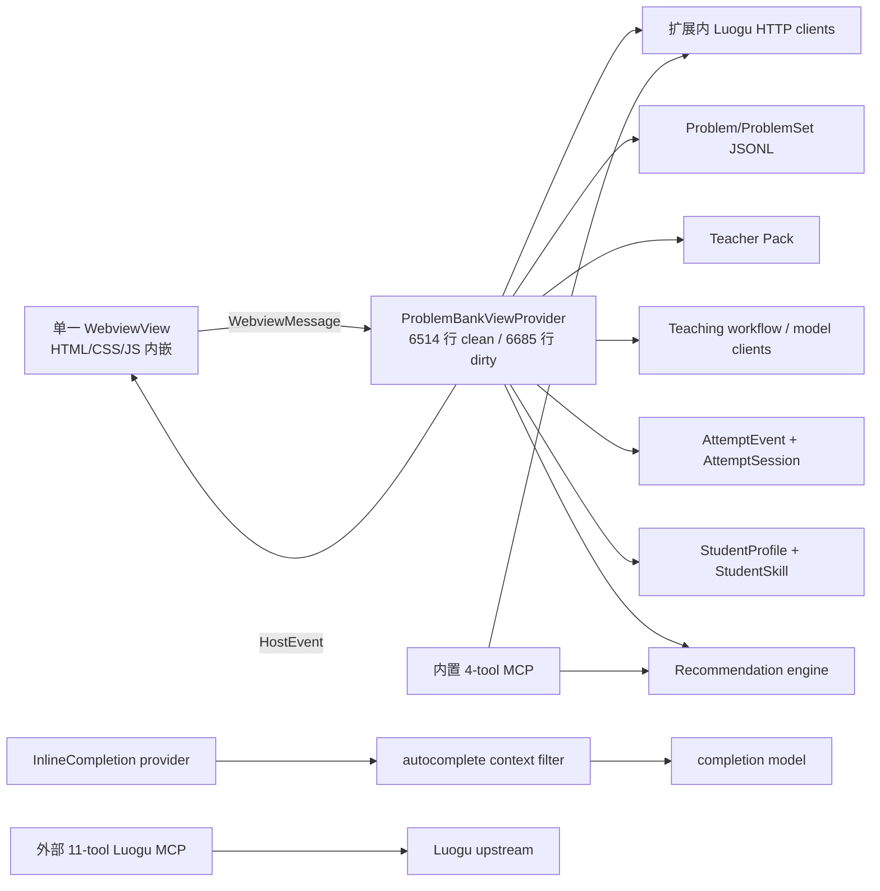
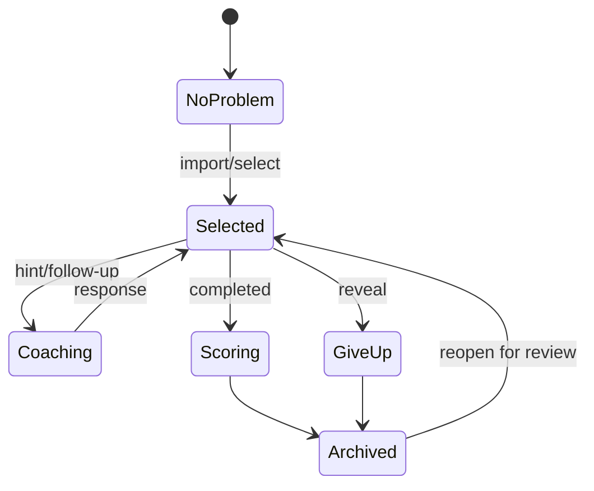

# 可信基线审计

- 审计日期：2026-07-10
- 审计性质：没有修改仓库业务源码或主动编辑用户数据；包含安装/激活真实扩展 profile 的运行观察，不能证明绝对无运行时副作用
- 目标：让后续实现能与一个可复现、包含失败的基线比较

## 1. 冻结点

### 1.1 扩展仓库

| 项目 | 值 |
| --- | --- |
| 仓库 | `C:\Users\qwerf\Desktop\student-autocomplete-lab` |
| 分支 | `codex/beta-0.2-one-shot-refactor` |
| HEAD | `098365f2f18a758692a493e9b7b31fe7fe71e163` |
| package 版本 | `0.1.0-beta.1` |
| 规划工作树 | `C:\Users\qwerf\.config\superpowers\worktrees\student-autocomplete-lab\next-gen-planning` |
| 规划分支 | `codex/next-gen-planning` |

主工作树在调查开始前已有 14 个未提交文件，全部视为用户资产，本轮没有覆盖、还原或格式化它们：

```text
src/autocomplete/prompt.ts
src/problemBank/luoguClient.ts
src/problemBank/luoguSearchClient.ts
src/sidebar/ProblemBankViewProvider.ts
src/sidebar/practiceFile.ts
src/teaching/solutionScore.ts
src/teaching/teachingReport.ts
test/autocomplete.test.ts
test/luoguClient.test.ts
test/luoguSearchClient.test.ts
test/practiceFile.test.ts
test/problemBankWebviewScript.test.ts
test/solutionScore.test.ts
test/teachingReport.test.ts
```

### 1.2 外部洛谷 MCP 仓库

| 项目 | 值 |
| --- | --- |
| 仓库 | `C:\Users\qwerf\Desktop\luogu-mcp-server` |
| 分支 | `main` |
| HEAD | `9d3f5bc47647620ea2f8566e2be65bdf5cc2ca3b` |
| package 版本 | `0.2.1` |
| 工作树 | 干净 |
| remote | `https://github.com/Kaiserunix/luogu-mcp-server.git` |

### 1.3 工具链

| 工具 | 实测版本 |
| --- | --- |
| VS Code | `1.126.0`, commit `7e7950df89d055b5a378379db9ee14290772148a`, x64 |
| Node.js | `25.8.1` |
| npm | `11.11.0` |
| TypeScript | `5.8.x`（由 lockfile 固定） |
| `@modelcontextprotocol/sdk` | `1.29.0` |
| Zod | `4.3.6` |
| Vitest | `3.2.4` |

`package.json` 仍声明 `engines.vscode = ^1.95.0` 和 `@types/vscode = ^1.95.0`。这与本轮锁定的 VS Code 1.125.x 最低环境不一致，后续必须作为显式迁移任务处理，不能顺手改版本。

## 2. 构建、测试与安装矩阵

| 范围 | 命令 | 结果 | 证据/备注 |
| --- | --- | --- | --- |
| clean HEAD | `npm ci` | 通过 | 146 个 package；审计告警另列 |
| clean HEAD | `npm run compile` | 通过 | TypeScript 无错误 |
| clean HEAD | `npm test` | 通过 | 73 files，246 tests |
| clean HEAD MCP | `npx vitest run test/problemSearchMcpServer.test.ts test/problemSearchMcpTools.test.ts` | 通过 | 2 files，5 tests |
| dirty 主工作树 | `npm run compile` | 通过 | 未覆盖用户修改 |
| dirty 主工作树 | `npm test` | 通过 | 73 files，252 tests；比 HEAD 多 6 条 |
| dirty 主工作树 MCP | 同上 | 通过 | 2 files，5 tests |
| 普通 beta VSIX | `npm run package:beta` | 通过 | 138 files，287.58 KB |
| 普通 beta 安装 | `code --install-extension ... --force` | 通过 | `kaiserunix.student-autocomplete-lab@0.1.0-beta.1` |
| 普通 beta 激活 | 无工作区 VS Code 1.126 安装态打开视图 | 通过 | Webview 可见并加载现有本地数据 |
| release VSIX | `npm run package:beta-release` | 通过 | 79 files，144.64 KB |
| release 卫生 | `npm run check:hygiene` | 通过 | 白名单 staging 检查通过 |
| release 安装 | `code --install-extension ...-release.vsix --force` | 通过 | `kaiserunix.student-autocomplete-lab-beta-release@0.1.0-beta.1` |
| release 激活 | 无工作区 VS Code 1.126 安装态打开视图 | **失败** | `Cannot find module '../teaching/workflow/actions'` |
| 洛谷 MCP build | `npm run build` | 通过 | 外部仓库 |
| 洛谷 MCP tests | `npm test` | 通过 | 7 files，33 tests |
| 洛谷 MCP local worker smoke | `npm run smoke:cf` | 通过 | health + `tools/list`，11 tools |
| 洛谷 MCP deployed worker smoke | `npm run smoke:cf -- https://luogu-mcp-server.lantangtang54.workers.dev` | 通过 | 远端 MCP 面可用 |
| 洛谷 MCP live upstream | `npm run smoke:live` | **失败** | 101s 后连接 `www.luogu.com.cn:443` 超时 |

### 2.1 release 激活阻断

白名单打包器允许 `teaching` 顶层文件，却没有复制 `src/teaching/workflow/*`。编译后的 `ProblemBankViewProvider.js` 仍 `require('../teaching/workflow/actions')`，因此 VSIX 可以被打包、安装、通过静态卫生检查，却在首次激活时失败。

这证明发布门不能止于“VSIX 生成成功”和“文件列表干净”。后续 release gate 必须在一个全新 user-data-dir 中安装、启动、打开视图，并读取 Extension Host 错误日志。

### 2.2 依赖安全基线

扩展 `npm audit --json`：5 个已知问题。

| 严重度 | 数量 | 主要来源 |
| --- | ---: | --- |
| critical | 1 | `vitest < 3.2.6` UI server 任意文件读取/执行 |
| high | 2 | `vite` Windows 路径/deny 绕过；`hono` 多项告警 |
| moderate | 1 | `qs` |
| low | 1 | `esbuild` |

外部洛谷 MCP：1 个 high，来自 `hono <= 4.12.24`。两边均显示有可用修复，但本轮没有更新依赖。

## 3. 当前功能与架构

### 3.1 用户可见能力

- 洛谷题号导入、搜索题目、搜索/导入题单、手工 Markdown 导入。
- 创建练习文件，支持 Python/C++/Rust 等模板路径。
- AI 教练：简单提示、具体提示、追问、放弃、完成评分、优化复盘。
- 本地 AI 估计式判题和人工回填 OJ verdict。
- 自动补全：编辑器 InlineCompletion 与侧栏预览。
- Student Profile、Student Skill、纠偏、禁用、版本快照和回滚。
- 基于痛点、重复失败、迁移证据和近期题目的下一题推荐。
- JSON/JSONL 本地持久化、内测事件记录、普通/内部/release 三条打包路径。
- 一个内置 stdio MCP：洛谷搜索/取题和痛点推荐。

### 3.2 现有运行时数据流



`ProblemBankViewProvider.ts` 同时拥有 Webview 注册、消息路由、HTML/CSS/浏览器脚本、题库 I/O、模型调用、Student Skill 合并、推荐、归档和运行状态。clean HEAD 为 6514 行；用户未提交修改后为 6685 行。该文件是当前最大的职责聚合点。

### 3.3 当前会话状态



这个状态图只存在于分散的按钮条件和处理函数中，不是一个可验证的领域状态机。`AttemptSession.status` 只有 `active | archived | deleted`，不能表达准备、编码、流式、检查点、运行、提交确认、判题、复盘、离线或错误恢复。

### 3.4 消息协议

- Webview 到 Host 有 21 个命令名，使用 TypeScript union。
- Host 到 Webview 有 13 个事件名，其中 6 个核心事件仍是 `[key: string]: unknown`。
- 没有协议版本、`requestId`、`attemptId`、revision、流序号、幂等键或取消终态。
- 浏览器收到任意 host message 都会解除 coach busy，非相关请求或迟到请求可错误解锁 UI。
- Webview 自己保存 `coachThreads`，Host 又保存 `AttemptSession.coachThread`，形成双事实源。

### 3.5 本地存储基线

安装态全局存储：`%APPDATA%\Code\User\globalStorage\kaiserunix.student-autocomplete-lab`。

| 文件/投影 | 实测 |
| --- | ---: |
| `problems.jsonl` | 4 条 |
| `completedProblems.jsonl` | 13 条 |
| `attemptEvents.jsonl` | 67 条，23,410 bytes |
| `attemptSessions.jsonl` | 19 条，15,716 bytes；6 active / 13 archived |
| 持久 coach turns | 8 条 |
| `studentProfile.json` | 3,554 bytes |
| `studentSkill.json` | 96,108 bytes；约 49,902 UTF-16 字符 |
| Student Skill revisions | 17 |
| Student Skill versions | 17 个；从 7,865 增长到 97,346 bytes |
| 当前 skills | 5：1 candidate / 2 active / 0 mastered / 2 disabled |
| pain points | 5，27 个正例，0 个 counterexample |
| transfer entries | 1 |
| correction entries | 2 |

67 条 AttemptEvent 的分布：

| kind | 数量 |
| --- | ---: |
| `follow_up_requested` | 29 |
| `solution_scored` | 12 |
| `recommendation_requested` | 8 |
| `specific_hint_requested` | 7 |
| `hint_requested` | 6 |
| `archived` | 3 |
| `lesson_reported` | 1 |
| `optimization_reviewed` | 1 |

没有结构化记录代码快照哈希、编译/样例结果、检查点回答、自我解释、真实提交意图、真实判题证据或迁移题结果。当前事件不能完整重放学习状态。

## 4. MCP 基线

### 4.1 双实现

| 能力 | 扩展内置 MCP | 外部 `luogu-mcp-server` |
| --- | --- | --- |
| 工具数 | 4 | 11 |
| 传输 | stdio | stdio + Cloudflare Worker Streamable HTTP |
| 搜题/取题 | 有 | 有 |
| 题单 | 搜索 | 搜索 + 详情 |
| topic/related/resolve | 无 | 有 |
| profile/capabilities | 无 | 有 |
| 产品推荐 | 有，直接复用扩展推荐器 | 有一套独立映射 |
| `outputSchema` | 无 | 无 |
| 结构化业务错误 | 无 | 不完整 |

扩展的所谓 `luoguMcpRecommendationCandidates` 仍是进程内 import，不是 MCP client。侧栏导题也直连扩展内 `luoguClient`。因此当前有三条可能漂移的路径：扩展 HTTP client、扩展内置 MCP、外部 MCP。

### 4.2 实测网络行为

- 本地与部署 Worker 的 MCP 握手和工具发现通过。
- 部署 Worker 可被发现，但本机到洛谷上游的 live smoke 超时。
- 结论：MCP 服务面可用不等于平台能力健康。`ProviderHealth` 必须分别报告 transport、auth、upstream、rate-limit 与 schema 状态。

## 5. UI 视觉与交互基线

测试对象：普通 beta VSIX，在无工作区的 VS Code 1.126.0 安装态打开，使用真实用户本地存储。未改变工作区信任。

证据限制：本轮没有在激活前后对整个真实 VS Code profile/globalStorage 做 byte hash，因此该观察只能证明“未主动执行设置/数据编辑”，不能作为可复现、无副作用的只读实验。后续 FND-01 必须使用独立 `--user-data-dir/--extensions-dir` 和脱敏 storage 副本，并记录真实 source/profile 的前后 hash；本段保留为真实用户 profile 观察，不追认更强结论。

### 5.1 宽度

| 侧栏内容宽度 | 观察 | 基线结论 |
| ---: | --- | --- |
| 260px | 第三个“学习画像”页签视觉截断；4 个统计 badge 换成两行；标题可换行；无明显水平滚动 | **失败**：关键导航标签不完整，布局发生显著跳动 |
| 320px | 三页签完整；主要卡片可读；垂直密度很高 | 条件通过；仍需减少同权操作和嵌套卡片 |
| 360px | 当前内容最稳定；等待区在首屏底部开始 | 条件通过 |
| 600px | 状态卡自动排成多列；输入区更宽；但主编辑器被严重挤压 | **产品失败**：宽内容应转编辑器 Panel，不应永久扩大侧栏 |

### 5.2 主题与无障碍

| 模式 | 结果 |
| --- | --- |
| Dark Modern | 可读；蓝色边框和多层卡片占主导 |
| Light Modern | 可读；次级文字/边框偏淡，需自动对比测试 |
| Default High Contrast | 内容可见，边框明显；大量嵌套表面造成视觉噪声 |
| `prefers-reduced-motion` | **未实现**：源码无对应 media query |
| VS Code reduced-motion class | **未实现/未覆盖** |
| 键盘焦点恢复 | 没有 `getState/setState` 或逻辑 focus key，未覆盖 |
| ARIA | 有部分 label；三个页签不是完整 tablist/aria-selected 模型 |

### 5.3 交互风险

- 三个顶级页面把“当前行动、题库、画像”设为同权导航，当前下一步不够突出。
- 提示、继续聊、放弃、完成、测试补全等动作平铺；高风险动作与普通动作距离过近。
- 配置、画像摘要、内测状态与诊断信息直接暴露在主 Webview 中，用户需要先理解模型、provider、开关和内部状态，才能判断当前该做什么；这不是换皮问题，而是产品层级和渐进披露缺失。
- Webview 重新创建后，浏览器草稿、滚动、展开状态和本地 thread 可能丢失。
- 当前 UI 测试主要读取 `ProblemBankViewProvider.ts` 并断言字符串存在，不能证明真实布局、焦点、主题或交互行为。
- release VSIX 的视图永久 spinner 不是视觉问题，而是激活模块缺失；必须由安装态 smoke 捕获。

## 6. 策略、画像与成本基线

### 6.1 模型 usage 记录

`.runtime/chat-completions-usage.jsonl` 有 41 条可解析记录：

- 37 条使用 `mimo.example.test`，属于测试/fixture，不得当作真实成本。
- 4 条使用 `deepseek-v4-pro` 的真实 endpoint。
- 4 条真实调用 prompt tokens 为 2247、2247、2247、2260。
- 真实调用总 tokens 范围 3153–4707，合计 15,383。

当前 usage schema 只有时间、provider format、model、base URL 和 token usage，没有教学动作、attempt、输入区段、历史文本占比、Student Skill 占比、延迟、重试、解析错误或最终质量。因此无法按“每个教学动作”建立完整成本基线。这个结论是基线结果，不是待掩盖的测试空白。

### 6.2 画像 prompt 体积

当前完整 Student Skill compact JSON 约 45,057 字符，粗估 12,874 tokens；实际教学调用使用 `studentSkillSummaryForTeaching`，当前实例序列化为 474 字符，粗估 136 tokens，仅为完整 JSON 的约 1.05%。

因此“画像提示 token 中位数下降 60%”应以**实际序列化后的 profile section**为基线，而不是拿 96 KB 文件大小作分母。后续 instrumentation 必须记录每个 prompt section 的字符/token 估计，至少拆分：problem、code、Teacher Pack、local evidence、learner state、history、system schema。

### 6.3 当前策略行为

可保留资产：

- Student Skill 有 candidate/active/mastered/disabled、纠偏、快照和回滚。
- 推荐器已排除当前/近期/完成/放弃/删除题。
- 推荐器对重复失败做难度收窄，对加难要求迁移或重复低提示成功。
- Teacher Pack、题面、代码和 OJ verdict 已作为教学上下文区分。
- 自动补全已有独立 context filter 和“不读题面”硬规则。

基线缺陷：

- Skill 晋级仍可由重复 LLM patch/置信分触发，缺少证据等级与概率不确定度。
- `mastered` 没有统一要求迁移题成功。
- 画像文件把正例、规则、叙述和投影混在一起，版本体积单调增长。
- counterexample 为 0，说明用户纠偏没有形成对称证据模型。
- 67 条事件不能重放当前 Student Skill；旧结论仍是事实载体。
- 完成评分、提示、追问等路径对 Student Skill/事件写入并不完全对称。
- 深度模型、多代理或 bandit 目前没有离线反事实评估基础。

## 7. 自动补全边界基线

当前正面约束：

- Inline provider 只从活动文档构造输入。
- 有学生代码 marker 和题面 prose 过滤。
- `StudentSkill.hardRules` 固定 `autocompleteMayReadProblemStatement=false`、`allowFullSolutionAutocomplete=false`。
- 自动补全模型和教学模型路由分开。

必须在新计划中封死的风险：

1. `requestMimoAutocomplete` 除 prompt 外还把 `suffix` 作为 provider 请求字段发送；仅断言 prompt 不含秘密并不足够。
2. 当光标位于“学生代码结束”标记之后，当前边界搜索可退化为文档末尾，可能纳入标记后的讲解/答案。
3. 侧栏“测试补全”预览路径必须与 Inline provider 共享同一安全 gate，不能自行拼上下文。
4. 类型层仍允许未来调用者传入不必要的 `activeProblem`/画像内容时，测试要覆盖完整请求体而非单一字符串。
5. 需要覆盖 prefix、suffix、文件名/路径标签、标记区外文本、缓存键、日志和预览返回值的零泄漏断言。

## 8. 基线裁决

| 领域 | 裁决 |
| --- | --- |
| 编译/单测 | 当前稳定，可作为回归起点 |
| release 包 | 静态卫生通过但安装激活失败，P0 阻断 |
| MCP | 外部洛谷 Server 明显更完整；上游网络和契约仍不足 |
| UI | 320–360px 勉强可用；260px 和 600px 产品目标不达标 |
| 状态模型 | 会话/事件资产可复用，但不能表达目标生命周期 |
| 学习画像 | 有安全与纠偏雏形；不可由现有事件完整重放 |
| 成本观测 | token 有少量记录，但不能按教学动作或 prompt section 归因 |
| 自动补全 | 方向正确，完整请求体与 marker 边界仍需专门泄漏门 |

所有后续方案必须在相同 fixture、相同 VS Code 版本和相同目标宽度下与本文件比较。朋友内测前必须重新生成一份不包含个人原始内容的 baseline delta。
