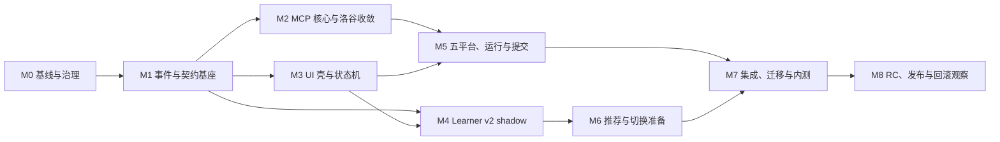

# 下一代算法学习工作台总实施编排

- 日期：2026-07-10
- 状态：Ready for implementation
- 调查基准：`098365f2f18a758692a493e9b7b31fe7fe71e163`
- 锁定需求总数：32
- 计划任务总数：78（FND 12 + MCP 17 + UI 17 + LRN 17 + INT 15）

> 本文是实施总控，不替代各分计划。执行者必须同时读取对应设计规格、ADR、分计划和需求追踪表。本规划阶段没有修改业务代码；正式实施从新的隔离工作树开始。

## 1. 任务定义

将当前 VS Code 扩展升级为状态驱动的算法学习工作台，同时完成五个平台的 OJ/MCP 联邦、可回放的学习事件与画像 v2、严格的自动补全边界、每次显式确认的真实提交，以及可验证、可迁移、可回滚的发行流程。

产品范围固定为：

- 用户：项目所有者与朋友内测。
- 最低环境：VS Code 1.125.x；发布时同时验证当前 stable。
- 平台：洛谷、LeetCode、牛客、Codeforces、AtCoder。
- UI：原生 TreeView + React WebviewView + React WebviewPanel。
- 数据：原始学习事件为唯一事实源，画像与 UI 均为投影。
- 提交：`prepare -> preview -> explicit confirm -> commit -> poll`；每次真实提交重新确认。
- 自动补全：只读本地学生代码、语言/路径标签和代码习惯，不进入学习工作台数据域。
- 迁移：旧 Student Skill 只读归档；v2 只能由可验证事件重放产生。

明确非目标：

- 不建设无人值守自动刷题或后台连续提交。
- 不声称未被对照数据证明的学习效果。
- 不统一抹平五个平台能力差异。
- 不让模型成为普通导题、运行、提交或状态同步的必经中间层。
- 不在扩展与外部 Server 中复制同一平台抓取/认证/提交逻辑。
- 不继续扩建旧 `ProblemBankViewProvider.ts` 的模板字符串 UI。

## 2. 执行前必读包

按以下顺序读取并把结论写入当前任务工作日志：

1. [可信基线](../../next-gen/baseline-audit.md)
2. [总设计规格](../specs/2026-07-10-next-generation-learning-workbench-design.md)
3. [风险登记册](../../next-gen/risk-register.md)
4. [需求追踪表](../../next-gen/requirements-traceability.md)
5. [ADR-0001：外部 OJ MCP 联邦](../../adr/0001-external-oj-mcp-federation.md)
6. [ADR-0002：混合式 VS Code UI 壳](../../adr/0002-hybrid-vscode-ui-shell.md)
7. [ADR-0003：事件派生 Learner State v2](../../adr/0003-event-derived-learner-state-v2.md)
8. [ADR-0004：每次真实提交显式确认](../../adr/0004-explicit-confirmation-for-oj-submit.md)
9. 当前里程碑对应的设计分册和实施分计划

分计划是执行细节的唯一来源：

- [事件与契约基座](./2026-07-10-event-and-contract-foundation.md)
- [OJ/MCP 联邦](./2026-07-10-oj-mcp-federation.md)
- [状态驱动 UI](./2026-07-10-state-driven-ui.md)
- [学习策略与画像 v2](./2026-07-10-learner-state-v2.md)
- [集成发布](./2026-07-10-integration-release.md)

## 3. 不可越过的基线事实

正式实施前先重放这些事实；若结果变化，更新基线附录并说明原因，不静默改写历史：

1. 基准提交的 `compile`、246 个扩展测试和 5 个内部 MCP 测试通过。
2. 用户主工作树有 14 个预先存在的未提交文件，全部是用户资产。
3. 普通 beta VSIX 可安装和激活，但包含不必要的内部/研究文档与大量散装 JS。
4. release VSIX 当前可构建且内容较干净，但安装后因缺少 `../teaching/workflow/actions` 无法激活。这是正式实施的 P0 发布阻断，不在规划分支修复。
5. 内置洛谷 MCP 只有 4 个工具，独立 `luogu-mcp-server` v0.2.1 有 11 个工具；双实现必须收敛。
6. `ProblemBankViewProvider.ts` 在用户工作树为 6685 行，Webview 与 Host 共同拥有状态，任意 Host 消息都可能清除 busy。
7. 当前真实 `studentSkill` 约 96 KB；教学提示实际发送的画像摘要中位基线约 136 token，60% 降幅门应以该 section 基线计量，而不是拿整个文件制造虚假改进。
8. 自动补全仍有 suffix、结束标记之后文本、预览路径和完整请求体缺少泄漏测试等边界风险。
9. 外部洛谷 Server 的本地构建与 33 个测试通过；live 上游连接在调查时超时，不能把网络失败误报为契约失败。
10. 当前 installed VS Code 是 1.126.0；目标最低版本仍锁定 1.125.x。

## 4. 仓库与所有权

### 4.1 扩展仓库

仓库：`student-autocomplete-lab`

拥有：

- 领域契约和 application services。
- 事件、Artifact、Attempt、LearnerState 投影。
- 类型化 `OjBroker`、capability policy、领域映射。
- VS Code UI、命令、SecretStorage、Server definition registration。
- 自动补全独立安全域。
- 集成测试、VSIX、迁移和回滚控制。

不拥有：

- 平台网页抓取细节。
- 平台登录流程与 Cookie 的解释。
- 平台提交协议实现。
- 五个平台各自响应格式的长期兼容逻辑。

### 4.2 洛谷 Server 仓库

仓库：`luogu-mcp-server`

拥有洛谷搜索、题面、提交同步、能力发现、健康、错误归一化与平台协议适配。扩展切换后，旧内置洛谷实现只作为短期 shadow 对照和回滚，不再主读。

### 4.3 OJ adapters 仓库

新仓库：`oj-mcp-adapters`

承载最薄的 Competitive Companion import、Codeforces public API、AtCoder `online-judge-tools`、牛客 import/run 和保留 upstream history 的 LeetCode package。每个包独立发布、固定精确版本，避免一个平台故障拖垮全部 provider。

### 4.4 契约发布物

`@student-autocomplete/oj-contracts` 是跨仓库唯一共享 artifact。它只包含 schema、类型、错误码、fixtures 和 conformance helpers，不包含 VS Code、MCP transport 或平台实现。

契约变更顺序固定为：

1. 在扩展仓库编写失败的契约测试和 schema 变更。
2. 发布候选契约 artifact，并固定内容 hash。
3. 外部 Server 升级并通过 conformance。
4. 扩展 Broker 升级并通过兼容窗口测试。
5. 集成分支统一 pin 精确版本。

禁止扩展和 Server 在未发布契约的情况下分别手写同名类型。

## 5. 分支与工作树策略

规划分支 `codex/next-gen-planning` 只承载本文档，不直接演化为实现分支。

从用户确认的干净基准创建以下隔离工作树：

| 车道 | 分支 | 主要任务 | 可开始条件 |
| --- | --- | --- | --- |
| Foundation | `codex/next-gen-foundation` | FND-01～FND-12 | 用户脏改动已归档且基准确认 |
| MCP | `codex/next-gen-mcp` | MCP-01～MCP-17 | FND checkpoint 已合并 |
| UI | `codex/next-gen-ui` | UI-01～UI-17 | FND-06、FND-07、FND-09 已合并 |
| Learner | `codex/next-gen-learner-v2` | LRN-01～LRN-17 | FND checkpoint + UI-02 接口可用 |
| Integration | `codex/next-gen-integration` | INT-01、INT-03～INT-15 | 三条功能车道达到各自验收门 |
| Early release repair | Foundation 上的隔离提交，完成后并入 Foundation checkpoint | INT-02 最小 bundle/installed-VSIX 闭环 | FND-01 已复现并记录 release 激活 P0 |

外部仓库分支：

- `luogu-mcp-server`: `codex/oj-contract-v1`
- `oj-mcp-adapters`: `codex/oj-contract-v1`

执行规则：

1. 不在用户当前脏工作树直接实施。
2. 每条车道先同步 Foundation checkpoint，再创建工作树。
3. 每个提交只服务一个任务编号。分计划给出的 Conventional Commit 标题可以保留，但 commit body 必须有机器可读 trailer `Task-ID: FND-03`；任务 checkpoint 标题以编号开头。追踪器按 trailer 校验，不依赖人工猜标题。
4. 跨仓库改动不得伪装成一个原子提交；使用同一 contract version/hash 和变更记录关联。
5. 功能车道不互相 cherry-pick 未完成的大提交；共享契约经 Foundation 或集成分支发布。
6. 每个任务结束时保留测试命令、结果、变更文件和回滚说明。
7. 用户主分支不接收未通过当前里程碑出口门的提交。
8. INT-02 虽沿用集成任务编号，但其早期最小提交属于 Foundation 关键路径；最终 Integration 只在该提交上加固，不另造一套 bundle pipeline。

## 6. 里程碑总览



## 7. M0：基线与治理冻结

### 入口

- 规划包已审阅。
- 用户确认实施基准提交。
- 用户当前 14 个未提交文件已由用户选择提交、暂存到独立分支或保留在原工作树。

### 操作

1. 记录扩展、洛谷 Server、VS Code、本机 MCP、Node/npm、VSIX 的精确版本。
2. 在新工作树重跑 baseline 中的 compile、完整测试、MCP 测试、普通/发行打包和全新 profile 激活。
3. 把与 2026-07-10 调查不同的结果作为增量附录，不修改原始调查结果。
4. FND-01 复现 P0 release 激活失败后，立即执行 INT-02 Phase A 的 extension bundle/当前静态资源/installed-VSIX 闭环；在修复 `../teaching/workflow/actions` 缺失并通过 G0R 前，不开始 FND-02。Vite Webview 资产留给 UI-03 后的 INT-02 Phase B。
5. 固定任务编号、契约命名和 ADR；任何变更走第 18 节的变更控制。

### 出口门 G0

- 用户资产没有被覆盖。
- 基线命令全部有时间戳、退出码和日志路径。
- 实施工作树从确认的 commit 创建。
- 所有人能区分“历史已知失败”和“新回归”。
- 已为 INT-02 建明确红灯；G0 允许历史失败存在，但 M1 的 FND-02 入口不允许它继续存在。

### 早期发布门 G0R

- INT-02 Phase A 生成本轮 hash-bound artifact manifest，fresh VS Code 1.125.x profile 安装、激活并打开当前旧 View。
- extension bundle 不缺 teaching workflow runtime；不存在 Vite manifest 时明确记录 legacy-current 资产模式，不伪造新 Webview 已完成。
- G0R 只解锁 FND-02；INT-02 仍需在 UI-03 后完成 Phase B 才整体关闭。

## 8. M1：事件与契约基座

执行 [事件与契约基座计划](./2026-07-10-event-and-contract-foundation.md) 的 FND-01～FND-12。

### 顺序

1. **批次 F1：基线与可发行地基**：FND-01 -> INT-02 Phase A -> G0R -> FND-02。
2. **批次 F2：事实源**：FND-03、FND-04、FND-05。
3. **批次 F3：领域状态与安全**：FND-06、FND-07。
4. **批次 F4：迁移与边界**：FND-08、FND-09、FND-10。
5. **批次 F5：架构门与 checkpoint**：FND-11、FND-12。

### 关键依赖

- FND-03 依赖 FND-02 的 UUID、Clock、canonical JSON 和 hash。
- FND-04 依赖 FND-03 envelope；FND-05 可在 FND-04 测试稳定后并行。
- FND-06 只消费事件契约，不直接依赖文件存储。
- FND-08 依赖 EventStore/ArtifactStore，并且只允许 dry-run 和新目录写入。
- FND-09 是独立安全门，但必须在任何新 UI/画像接入前完成。
- FND-10 必须先于新模型调用上线，否则无法证明 token 目标。

### 出口门 G1

- EventStore 在进程内和多个 VS Code Extension Host 之间都是单写者、append-only；跨进程 crash/lease recovery、复合 uniqueness 与尾损坏测试通过。
- ArtifactStore 用内容寻址，事件不内嵌大段代码/题面/答案。
- Attempt 使用 UUIDv7，不再以 `problemKey` 复用身份。
- SafetyOverlay 对 disabled skill 和答案揭示具有不可绕过的领域级约束。
- v1 archive/dry-run 幂等且不改写旧文件。
- 自动补全完整请求体泄漏测试通过。
- 架构依赖门阻止 Domain 导入 VS Code/MCP/storage/fetch。
- 固定一个可供三条车道共同使用的 Foundation checkpoint commit。
- release VSIX 全新 profile 已能激活；以后每个改变 import graph/contribution/asset/provider artifact 的里程碑重复 installed smoke。

## 9. M2：MCP 核心与洛谷收敛

先执行 MCP-01～MCP-06，再开放其他平台工作。

### 顺序

1. MCP-01 固定 OJ 契约 artifact 和 provider manifest。
2. MCP-02～MCP-03 建立 registry、client lifecycle、capability policy 和分层 health。
3. MCP-04 在外部洛谷 Server 实现同一契约。
4. MCP-05 做只读 shadow compare，保存结构化差异而非原始敏感响应。
5. MCP-06 按操作切换洛谷主读，确认旧内置实现不再接受新功能。

### 允许并行

- MCP-02 与外部仓库 MCP-04 可在 MCP-01 契约冻结后并行。
- MCP-03 可与洛谷 conformance fixtures 并行，但不能先于 MCP-02 合并。
- UI 车道可同时进行 UI-01～UI-08，不得直接调用平台 provider。
- Learner 车道可进行 LRN-01～LRN-08 shadow，不得消费未经 Broker 映射的平台原始数据。

### 出口门 G2

- 外部洛谷 Server 是权威平台实现。
- 扩展只持有 protocol client、domain mapping 和 orchestration。
- capability 来源、认证状态、风险和更新时间可见。
- live 上游失败能区分 transport、auth、rate-limit、contract drift 和 platform error。
- 旧内置实现有明确删除条件，且没有新增调用者。
- Agent-facing entrypoint 的实际 tools/list 只有 R0/R1；产品 private entrypoint 与凭据不向 Agent 暴露。

## 10. M3：UI 壳与状态机

执行 UI-01～UI-08，建立可运行的新壳，但默认 feature flag 关闭。

### 顺序

1. UI-01：protocol v2 和运行时 schema。
2. UI-02：`SessionCoordinator`、`UiProjector`、`MessageRouter`。
3. UI-03～UI-04：React/Vite 双入口和 CSP/资源安全 Host。
4. UI-05：原生题库 TreeView。
5. UI-06～UI-07：Current Session reducer 与 ONE NOW/NEXT/BEFORE。
6. UI-08：流式教练、取消和检查点。

### 强制边界

- Webview 只发送 command，不直接写 EventStore、storage、MCP 或 model。
- Host 只通过 versioned event 更新 UI；未知/过期消息必须可拒绝。
- 单个请求完成不能清除其他请求的 pending 状态。
- projection 更新不重建整页，草稿、滚动、焦点和取消状态可恢复。
- UI 不复制领域状态机，不把 DOM class 当业务状态。
- 设置、账号、provider、模型与诊断使用 VS Code 原生渐进披露；正常学习首屏不渲染配置表单、feature flags 或内部遥测。
- 动态教练只发布已完整验证的 learner-facing blocks，不把模型原始 token 流直接发送到 Webview。

### 出口门 G3

- 新 UI 可在空状态、准备、编码、流式教练、检查点和错误恢复间确定性转换。
- TreeView 与 Current Session 职责不重叠；Review Panel 的 protocol/host 边界已固定，但完整 Panel 在 UI-10 交付。
- 260/320/360/600px 的组件级截图无横向溢出。
- keyboard、ARIA/axe、theme tokens、reduced motion 和“设置不裸露/一个主行动”的基础门通过。
- 旧 Provider 仍可回滚，但不与 v2 同时写领域状态。

## 11. M4：Learner v2 shadow

执行 LRN-01～LRN-08、LRN-12～LRN-14。LRN-09～LRN-11 可以写入 shadow，但不进入主推荐。

### 顺序

1. LRN-01～LRN-02：旧工作流映射和 archive/apply migration 输入。
2. LRN-03～LRN-04：加权 Beta-Bernoulli reducer、状态门和冲突治理。
3. LRN-05：编译器、样例、测试、运行轨迹和 OJ verdict 的确定性证据 producers。
4. LRN-06～LRN-08：LLM candidate、教学安全 gate、单动作 controller 和事件化循环。
5. LRN-12～LRN-14：compact summary、replay/calibration CLI 和 v1/v2 shadow 报告。

### 强制边界

- LLM 只提出技能、误区和教学动作候选，不能直接写掌握状态。
- E5 mastery 必须有独立迁移证据；同题重复通过不能替代迁移。
- disabled 是吸收性用户覆盖，任何 reducer/recommender/model 都不能自动重激活。
- 答案只在明确放弃或用户执行 reveal 动作后可见。
- 每轮教学默认一个动作，动作必须携带可解释 reason 和 evidence references。
- 模型 learner-facing 内容在首个 block 发出前整体通过答案/完整解/子目标安全门。

### 出口门 G4

- 同一事件流和同一 `LearnerReplayContextV2` 重放得到 byte-stable 或规范化等价投影。
- 损坏、重复、乱序和冲突事件有确定处理规则。
- 画像提示 section 中位 token 不高于基线的 40%，且不以删掉必要安全上下文达成。
- 无迁移证据的 mastered 为零。
- disabled skill 重激活为零。
- v1/v2 差异报告可审阅，live 主读仍在 v1。

## 12. M5：五平台、运行与提交

执行 MCP-07～MCP-17，并完成 UI-09 的运行/提交界面；UI-12 只在 M6 执行一次。

### 平台顺序

1. MCP-07：创建 adapter monorepo 和共享测试基础。
2. MCP-08：Competitive Companion 单次导入，覆盖五平台题面入口。
3. MCP-09：Codeforces official public API read。
4. MCP-10：AtCoder 本地 `online-judge-tools` adapter，自动提交保持 `disabled_by_policy` 默认。
5. MCP-11：牛客最薄 import/run；没有可靠 submit 就诚实返回 unsupported。
6. MCP-12：在 adapter monorepo 固定 LeetCode fork package，验证双站点、认证隔离和 run/submit。
7. MCP-13：统一 RunGateway。
8. MCP-14：提交 application service 和原生确认。
9. MCP-15：SecretStorage 与 `McpServerDefinitionProvider`。
10. MCP-16～MCP-17：五平台 conformance、故障 PoC、迁移验收和旧实现清理门。

### 真实提交规则

- 默认测试只使用 fixture、mock endpoint、dry-run 或平台 sandbox。
- live submit 不是全局验收硬门；只有某 provider 已通过安全/条款审批时，首次真实提交才由项目所有者在场并使用专门测试账号与低风险测试题。
- preview 显示平台、站点、题号、语言、文件 URI、文件 hash、provider、风险和预计动作。
- confirm token 短期、单次、绑定 preview hash；过期、文档变化、provider 变化均失效。
- prepare 预分配稳定 `submissionOperationId`；Server ledger 在 dispatch 前原子消费 proof。commit 没有自动重试；超时/崩溃只按 operation id poll，不生成第二次 dispatch。
- 测试日志不记录 Cookie、API key、完整代码、完整题面或答案。

### 出口门 G5

- 五个平台 capability 探测与真实支持一致，不伪造对称能力。
- 断网、限流、认证过期、响应漂移和 provider crash 有可恢复错误路径。
- 所有凭据只进入 SecretStorage 和本地受控 transport。
- 未确认、过期确认、hash 变化和重复 commit 均不能产生外部写。
- VS Code Agent 能发现同平台的 read-only entrypoint且实际没有 R2-R4；普通 UI 流程仍直接通过 typed Broker/private entrypoint。
- 空 PATH/空 provider cache 可按 artifact manifest 安装、校验、启动、卸载和回退。

## 13. M6：推荐器与切换准备

执行 LRN-09～LRN-11、LRN-15～LRN-17，并完成 UI-10～UI-17。

### 推荐器顺序

1. LRN-09：硬过滤重复题、禁用技能、越级难度和不可用平台。
2. LRN-10：掌握度、不确定度、遗忘、迁移需求、兴趣和成本的多目标排序。
3. LRN-11：只记录 propensity 和 bandit shadow；不在首发启用在线探索。
4. LRN-15：实现切换/回滚机制，只在 fixture/脱敏副本演练；真实主读仍不切。
5. LRN-16～LRN-17：朋友内测任务、结论门和 Learner v2 验收。

### UI 收尾顺序

1. UI-10：Review Panel。
2. UI-11：主题、响应式、reduced motion 和 200% zoom。
3. UI-12：草稿、焦点、滚动锚点和多 peer 恢复。
4. UI-13：行为、协议和状态机测试替换源字符串断言。
5. UI-14～UI-15：Playwright 和真实 Extension Host 视觉/交互矩阵。
6. UI-16：绞杀旧 Provider。
7. UI-17：UI 总验收。

### 出口门 G6

- 每个推荐都有可见理由和证据，不返回被禁用或不可用平台题目。
- bandit 仅 shadow，不改变用户选择。
- `LearnerStateV2` 切换/回滚机制在副本可复现；真实用户 pointer 仍为 v1，等待 INT-04/INT-13/INT-15。
- 新 UI 完整覆盖 run、submit preview/confirm、verdict、review 和 recommendation。
- 所有目标宽度、主题、键盘、减少动画、200% zoom 和恢复场景通过真实 Extension Host 门。
- 正常首屏无设置/内部参数，视觉层级与密度人工评审通过，axe serious/critical 为零。
- 旧 Provider 不再注册，回滚包仍能在一个发布周期内恢复。

## 14. M7：集成、迁移与朋友内测

执行 INT-01～INT-13。

### 顺序

1. INT-01：建立集成分支、固定全部依赖和 contract hash。
2. INT-02 复核早期 bundle pipeline并完成可复现加固；INT-03 执行安全和许可证门。已知激活 P0 必须早在 M1 消除。
3. INT-04～INT-05：真实数据副本迁移、跨域完成语义和事件一致性。
4. INT-06：自动补全完整请求体泄漏门。
5. INT-07～INT-10：五平台黄金路径、提交故障注入、真实 UI 矩阵、隐私/发行扫描。
6. INT-11：性能与成本门。
7. INT-12：至少 30 个朋友内测任务 Gate A。
8. INT-13：全量回滚演练。

### 数据迁移顺序

1. 复制真实用户数据到隔离 fixture，删除凭据和直接身份信息。
2. 运行 archive/dry-run，记录输入 hash、事件数、丢弃理由和差异。
3. 重复 dry-run，结果必须一致。
4. 在副本运行 apply，验证旧文件未改写。
5. 重放 v2，验证 projection 和 recommender。
6. 切 pointer，完成黄金路径。
7. 一键回滚 pointer，验证旧版可读。
8. M7 到此停止，只产出真实数据副本演练报告；真实数据 apply/主读切换由 INT-15 在 RC 与回滚演练通过后执行。

### 朋友内测结论规则

- 至少 30 个完整任务，不等于 30 位用户。
- 记录任务、平台、技能、提示层级、运行/提交结果、迁移探针、用户纠偏、恢复和推荐接受情况。
- 没有对照或迁移表现时，只报告系统指标、相关性和可用性。
- 任何答案泄漏、禁用技能重激活、未确认提交或数据损坏立即停止 Gate A。

### 出口门 G7

- baseline、migrate、rollback、golden path 和 privacy 报告齐全。
- 五平台至少各有一个代表性黄金路径；不支持的写能力有明确 policy evidence。
- 30 个任务完成且没有 P0/P1 数据安全或提交安全事件。
- 性能、token、推荐硬门和视觉门达到分计划阈值。
- 全量回滚在目标时间内恢复可用旧读路径。

## 15. M8：RC、发布与观察

执行 INT-14～INT-15。

### RC 顺序

1. 从集成分支构建 deterministic release VSIX。
2. 校验 SBOM、LICENSE、NOTICE、manifest、source map 和 package contents。
3. 在全新 VS Code 1.125.x profile 安装、激活和跑黄金路径。
4. 在当前 stable 的全新 profile 重复安装与黄金路径。
5. 在空 PATH/空 provider cache 安装并校验 provider artifacts；验证 Agent read-only tools/list、扩展禁用/启用、窗口重载、provider crash、离线恢复和凭据过期。
6. 对最终安装 VSIX 重跑完整宽度/主题/reduced-motion/键盘/serializer/CSP/设置不裸露矩阵。
7. 签署发布检查表，固定 `v0.2.0-beta.1` hash。
8. 项目所有者按 INT-15 对真实数据再次 dry-run、确认 source hash、apply、冻结 v1 writer、一次切主读并完成 24h soak；通过后再向少量朋友分批开放。

### 观察指标

- 激活失败率。
- migration/rollback 失败率。
- provider health 和 contract drift。
- 未确认外部写拦截数。
- EventStore corruption/recovery。
- UI command rejection 和 stale response。
- prompt token、latency、model error。
- recommendation hard-gate violation。
- answer reveal 与 autocomplete leakage。

### 自动回退触发

以下任一条件触发停止扩散并回退：

1. 未经当次确认产生真实提交。
2. 凭据、答案、Teacher Pack、原始代码或个人事件进入日志/发行包/无关 MCP。
3. 迁移覆盖旧数据或无法恢复 pointer。
4. 自动补全完整 request 出现禁止来源内容。
5. disabled skill 被自动重激活。
6. 同一 submission operation 产生重复 upstream dispatch。
7. 全新 profile 无法激活或核心黄金路径无法启动。

### 出口门 G8

- RC 在两个 VS Code 版本全新 profile 下通过。
- 真实用户迁移由 INT-15 幂等完成；旧文件 byte-identical，rollback-compatible VSIX 可恢复 v1 read-only 且继续捕获 v2 facts。
- 发布资产 hash、SBOM、测试证据和回滚包已归档。
- 小范围观察窗内没有触发自动回退条件。
- v1 只读回滚能力保留至一个完整发布周期结束。

## 16. 任务依赖图

下表给出跨任务硬依赖；同一分计划内部未列出的顺序仍按文件顺序执行。

| 任务 | 硬依赖 | 解锁 |
| --- | --- | --- |
| FND-01 | G0 | INT-02 Phase A |
| FND-02 | FND-01、G0R | FND-03 |
| FND-03 | FND-02 | FND-04、FND-06、LRN-01 |
| FND-04 | FND-03 | FND-05、FND-08、LRN replay |
| FND-05 | FND-04 | 代码/题面/答案 artifact 引用 |
| FND-06 | FND-03 | UI-02、LRN-08 |
| FND-07 | FND-03 | UI/MCP/LRN feature rollout |
| FND-08 | FND-04、FND-05 | LRN-02、INT-04 |
| FND-09 | FND-01 | UI/LRN/MCP 集成不污染 autocomplete |
| FND-10 | FND-03 | LRN-12、INT-11 |
| FND-11 | FND-03～FND-10 | 三车道架构边界 |
| FND-12 | FND-11 | G1 与三车道并行 |
| MCP-01 | FND-12 | MCP-02、MCP-04、MCP-07 |
| MCP-02 | MCP-01 | MCP-03、MCP-05、MCP-15 |
| MCP-03 | MCP-02 | MCP-05、MCP-13、MCP-14 |
| MCP-04 | MCP-01 | MCP-05 |
| MCP-05 | MCP-02～MCP-04 | MCP-06 |
| MCP-06 | MCP-05 | 洛谷主读与 G2 |
| MCP-07 | MCP-01 | MCP-08～MCP-12 |
| MCP-08 | MCP-07 | 五平台导题 |
| MCP-09 | MCP-07 | Codeforces read |
| MCP-10 | MCP-07 | AtCoder local run/policy |
| MCP-11 | MCP-07 | 牛客 import/run |
| MCP-12 | MCP-07 | LeetCode read/run/submit |
| MCP-13 | MCP-03、MCP-08～MCP-12、LRN-01、LRN-05 | UI-09、INT-07 |
| MCP-14 | MCP-03、MCP-13、FND-07、LRN-01、LRN-05 | UI-09、INT-08 |
| MCP-15 | MCP-02、MCP-03 | Agent discovery、credential isolation |
| MCP-16 | MCP-08～MCP-15 | MCP-17、INT-07 |
| MCP-17 | MCP-06、MCP-16 | G5 |
| UI-01 | FND-06、FND-07 | UI-02、UI-06 |
| UI-02 | UI-01 | UI-05～UI-10、LRN-08 |
| UI-03 | UI-01 | UI-04、UI-06、UI-10、INT-02 Phase B |
| UI-04 | UI-03 | UI-06、UI-10 |
| UI-05 | UI-02 | 题库壳层 |
| UI-06 | UI-01～UI-04 | UI-07、UI-08、UI-12 |
| UI-07 | UI-06 | 主会话行动层 |
| UI-08 | UI-02、UI-06、UI-07 | 已验证 block 的纯渲染/检查点交互、LRN-08 |
| UI-09 | UI-02、MCP-13、MCP-14 | 运行/提交 UI |
| UI-10 | UI-02～UI-04、LRN-08、LRN-10 | 复盘/画像证据 |
| UI-11 | UI-06、UI-10 | UI-14、UI-15 |
| UI-12 | UI-02、UI-06 | UI-14、UI-15 |
| UI-13 | UI-01～UI-12 | UI-14、UI-15 |
| UI-14 | UI-11～UI-13 | UI-15、INT-09 |
| UI-15 | UI-14 | UI-16 |
| UI-16 | UI-15、FND-07 | UI-17 |
| UI-17 | UI-16 | G6、INT-09 |
| LRN-01 | FND-03、FND-04 | LRN-02、LRN-03、LRN-05 |
| LRN-02 | FND-08、LRN-01 | LRN-13、INT-04 |
| LRN-03 | LRN-01 | LRN-04、LRN-09、LRN-12 |
| LRN-04 | LRN-03、FND-07 | LRN-06、LRN-09 |
| LRN-05 | LRN-01、MCP-01 | LRN-06、LRN-08 |
| LRN-06 | LRN-04、LRN-05 | LRN-07 |
| LRN-07 | LRN-06 | LRN-08 |
| LRN-08 | UI-02、UI-08、LRN-05～LRN-07 | 生产 ValidatedBlockPublisher 接线、LRN shadow |
| LRN-09 | LRN-03、LRN-04 | LRN-10 |
| LRN-10 | LRN-09 | LRN-11、UI recommendation |
| LRN-11 | LRN-10 | offline evaluation only |
| LRN-12 | FND-10、LRN-03 | INT-11 |
| LRN-13 | LRN-02、LRN-03 | LRN-14、LRN-15 |
| LRN-14 | LRN-13 | LRN-15 |
| LRN-15 | LRN-14、FND-07 | LRN-16、INT-13 |
| LRN-16 | LRN-10、LRN-15 | LRN-17、INT-12 |
| LRN-17 | LRN-12、LRN-16 | G6 |
| INT-01 | G5、G6 | INT-03～INT-15 |
| INT-02 | FND-01（Phase A）、UI-03（Phase B） | G0R、INT-14 |
| INT-03 | INT-01、INT-02 Phase B | INT-14 |
| INT-04 | FND-08、LRN-02、INT-01 | INT-05、INT-13 |
| INT-05 | INT-04 | INT-07 |
| INT-06 | FND-09、INT-01 | privacy/release gate |
| INT-07 | MCP-16、UI-17、LRN-17、INT-05 | INT-12、INT-14 |
| INT-08 | MCP-14、MCP-16 | INT-14 |
| INT-09 | UI-17 | INT-14 |
| INT-10 | INT-02、INT-03、INT-06 | INT-14 |
| INT-11 | FND-10、LRN-12 | INT-12、INT-14 |
| INT-12 | INT-07～INT-11 | INT-13 |
| INT-13 | INT-04、LRN-15、INT-12 | INT-14 |
| INT-14 | INT-02～INT-13 | RC |
| INT-15 | INT-04、INT-13、INT-14 | G8 |

## 17. 并行执行规则

### 可安全并行

- 契约冻结后，外部洛谷 Server conformance 与扩展 Broker lifecycle。
- Foundation checkpoint 后，MCP core、UI protocol/shell、Learner evidence/reducer 三条车道。
- 五个平台的只读 adapter PoC，但共享契约变更必须先串行合并。
- UI 视觉矩阵与 Learner replay 数据准备。
- 安全/许可证扫描与朋友内测任务编排。

### 必须串行

- Event envelope 在 EventStore 之前。
- provider capability policy 在 run/submit UI 之前。
- submit preview 在 confirm/commit 之前。
- Learner shadow 报告在主读切换之前。
- 真实数据副本迁移在真实数据迁移之前。
- rollback 演练在 RC 发布之前。
- 发布内容验证在用户安装之前。

### 合并冲突高风险区

以下文件/模块由单一车道暂时拥有，其他车道通过接口协作：

| 区域 | 临时所有者 | 其他车道接入方式 |
| --- | --- | --- |
| `package.json` / build scripts | Integration | 小 PR 提议，Integration 统一 pin |
| Event contracts | Foundation | versioned artifact |
| OJ contracts | MCP | `@student-autocomplete/oj-contracts` |
| UI protocol | UI | runtime schema + generated types |
| Learner event payloads/reducer | Learner | event envelope extension point |
| extension activation wiring | Integration | 各车道提供 registration function |
| `ProblemBankViewProvider.ts` | UI | 只做 strangler 迁移，不接新业务 |
| autocomplete provider/prompt | Foundation safety owner | 只通过 Gatekeeper public API |

## 18. 变更控制

已批准的 ADR 不因实现方便被悄悄绕过。出现以下情况时必须提交 Decision Amendment：

- 新增或删除首批平台。
- 改成扩展内置平台逻辑。
- 改变每次显式确认规则。
- 允许 autocomplete 读取学习工作台数据。
- 改变事件为唯一事实源。
- 引入在线 bandit 或深度知识追踪为主读。
- 缩短、取消或提前删除“保留一个完整发布周期”的 v1 只读回滚能力。
- 改变最低 VS Code 版本。

Decision Amendment 必须包含：

1. 触发证据。
2. 被影响的 ADR、需求和任务。
3. 安全、隐私、迁移和回滚影响。
4. 新的失败测试与验收证据。
5. 用户明确批准记录。

普通实现细节在不改变锁定行为时，可由执行者按现有代码风格决定，并记录在任务提交说明中。

## 19. 每个任务的执行协议

后续执行模型对每个任务严格使用同一循环：

1. 读取任务条目、关联需求、设计段落和风险。
2. 检查工作树、分支、基准和用户已有改动。
3. 写最小失败测试，确认失败原因正是缺失行为。
4. 实现满足测试的最小变更。
5. 运行任务级测试、相关回归、compile/typecheck。
6. 检查安全边界、日志、package contents 和迁移影响。
7. 更新测试证据和需求追踪状态，不改写原始基线。
8. 自审 diff；必要时安排独立 reviewer。
9. 只提交与该任务编号相关的文件。
10. 在里程碑出口门统一运行扩大测试矩阵。

任务完成报告必须包含：

- 任务 ID 与服务的需求 ID。
- 修改文件。
- 新增/修改的契约。
- 红灯测试及其预期失败。
- 绿灯命令和退出结果。
- 未运行的测试及原因。
- 数据/安全/隐私影响。
- feature flag 和回滚动作。
- commit hash。

## 20. 测试证据层级

| 层级 | 证据 | 能证明 | 不能单独证明 |
| --- | --- | --- | --- |
| T0 | pure unit/property tests | reducer、schema、policy 纯逻辑 | VS Code/平台真实行为 |
| T1 | contract/conformance tests | 跨仓库结构和错误契约 | 平台当前可用性 |
| T2 | integration tests | application + infra 组合 | 真实 UI、真实认证 |
| T3 | Extension Host/Playwright | 安装态 UI、命令、恢复、主题 | 五平台 live 稳定性 |
| T4 | isolated live PoC | 当前平台握手/认证/运行/提交 | 长期学习效果 |
| T5 | replay/calibration | 画像、推荐、token/成本 | 真实迁移学习 |
| T6 | 朋友内测 | 使用性和有限迁移表现 | 普遍因果学习提升 |

所有总验收结论必须标记证据层级。不能用 T0 源字符串断言替代 T3 截图，也不能用 T5 replay 相关性宣称 T6 学习提升。

## 21. 风险驱动停机门

执行中出现以下情况，当前车道停止合并但保留可诊断分支：

- EventStore 发生无法解释的事件丢失、重排或非幂等重放。
- migration dry-run 与 apply 对同一输入产生不一致语义。
- OJ provider 无法区分“能力不支持”和“暂时失败”。
- 确认 token 可跨文件 hash、平台、题目或时间窗口复用。
- Webview 能绕过 Host/application service 直接写状态或发平台请求。
- LLM 输出可绕过 disabled、mastery transfer 或 answer gate。
- autocomplete 泄漏测试捕获题面、Teacher Pack、教练、画像或答案。
- release VSIX 全新 profile 激活失败。
- 真实提交测试无法确保专门账号、低风险题目和用户在场。

停止后只允许增加诊断、测试和回滚修复；不得用关闭测试或放宽契约继续推进。

## 22. 发布批次与回滚矩阵

| 批次 | 开启项 | 默认关闭项 | 回滚 |
| --- | --- | --- | --- |
| Internal A | EventStore shadow、cost telemetry | 新 UI、v2 主读、外部提交 | 保持 v2 facts capture，关闭 shadow projections |
| Internal B | 外部洛谷只读、UI v2 | 其他平台 submit、v2 主读 | 切回内置洛谷/旧 UI |
| Internal C | 五平台 read/import/run | 所有真实 submit、bandit | provider flag 逐个关闭 |
| Owner RC | v2 shadow、submit preview、真实数据迁移 dry-run | bandit online、所有未审批 live submit | rollback-compatible VSIX + v1 read-only pointer |
| Friends Gate A | 新 UI、v2 主读、支持平台单次提交 | online exploration、无人值守写 | 一键回 v1 + provider kill switch |
| Post-cycle | 删除已验证无调用旧实现 | 仍禁后台连续提交 | 保留数据 archive 与 rollback-compatible VSIX |

回滚是 pointer/registration/feature flag 切换，不删除新事件、不覆盖旧文件、不尝试“反向重写”历史。

## 23. 完成定义

本项目只有同时满足以下条件才算完成：

1. 78 个任务均有对应提交和验收证据。
2. 需求追踪表不存在未覆盖、无测试或孤立任务。
3. 五个平台 capability 探测准确，错误可恢复，能力不对称可见。
4. 没有当次显式确认就无法真实提交，且 commit 不自动重试。
5. UI 在最终安装 VSIX 的目标宽度、主题、键盘、减少动画和恢复矩阵通过；首屏不裸露设置/内部参数，层级与密度评审通过。
6. 原始事件可重放生成 v2，旧 Student Skill 只读，迁移幂等，一键回滚可用。
7. 无迁移证据 mastery、disabled 重激活、无理由推荐和答案泄漏均为零。
8. autocomplete 完整请求体禁止内容泄漏为零。
9. 凭据、原始代码、Teacher Pack、答案和个人事件不进入日志、发行包或无关 MCP。
10. release VSIX 内容干净，在 VS Code 1.125.x 与当前 stable 全新 profile 可安装、激活并完成代表性黄金路径；空 PATH/cache 可安装回退 provider，Agent tools/list 只有 R0/R1。
11. 至少 30 个朋友内测任务形成可审计报告；没有足够证据时结论用语保持克制。
12. rollback-compatible VSIX、v1 数据 archive、provider artifacts/SBOM、测试报告和发布 hash 已归档。

## 24. 交给后续 5.6 的启动指令

每次只启动一个里程碑或一个明确任务批次。首个实现任务建议使用以下上下文：

```text
你正在实施“下一代算法学习工作台”。先读取：
1. docs/next-gen/README.md
2. docs/superpowers/plans/2026-07-10-next-generation-master-program.md
3. docs/superpowers/plans/2026-07-10-event-and-contract-foundation.md
4. docs/superpowers/plans/2026-07-10-integration-release.md
5. docs/next-gen/requirements-traceability.md

当前只执行固定顺序 FND-01 -> INT-02 Phase A -> G0R -> FND-02。G0R 未通过不得开始 FND-02；不要提前执行 INT-02 Phase B。
不要改动用户原工作树；从确认基准建立独立 worktree。
严格先写失败测试，再写最小实现，运行任务列出的验证命令。不要提前实现后续 UI、MCP 或 Learner 功能。
任务结束时报告需求 ID、文件、测试、回滚、commit hash 和仍存在的基线失败。
```

后续批次沿用同一格式，只替换当前分计划和任务 ID。执行者不得因上下文窗口限制跳过基线、ADR、需求映射或出口门。
