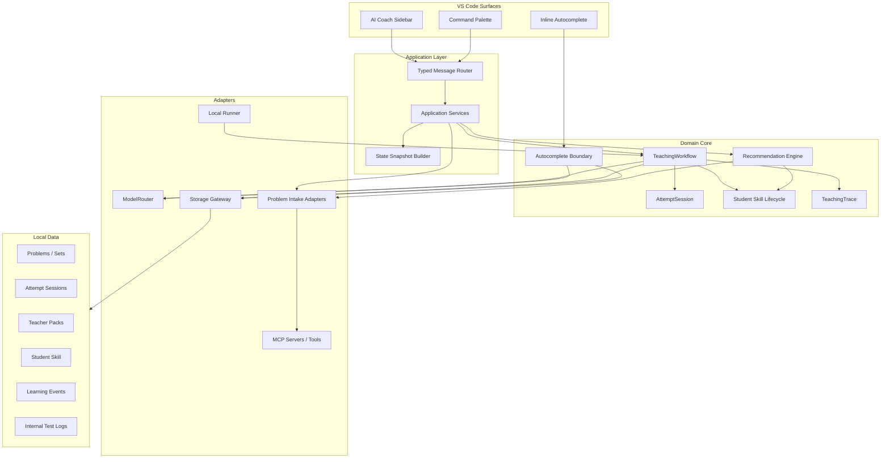

# Student Autocomplete Lab Million-Token Super Architecture Blueprint

Date: 2026-05-10

Status: master architecture blueprint for beta 0.2 and beyond. This document intentionally integrates the earlier beta 0.2 requirements, agent-framework research, teaching-eval research, learning-records research, skill-distillation research, release-lane design, internal-test design, and refactor architecture design.

This is not a public README. It is the "big brain" maintainer map for turning Student Autocomplete Lab from a promising VS Code prototype into a testable learning product.

## 0. North Star

Student Autocomplete Lab should become a local-first algorithm learning coach:

1. Safe autocomplete saves typing but never reads the problem statement, Teacher Pack, hidden standard answer, or pain-point analysis.
2. The AI coach is explicit, session-aware, and focused on the student's current code and current problem.
3. Every problem attempt creates evidence: hints, OJ-like outcome, abandon/AC flow, corrections, score, recommendation, and transfer result.
4. Student Skill is a small, testable learning model, not a blob of memories.
5. Recommendations are based on pain points, difficulty, recent history, and transfer evidence.
6. Internal testing can spend millions of tokens, but public beta release remains clean, local, and honest.

The product promise is not "AI solves problems for you." The product promise is:

> "This tool helps you notice why you are stuck, take the smallest useful next step, and build a learning profile that recommends what to practice next."

## 1. Design Inputs

### 1.1 Current Runtime Evidence

Current source shape:

- `src/sidebar/ProblemBankViewProvider.ts` is over 5000 lines and about 187k characters.
- `src/sidebar` has the largest byte footprint because host handlers, HTML, CSS, JS, Markdown rendering, and UI state are embedded in one provider.
- `src/teaching` already contains the real product core: diagnosis, lesson report, scoring, recommendation, Student Skill, taxonomy, Teacher Pack, trials, and transfer validation.
- `src/autocomplete` is already usefully separate and must stay separate.
- `src/models` and `src/config` already support multiple provider modes but need a role-based router.
- `src/practice` and CLI trials are strong enough to become the internal eval harness foundation.

Current validation strength:

- 67 test files;
- 214 unit/integration tests;
- 1000-fixture longitudinal self-evolution dry run;
- release hygiene tests;
- internal packaging tests;
- model provider listing tests;
- Student Skill disable/rollback tests;
- manual Markdown parser tests;
- autocomplete context boundary tests.

### 1.2 Prior Research Conclusions

From agent-framework research:

- Do not embed a generic multi-agent runtime in the VS Code extension.
- Build a deterministic TypeScript `TeachingWorkflow`.
- Use role prompts, guardrails, sessions, trace spans, and MCP tool boundaries.

From teaching-eval research:

- Scenario replay matters more than unit tests alone.
- Observability is a product primitive.
- Student Skill should schedule retrieval, transfer, and micro-repair.
- Structural guardrails are stronger than prompt-only guardrails.

From learning-record/UI research:

- Keep learning events local and xAPI/Caliper-inspired, not a full LRS.
- Do interpretable knowledge tracing first.
- Use Playwright screenshots as a serious UI regression gate.
- UI must show context, evidence, and control.

From skill-distillation research:

- A skill is not a memory entry; it is a reusable operating pattern with evidence and limits.
- Use observation -> candidate -> active -> mastered/disabled.
- User corrections are first-class evidence.
- Disabled skills must not silently reactivate.
- Transfer probes are required before claiming learning.

From release-lane design:

- beta dev, beta release, and beta internal must remain separate packages.
- internal logs and research artifacts never enter public release.
- beta release must be staged cleanly by composition, not post-hoc string hope.

## 2. Product Architecture In One Picture



The key rule:

> UI may request actions. UI may render state. UI may not own learning logic.

## 3. System Layers

### 3.1 UI Layer

Surfaces:

- AI Coach sidebar;
- Inline autocomplete provider;
- command palette shortcuts;
- internal testing panel in internal package only;
- future screenshot/test harness view.

Responsibilities:

- collect explicit user actions;
- show current problem/session/state;
- show model/provider status;
- render AI output safely;
- show evidence and corrections;
- never directly mutate Student Skill;
- never directly call model provider clients.

Non-responsibilities:

- deciding when a skill becomes active;
- deciding whether a recommendation should increase difficulty;
- building raw teaching prompts;
- computing storage paths;
- calling low-level fetch clients.

### 3.2 Application Layer

New folder target: `src/app/`.

Responsibilities:

- compose services for VS Code and CLI;
- route typed commands to domain workflows;
- capture editor state;
- assemble state snapshots;
- normalize user-visible errors;
- route internal records only when the internal build enables them.

Primary files:

- `src/app/createAppServices.ts`;
- `src/app/commands.ts`;
- `src/app/stateSnapshot.ts`;
- `src/app/errors.ts`;
- `src/app/buildInfo.ts`.

### 3.3 Domain Core

Domain modules are pure TypeScript and must not import `vscode`.

Core modules:

- `src/attempt`;
- `src/workflow`;
- `src/studentSkill`;
- `src/recommendation`;
- `src/autocomplete`;
- `src/teaching`;
- `src/eval`.

The domain core should be usable from:

- VS Code sidebar;
- CLI fixture runs;
- internal replay;
- future MCP internal tools;
- future webview/component tests.

### 3.4 Adapter Layer

Adapters isolate IO:

- VS Code API;
- filesystem;
- SecretStorage;
- OpenAI-compatible HTTP;
- Anthropic native HTTP;
- Luogu public-ish fetch/search;
- MCP tools;
- Python runner;
- package-lane staging scripts.

Adapter rule:

> Adapters can be messy. Domain core cannot.

## 4. Attempt Session As The Atomic Unit

The most important architecture upgrade is `AttemptSession`.

Current problem:

- A selected problem is not enough.
- A coach action is not enough.
- A code snapshot is not enough.
- Follow-up needs continuity.
- Completion review needs history.
- Student Skill merge needs evidence source.

Target:

```ts
export interface AttemptSession {
  schemaVersion: "attempt-session/v1";
  id: string;
  studentId: string;
  problemKey: string;
  problem: {
    platform: "luogu" | "leetcode" | "manual" | "synthetic";
    id: string;
    title: string;
    tags: string[];
    difficulty?: number;
    sourceUrl?: string;
  };
  state: "active" | "abandoned" | "revealed" | "completed" | "archived" | "deleted";
  language: string;
  codeSnapshots: CodeSnapshot[];
  ojVerdict: OjVerdict;
  coachThread: CoachTurn[];
  hintState: HintState;
  teacherPackRef?: TeacherPackRef;
  scoreRef?: string;
  recommendationRefs: string[];
  learningEventIds: string[];
  createdAt: string;
  updatedAt: string;
}
```

Design decisions:

- `problemKey` identifies the public problem.
- `session.id` identifies one learner attempt.
- Multiple attempts on the same problem are allowed.
- Archived sessions remain follow-up capable.
- Deleted problems do not become archived records.
- Raw code snapshots are local-only and excluded from release artifacts.

## 5. Teaching Workflow

`TeachingWorkflow` is the deterministic orchestrator. It is not an autonomous agent.

```ts
export interface TeachingWorkflow {
  giveHint(input: TeachingActionInput): Promise<TeachingActionResult>;
  giveMoreSpecificHint(input: TeachingActionInput): Promise<TeachingActionResult>;
  continueConversation(input: FollowUpInput): Promise<TeachingActionResult>;
  abandon(input: AbandonInput): Promise<LessonReportResult>;
  revealStandardAnswer(input: RevealInput): Promise<RevealResult>;
  completeReview(input: CompletionReviewInput): Promise<CompletionReviewResult>;
  estimateSubmission(input: SubmissionJudgeInput): Promise<SubmissionJudgeResult>;
  optimizeArchived(input: OptimizationInput): Promise<OptimizationResult>;
  recommendNext(input: RecommendationRequest): Promise<RecommendationResult[]>;
}
```

### 5.1 Workflow Invariants

- `giveHint` returns one primary pain point and one next step.
- `giveMoreSpecificHint` deepens the same issue unless the prior issue was clearly wrong.
- `continueConversation` can be casual, but answer leakage rules still apply.
- `abandon` creates a lesson report, not a stronger hint.
- `revealStandardAnswer` is available only after abandon/revealed state.
- `completeReview` scores learning before archive.
- `optimizeArchived` works only on completed/archived sessions.
- `recommendNext` must include reason, target skill, difficulty change, and transfer status.

### 5.2 Workflow Span Model

Every workflow step emits local trace spans:

```ts
export interface TeachingTraceSpan {
  id: string;
  sessionId: string;
  parentId?: string;
  kind:
    | "problem.intake"
    | "teacher_pack.ensure"
    | "context.gate"
    | "model.request"
    | "model.parse"
    | "skill.patch"
    | "skill.merge"
    | "attempt.event"
    | "recommendation.rank"
    | "ui.state";
  startedAt: string;
  endedAt?: string;
  modelRole?: ModelRole;
  inputContextSummary?: ContextSummary;
  outputSummary?: string;
  usage?: TokenUsage;
  error?: TraceError;
}
```

Trace spans let us answer:

- Which model call made this recommendation?
- Which Teacher Pack influenced this hint?
- Which Student Skill patch caused a bad future recommendation?
- Did autocomplete ever receive forbidden context?

## 6. AI Roles And Model Router

The extension needs a role-based model router.

```ts
export type ModelRole =
  | "autocomplete"
  | "coach"
  | "diagnosis"
  | "teacherPack"
  | "lesson"
  | "judge"
  | "score"
  | "optimizer"
  | "recommendation"
  | "verifier";
```

### 6.1 Provider Modes

Supported modes:

- OpenAI official;
- OpenAI-compatible chat;
- OpenAI-compatible completions;
- Anthropic native Messages;
- local/self-hosted compatible autocomplete;
- future MCP-backed model provider bridge only if it respects SecretStorage.

### 6.2 Routing Contract

```ts
export interface ModelRouter {
  complete(role: ModelRole, request: ModelRequest): Promise<ModelResponse>;
  listModels(config: ProviderDraftConfig): Promise<ProviderModelInfo[]>;
  healthCheck(role: ModelRole): Promise<ModelHealth>;
}
```

No feature should call `requestMimo...` by name after the refactor. MiMo becomes one OpenAI-compatible provider configuration.

### 6.3 Error Policy

Errors must include:

- provider mode;
- endpoint without API key;
- model;
- role;
- HTTP status if available;
- transient classification for 500/502/503/fetch failed.

Errors must not include:

- API keys;
- raw full problem statement unless already visible in UI;
- raw code in public logs.

### 6.4 Token Usage Policy

Token usage is required for serious internal testing.

Storage:

- `.runtime/model-usage.jsonl` for dev/internal;
- no usage logs in beta release package;
- usage summaries can be exported manually.

Fields:

- role;
- provider;
- model;
- prompt tokens;
- completion tokens;
- total tokens;
- cache hit/miss if provider reports it;
- request duration;
- parse retry count;
- scenario/session ID.

## 7. Context Gatekeeper

The Context Gatekeeper is the safety core.

```ts
export interface ContextGatekeeper {
  build(role: ModelRole, input: ContextInput): ContextBundle;
  audit(bundle: ContextBundle): ContextAuditResult;
}
```

### 7.1 Context Matrix

| Data | Autocomplete | Hint/Coach | Lesson | Score | Recommend | Internal Eval |
| --- | --- | --- | --- | --- | --- | --- |
| Current code window | yes | yes | yes | yes | summarized | yes |
| Problem statement | no | yes | yes | yes | summarized | yes |
| Teacher Pack | no | yes | yes | yes | summarized | yes |
| Standard answer | no | no | gated | no by default | no | fixture only |
| Student Skill pain points | no | yes | yes | yes | yes | yes |
| Student code habits | yes | yes | yes | yes | summarized | yes |
| Correction log | no | yes | yes | yes | yes | yes |
| Internal logs | no | no | no | no | no | yes |

### 7.2 Autocomplete Hard Rule

Autocomplete context can include:

- current document prefix/suffix;
- language id;
- file path;
- safe code habit rules;
- local style constraints.

Autocomplete context cannot include:

- problem statement;
- hidden Teacher Pack;
- standard answer;
- AI diagnosis;
- pain-point history;
- recommendation result.

This rule should be proven by tests on the prompt builder and by trace audit.

## 8. Student Skill v2

Student Skill v1 is useful but too compressed. v2 should split learning state from teaching preference.

```ts
export interface StudentSkillV2 {
  schemaVersion: "student-skill/v2";
  studentId: string;
  revision: number;
  hardRules: StudentHardRules;
  learningSkills: Record<string, LearningSkillEntry>;
  teachingPersona: TeachingPersona;
  misconceptionFamilies: Record<string, MisconceptionFamilyState>;
  transferEvidence: Record<string, TransferEvidenceState>;
  correctionLog: SkillCorrection[];
  distillationLedger: SkillDistillationEvent[];
  createdAt: string;
  updatedAt: string;
}
```

### 8.1 Learning Skill Entry

```ts
export interface LearningSkillEntry {
  id: string;
  label: string;
  status: "observation" | "candidate" | "active" | "mastered" | "disabled";
  confidence: number;
  evidenceCount: number;
  recurrenceCount: number;
  transferPassCount: number;
  transferFailCount: number;
  sourcePainPoints: string[];
  rules: string[];
  evidenceIds: string[];
  counterEvidenceIds: string[];
  lastSeen: string;
  disabledReason?: string;
  honestBoundary: string;
}
```

### 8.2 Teaching Persona

```ts
export interface TeachingPersona {
  responseLanguage: "zh-CN" | "en-US" | "raw";
  defaultDetailLevel: "short" | "normal" | "detailed";
  explanationStyle: Array<"example_first" | "concept_first" | "code_location_first" | "counterexample_first">;
  tooHardSignals: string[];
  helpfulSignals: string[];
  unhelpfulPatterns: string[];
}
```

### 8.3 Promotion Rule

```text
observation:
  created from one diagnosis or one completion review.
candidate:
  requires repeated evidence OR high-confidence diagnosis plus user confirmation.
active:
  requires repeated evidence and no strong counterevidence.
mastered:
  requires successful transfer probe or repeated low-hint success.
disabled:
  user action or strong correction. Model cannot reactivate.
```

### 8.4 Merge Rule

Models propose patches. TypeScript merges patches.

The model may say:

- "candidate skill should be X";
- "this evidence supports Y";
- "this correction weakens Z".

The deterministic merge decides:

- whether status changes;
- whether disabled remains disabled;
- whether confidence decays;
- whether transfer evidence is enough;
- whether a vague skill normalizes to a specific taxonomy.

## 9. Teacher Pack Architecture

Teacher Pack is hidden reference context. It is not student output by default.

```ts
export interface TeacherPackV2 {
  schemaVersion: "teacher-pack/v2";
  problemKey: string;
  problemHash: string;
  generatedBy: ModelIdentity;
  generatedAt: string;
  summary: string;
  constraints: string;
  expectedAlgorithm: string;
  expectedComplexity: Complexity;
  acceptableBruteForce: BruteForcePolicy;
  keyInvariants: string[];
  commonPitfalls: Pitfall[];
  minimalCounterexamples: Counterexample[];
  hintPlan: HintPlan;
  referenceSolution?: GatedReferenceSolution;
  confidence: number;
}
```

Rules:

- generate on import or first coach action;
- cache by problem hash;
- invalidate when manual Markdown changes;
- do not include raw Teacher Pack in autocomplete;
- do not publish cached Teacher Packs;
- standard answer remains gated.

## 10. Recommendation Architecture

Recommendation must become a rule engine plus model explanation, not a model-only guess.

### 10.1 Inputs

- active/candidate Student Skill;
- recent completed and deleted problems;
- transfer evidence;
- problem catalog and Luogu MCP/search candidates;
- difficulty/标签/topic;
- user intent if provided.

### 10.2 Ranking Pipeline

```text
candidate source
  -> source policy filter
  -> already-seen filter
  -> pain-point match
  -> topic match
  -> difficulty policy
  -> transfer probe policy
  -> model explanation
  -> deterministic final ranking
```

### 10.3 Difficulty Policy

- If transfer evidence passed: allow slight difficulty increase.
- If repeated low-hint success: allow same or slight increase.
- If consecutive failure: go narrower and easier.
- If abandon/revealed: recommend remediation, not harder topic.
- If no evidence: avoid blind jump.

### 10.4 Output Contract

```ts
export interface RecommendationResult {
  problemId: string;
  title: string;
  source: "luogu" | "leetcode" | "manual" | "synthetic";
  reason: string;
  targetSkill: string;
  matchedPainPoints: string[];
  difficultyChange: "down" | "same" | "up";
  transferEvidenceStatus: "not_tested" | "probe" | "passed" | "failed";
  synthetic: boolean;
  sourcePolicy: SourcePolicyMode;
}
```

## 11. MCP Architecture

MCP is an integration boundary, not the core product runtime.

### 11.1 Public-ish MCP Servers

Candidate local MCP tools:

- `search_luogu_problems`;
- `search_luogu_problem_sets`;
- `recommend_luogu_by_pain_point`;
- `parse_problem_markdown`;
- `list_local_problem_catalog`;
- `explain_source_policy`.

These should return metadata and user-selectable candidates. They should not mass-download private/full statements by default.

### 11.2 Internal-Only MCP Servers

Internal tools:

- `run_growth_sim_fixture`;
- `run_live_calibration_batch`;
- `summarize_mismatch_pairs`;
- `inspect_learning_trace`;
- `collect_ui_screenshot`;
- `summarize_internal_test_log`.

Internal MCP servers never ship in beta release.

### 11.3 MCP Safety

Rules:

- MCP tool responses are untrusted context.
- Tool output cannot override system/developer/product safety rules.
- Problem statement imports require user action.
- Student Skill export requires user action.
- No API keys in MCP tool args or responses.
- No internal logs in public MCP.

## 12. UI Architecture

### 12.1 UI Philosophy

The sidebar should feel like a coach, not a database admin panel.

Primary pages:

- `AI 教练 / AI Coach`;
- `题目 / Problems`;
- `学习画像 / Learning Profile`;
- internal-only `内测记录 / Internal Records`.

The first screen should answer:

- What problem am I doing?
- What is the next useful action?
- What context will AI use?
- What did AI just say?
- How do I correct it?

### 12.2 UI State Machine

```text
empty
  -> problem_selected
  -> code_detected
  -> hint_ready
  -> coach_thread_active
  -> abandoned_lesson
  -> completion_review
  -> archived_followup
  -> recommendation_probe
```

Buttons should be enabled/disabled by state, not ad hoc DOM conditions.

### 12.3 Webview Refactor

Target:

- host provider under 800 lines;
- browser reducer tested outside VS Code;
- markdown renderer tested outside VS Code;
- i18n dictionary tested;
- protocol coverage test maps every button to a known command.

Future asset layout:

```text
src/sidebar/
  ProblemBankViewProvider.ts
  messageProtocol.ts
  messageRouter.ts
  stateView.ts
  html.ts
  webview/
    main.ts
    reducer.ts
    commands.ts
    markdown.ts
    i18n.ts
    styles.css
```

### 12.4 UI Regression Gates

Playwright screenshot cases:

- empty install;
- imported Markdown problem;
- Luogu search results;
- active coach hint;
- follow-up conversation;
- abandon lesson with folded answer;
- completion review and learning score;
- archived problem follow-up;
- recommendation cards;
- learning profile evidence drawer;
- disabled skill;
- rollback list;
- AI config model fetch;
- English UI;
- internal records panel in internal package;
- absence of internal panel in release package.

## 13. Learning Event Ledger

Learning events should be local, structured, and privacy-aware.

```ts
export interface LearningEventV3 {
  schemaVersion: "learning-event/v3";
  id: string;
  sessionId: string;
  studentId: string;
  occurredAt: string;
  type:
    | "problem_imported"
    | "attempt_started"
    | "code_snapshot"
    | "hint_requested"
    | "followup_sent"
    | "lesson_report_created"
    | "standard_answer_revealed"
    | "completion_reviewed"
    | "skill_patch_proposed"
    | "skill_patch_merged"
    | "skill_feedback"
    | "recommendation_shown"
    | "transfer_probe_assigned"
    | "transfer_probe_result"
    | "problem_archived"
    | "problem_deleted";
  problemKey?: string;
  targetSkill?: string;
  payloadSummary: Record<string, unknown>;
  privateRefs?: {
    codeSnapshotId?: string;
    traceSpanIds?: string[];
  };
}
```

Public beta can store local learning events. Internal beta can store richer records. Public release must not include any user's events.

## 14. Evaluation Architecture

Unit tests are necessary but not enough. The product needs eval tiers.

### 14.1 Eval Tiers

| Tier | Purpose | Scale | Provider |
| --- | --- | --- | --- |
| Unit | parser, prompt, merge, recommendation invariants | every commit | local |
| Fixture longitudinal | self-evolution without model cost | 1000 samples | fixture |
| Scenario replay | full workflow with saved traces | 50-500 sessions | stub/live |
| Live calibration | model quality and parser robustness | 100-200 calls | MiMo/compatible |
| UI screenshot | clickability and layout | 10-20 states | Playwright |
| Red-team | answer leakage, prompt injection, context leaks | curated suite | stub/live |
| Release hygiene | package boundary | every package | local |
| Friend internal | real user signals | 20+ problems | internal build |

### 14.2 Million-Token Budget Use

If there is budget to spend, spend it where it creates evidence:

| Budget Lane | Token Target | Purpose |
| --- | ---: | --- |
| Teacher Pack generation | 700k | hidden references for representative public/manual problems |
| Diagnosis calibration | 900k | pain-point and skill-candidate accuracy |
| Follow-up conversations | 600k | "too hard", "simpler", casual ask, thread continuity |
| Completion review | 700k | learning score, brute-force AC, complexity gap |
| Recommendation explanations | 400k | transfer evidence and difficulty policy |
| Surrogate verifier | 500k | validate skill patches and recommendation reasons |
| Red-team prompts | 300k | answer leakage and prompt injection |
| UI copy variants | 150k | Chinese/English wording and clarity |
| Reserved retries/errors | 750k | JSON repair, transient model failures, reruns |

Total planned envelope: 5M tokens.

Million-token spending must be batchable and resumable. Never spend a large run without:

- fixture dry run passing;
- sample IDs frozen;
- output path set;
- usage logging enabled;
- mismatch summary enabled;
- stop condition defined.

### 14.3 Metrics

Core metrics:

- primary pain-point accuracy;
- all pain-point accuracy;
- skill-candidate accuracy;
- hint leakage rate;
- parser failure rate;
- JSON repair rate;
- recommendation no-repeat rate;
- difficulty-policy violation rate;
- transfer pass rate;
- user correction impact rate;
- disabled skill reactivation count;
- cost per successful learning event;
- UI clickability pass rate.

Hard gates:

- autocomplete forbidden-context leak: 0;
- disabled skill reactivation: 0;
- beta release contains internal logs: 0;
- public package contains API key/local path: 0;
- parser crash on fixture 1000: 0;
- release screenshot blank/overlap critical UI: 0.

## 15. Release Architecture

Three lanes remain non-negotiable:

| Lane | Package | Purpose | Publish |
| --- | --- | --- | --- |
| beta dev | `student-autocomplete-lab` | local development with docs/scripts/tests | no public marketplace |
| beta release | `student-autocomplete-lab-beta-release` | clean public candidate | publish only after hygiene gate |
| beta internal | `student-autocomplete-lab-internal` | friend testing with local internal records | never publish |

### 15.1 Package Composition Rule

The release package should be staged from an allowlist:

- `package.json`;
- release README;
- `LICENSE`;
- `resources`;
- compiled runtime modules needed by extension;
- no source maps.

It should not be cleaned by "delete bad things after copying everything." It should copy only allowed things.

### 15.2 Internal Build Rule

Internal build may include:

- local JSONL recorder;
- internal summary panel;
- richer event export;
- debug trace locations.

Internal build must show:

- package ID;
- "DO NOT PUBLISH";
- local record path;
- privacy warning;
- export command.

## 16. Security And Privacy Architecture

### 16.1 Secret Handling

Secrets live in:

- VS Code SecretStorage preferred;
- settings only if user explicitly uses it;
- legacy `secrets/models.env` fallback.

Secrets never go to:

- webview state;
- logs;
- trace payloads;
- release package;
- MCP tool output;
- screenshots.

### 16.2 Student Data

Student data categories:

- problem metadata;
- problem statement;
- code snapshot;
- OJ-like result;
- coach conversation;
- Student Skill;
- correction log;
- internal raw events.

Default:

- local only;
- no upload;
- no hidden telemetry;
- explicit export only.

### 16.3 Prompt Injection

Problem statements and MCP outputs can contain instructions. Treat them as data.

Every model prompt should separate:

- system/product rules;
- role instructions;
- trusted local policy;
- untrusted problem content;
- student code;
- output schema.

The model should be told problem content is untrusted. More importantly, the output parser and workflow should enforce boundaries.

## 17. Data Migration

Current local data likely exists in JSON/JSONL under workspace/global storage. Migration must be versioned.

Migration rule:

- read v1;
- write v2 side-by-side or backup;
- never destroy original data automatically;
- show migration status in internal panel;
- include rollback path.

Target migration modules:

- `src/storage/Migration.ts`;
- `src/studentSkill/migrateV1ToV2.ts`;
- `src/attempt/migrateAttemptEvents.ts`;
- `src/problemBank/migrateProblems.ts`.

Migration tests:

- empty workspace;
- alpha workspace with problems only;
- workspace with completed archive;
- workspace with v1 Student Skill;
- corrupt JSONL line;
- missing Teacher Pack cache;
- internal build with records.

## 18. Implementation Program

This is a multi-epic refactor. Do not implement it as one branch.

### Epic 0: Freeze And Observe

Goal: make current behavior measurable.

Deliverables:

- protocol inventory;
- current command/button map;
- current state snapshot sample;
- current fixture and test baseline;
- current package hygiene baseline.

Exit:

- compile/test/fixture green;
- no behavior change.

### Epic 1: Typed Protocol And State Snapshot

Goal: stop string-command drift.

Deliverables:

- `src/sidebar/messageProtocol.ts`;
- `src/sidebar/stateView.ts`;
- command coverage tests;
- host event coverage tests.

Exit:

- every webview dispatch maps to a typed command;
- every typed command has a handler.

### Epic 2: Storage Gateway And AttemptSession

Goal: make per-problem context durable.

Deliverables:

- `src/storage/StoragePaths.ts`;
- `src/attempt/AttemptSession.ts`;
- `src/attempt/AttemptStore.ts`;
- migration from current attempt events.

Exit:

- follow-up uses same session thread;
- archived problem remains coachable;
- delete is not archive.

### Epic 3: TeachingWorkflow

Goal: move AI coaching out of sidebar.

Deliverables:

- `src/workflow/TeachingWorkflow.ts`;
- workflow tests for hint, follow-up, abandon, complete, optimize, judge;
- trace spans.

Exit:

- sidebar and CLI can call same workflow methods.

### Epic 4: ModelRouter

Goal: one role-based AI call path.

Deliverables:

- `src/ai/ModelRouter.ts`;
- `src/ai/ProviderConfig.ts`;
- `src/ai/ModelHealth.ts`;
- usage logging.

Exit:

- no new code calls MiMo-named helpers directly;
- provider errors are clear and key-safe.

### Epic 5: Student Skill v2

Goal: real self-evolution lifecycle.

Deliverables:

- v2 schema;
- v1 migration;
- deterministic patch merge;
- evidence cards;
- transfer states;
- disabled reactivation tests.

Exit:

- observation/candidate/active/mastered/disabled works;
- correction affects next merge.

### Epic 6: Recommendation Engine v2

Goal: recommendation becomes explainable and transfer-aware.

Deliverables:

- moved `src/recommendation`;
- Luogu MCP candidates integrated;
- difficulty policy;
- no-repeat filter;
- transfer probe assignment.

Exit:

- recommendation cards always explain target skill and difficulty change.

### Epic 7: Webview Split And UI Gates

Goal: make UI changes safe.

Deliverables:

- extracted markdown renderer;
- extracted reducer;
- extracted CSS/i18n;
- Playwright screenshot runner.

Exit:

- provider under 800 lines;
- clickability tests cover main actions.

### Epic 8: Eval Harness v2

Goal: million-token experiments become controlled.

Deliverables:

- scenario replay format;
- resumable live batch CLI;
- mismatch summary;
- token usage report;
- red-team suite.

Exit:

- 1000 fixture dry run;
- 100 live call calibration;
- no parser crash.

### Epic 9: Release Lane Hardening

Goal: beta release becomes publishable.

Deliverables:

- allowlist release staging;
- internal build banner;
- package diff report;
- release checklist.

Exit:

- beta release clean;
- internal lane clearly private.

## 19. Governance Rules

Rules for future work:

1. Do not change UI and AI prompt semantics in the same commit.
2. Do not change storage schema without migration tests.
3. Do not add a model role without context-gate tests.
4. Do not promote a Student Skill status by prompt alone.
5. Do not add an MCP tool without a source/permission policy.
6. Do not run live batches without output path, resume key, and usage logging.
7. Do not publish a package that was not staged from allowlist.
8. Do not claim learning improvement without transfer evidence.
9. Do not call AI judge an official OJ result.
10. Do not let autocomplete read problem statements.

## 20. Architecture Debt Register

| Debt | Severity | Why It Matters | Fix Epic |
| --- | --- | --- | --- |
| Sidebar monolith | high | UI bugs and command drift | 1, 7 |
| No durable AttemptSession | high | follow-up and cache continuity weak | 2 |
| AI calls scattered by feature | high | provider config and errors drift | 4 |
| Student Skill v1 lifecycle too simple | high | self-evolution claim underpowered | 5 |
| Recommendation partly model/explanation-driven | medium | weak transfer proof | 6 |
| Webview tests are source-substring heavy | medium | catches some bugs but not behavior | 7 |
| Release cleaning partly scanner-based | medium | future accidental leak risk | 9 |
| Internal traces not unified | medium | live runs hard to compare | 8 |
| MCP tool boundary young | medium | future prompt/tool injection risk | 6, 8 |
| English UI beta only | low | publish polish | 7 |

## 21. The "Super" Target State

When this architecture is real, the product can support this story:

1. Student imports a Markdown or Luogu problem.
2. Extension creates an `AttemptSession`.
3. Autocomplete helps with syntax using only code context.
4. Student asks for a hint.
5. `TeachingWorkflow` builds a context bundle, proving what it included.
6. Teacher Pack and Student Skill guide the diagnosis.
7. The hint is short, focused, and non-spoiling.
8. Student says "too hard".
9. The same session thread continues and lowers the explanation level.
10. Student completes or gives up.
11. The workflow creates a lesson or learning score.
12. Student Skill patch is proposed, verified, and deterministically merged.
13. Learning Profile shows the evidence and lets the student correct it.
14. Recommendation engine proposes the next problem with reason and transfer status.
15. Internal build records the session locally.
16. Eval harness can replay the session later.
17. Beta release can ship without any internal logs or research artifacts.

That is the product.

## 22. First Three Concrete Moves

If we start implementing after this design, do these first:

1. **Protocol seam**: create typed webview command and host event contracts, with coverage tests.
2. **AttemptSession seam**: add persistent session storage and route follow-up through it.
3. **TeachingWorkflow seam**: move hint/follow-up/abandon/complete orchestration out of `ProblemBankViewProvider`.

Do not start with:

- React rewrite;
- new model provider features;
- more prompt tuning;
- full live 1000-call experiments;
- public release.

The architecture has to earn those.

