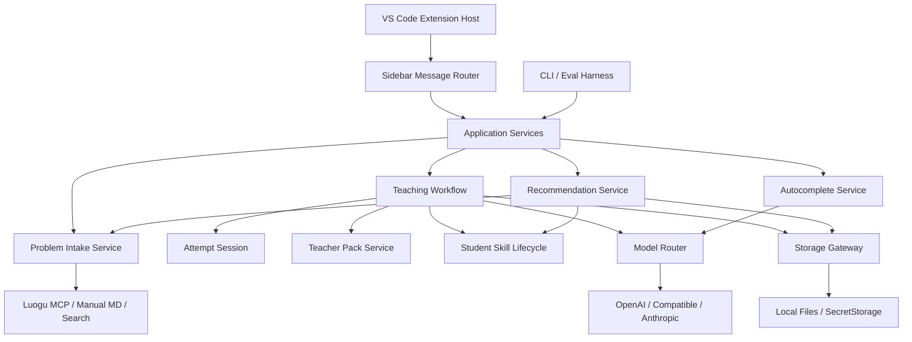

# Student Autocomplete Lab Refactor Architecture Design

Date: 2026-05-10

Status: refactor-level architecture design for beta 0.2. This is a maintainer-facing design document, not a public release note.

## 1. Summary

Student Autocomplete Lab is past the "small VS Code prototype" stage. The product now has safe autocomplete, AI coach actions, manual Markdown import, Luogu search/import, Student Skill, learning score, optimization review, recommendation, internal testing, release lanes, and longitudinal evals. The current runtime works, but the architecture is strained.

The main refactor target is not "make the code prettier." The target is to make the product safe to keep changing:

- UI actions should not break unrelated AI flows.
- AI provider routing should be one service, not scattered helpers.
- Every problem should have a persistent attempt session and coach thread.
- Student Skill evolution should be a deterministic lifecycle with evidence.
- Release/internal/beta lanes should be enforced by composition, not string stripping.
- Large evals should run against the same workflow core as the VS Code UI.

Recommended strategy: **domain-core refactor with staged UI extraction**.

Do not rewrite the extension in React/Vite yet. First extract the core state machine, command contracts, model router, and persistence boundaries from the current sidebar monolith. Once the runtime core is testable, split the webview HTML/CSS/JS into files or a small bundled frontend.

## 2. Current Baseline

### 2.1 Good Existing Shape

The repository already has useful module boundaries:

- `src/autocomplete`: prompt boundary, request gate, inline provider.
- `src/problemBank`: Luogu/manual/search/source policy.
- `src/models`: OpenAI-compatible completions/chat/responses/model listing.
- `src/teaching`: diagnosis, lesson report, scoring, optimization, recommendation, taxonomy, Teacher Pack, Student Skill.
- `src/practice`: local execution, fixtures, trial planning.
- `src/internalTesting`: private local records.
- `src/release`: release-time internal no-op.

The test surface is strong for a beta project:

- pure domain tests for teaching, recommendation, manual parser, provider models;
- longitudinal self-evolution fixture gate;
- release hygiene checks;
- webview string tests that caught real UI regressions.

### 2.2 Main Structural Problem

`src/sidebar/ProblemBankViewProvider.ts` is doing too much:

- 5178 lines;
- about 187k characters;
- message protocol definitions;
- filesystem path selection;
- problem import/search/persistence;
- Teacher Pack generation;
- AI coach dispatch;
- lesson/score/optimization/submission judge;
- Student Skill feedback/disable/rollback;
- internal testing record calls;
- full HTML, CSS, and browser-side JavaScript;
- markdown renderer;
- UI translations;
- local state and event listeners.

This explains the observed product pain:

- a UI button can break because a string ID, event listener, message command, and host handler drift apart;
- custom "Ask AI" can fail while fixed buttons work;
- learning score can archive a problem and accidentally remove follow-up context;
- UI tests assert source substrings instead of behavior because the webview script is embedded;
- release hygiene has to strip strings instead of excluding modules cleanly.

## 3. Alternatives Considered

### Option A: Small Extraction Only

Split `ProblemBankViewProvider.ts` into `renderHtml`, `webviewScript`, and `messageHandlers`, leaving behavior mostly intact.

Pros:

- fastest;
- low risk;
- immediately reduces file size.

Cons:

- does not solve hidden coupling between UI commands and teaching state;
- CLI/eval and UI still use different orchestration paths;
- Student Skill lifecycle remains bolted onto diagnosis calls.

Use this only for emergency UI stabilization.

### Option B: Domain-Core Refactor With Staged UI Extraction

Extract a TypeScript application core:

- `AttemptSession`;
- `TeachingWorkflow`;
- `ModelRouter`;
- `StudentSkillLifecycle`;
- `RecommendationService`;
- `ProblemIntakeService`;
- `StorageGateway`.

The VS Code sidebar becomes a client of this core. CLI trials also call the same core.

Pros:

- fixes the real architecture problem;
- keeps current extension API and tests usable;
- allows TDD around domain behavior before UI rewiring;
- preserves release/internal lanes.

Cons:

- slower than a pure UI split;
- requires careful adapter shims so existing behavior keeps passing.

This is the recommended route.

### Option C: Full Frontend Rewrite First

Move the webview to React/Svelte/Vite and redesign the UI around a store.

Pros:

- best UI developer experience eventually;
- easier Playwright/component testing later.

Cons:

- high churn before the domain state is stable;
- can recreate current bugs with nicer components;
- complicates VSIX release hygiene and packaging now.

Defer until after Option B's core exists.

## 4. Target Architecture



### 4.1 Dependency Rule

Dependencies flow inward:

```text
VS Code UI / CLI
  -> application services
    -> domain workflow
      -> pure domain modules
    -> adapters: storage, models, problem sources
```

Domain modules must not import `vscode`.

UI modules must not directly call model clients, Student Skill merge logic, or file paths except through application services.

Autocomplete must remain independent from problem statements and Teacher Packs.

## 5. Proposed Module Layout

### 5.1 Application Layer

New folder: `src/app/`

| File | Responsibility |
| --- | --- |
| `services.ts` | Compose app services from VS Code context, storage paths, model router, recorders |
| `commands.ts` | Typed command handlers used by webview and command palette |
| `stateSnapshot.ts` | Build UI state snapshot without rendering HTML |
| `errors.ts` | Normalize user-visible errors without leaking keys |

The app layer is the only layer that coordinates multiple domains.

### 5.2 Attempt Layer

New folder: `src/attempt/`

| File | Responsibility |
| --- | --- |
| `AttemptSession.ts` | Persistent per-problem state: selected problem, code snapshot, OJ status, coach thread, hint count |
| `AttemptEventLedger.ts` | Append and summarize attempt events |
| `AttemptStore.ts` | Load/save sessions and events |
| `types.ts` | Stable contracts |

An `AttemptSession` is the unit of context caching. The AI coach should not start from scratch on every click.

Core type:

```ts
export interface AttemptSession {
  id: string;
  problemKey: string;
  problemId: string;
  title: string;
  language: string;
  status: "active" | "abandoned" | "completed" | "archived" | "deleted";
  codeSnapshot?: {
    text: string;
    hash: string;
    capturedAt: string;
  };
  ojVerdict: OjVerdict;
  hintCount: number;
  coachThread: CoachTurn[];
  teacherPackId?: string;
  createdAt: string;
  updatedAt: string;
}
```

### 5.3 Teaching Workflow

New folder: `src/workflow/`

| File | Responsibility |
| --- | --- |
| `TeachingWorkflow.ts` | One deterministic entrypoint for hint, follow-up, abandon lesson, completion review, optimization, judge estimate |
| `TeachingTrace.ts` | Local trace spans for internal/debug builds |
| `TeachingWorkflowPrompts.ts` | Route prompt selection, not raw provider calls |
| `TeachingWorkflowResult.ts` | UI/CLI-safe result shapes |

Workflow methods:

```ts
interface TeachingWorkflow {
  giveHint(input: TeachingActionInput): Promise<TeachingActionResult>;
  continueConversation(input: TeachingActionInput): Promise<TeachingActionResult>;
  abandon(input: TeachingActionInput): Promise<LessonActionResult>;
  completeReview(input: CompletionReviewInput): Promise<CompletionReviewResult>;
  optimizeArchived(input: OptimizationInput): Promise<OptimizationResult>;
  estimateSubmission(input: SubmissionJudgeInput): Promise<SubmissionJudgeResult>;
}
```

Rules:

- all coach actions load or create an `AttemptSession`;
- all actions append trace spans and attempt events;
- only abandon can reveal standard answer;
- completion review can archive only after the review result is recorded;
- follow-up reads the current session thread;
- Student Skill merge is a workflow step, not a sidebar helper.

### 5.4 Model Router

New folder: `src/ai/`

| File | Responsibility |
| --- | --- |
| `ModelRouter.ts` | Role-based routing: autocomplete, coach, teacherPack, judge, score, optimize, recommend |
| `ProviderConfig.ts` | Convert VS Code settings + SecretStorage + legacy env into typed config |
| `ProviderClient.ts` | Calls current `models/*Client` functions through one interface |
| `ModelHealth.ts` | Health check, transient error classification, model list cache |
| `usage.ts` | Usage accounting to `.runtime`, never release |

Model roles:

- `autocomplete`;
- `coach`;
- `diagnosis`;
- `teacherPack`;
- `judge`;
- `score`;
- `optimizer`;
- `recommendation`;
- `verifier`.

The current `requireMimoTeachingConfig` / `requireMimoAutocompleteConfig` naming should be retired or wrapped. The public API should not pretend every provider is MiMo.

### 5.5 Student Skill Lifecycle

New folder: `src/studentSkill/` or keep `src/teaching/studentSkill.ts` as a compatibility barrel while moving implementation.

| File | Responsibility |
| --- | --- |
| `schema.ts` | `student-skill/v2` types |
| `patch.ts` | Model-proposed patch shape |
| `merge.ts` | Deterministic merge rules |
| `lifecycle.ts` | observation/candidate/active/mastered/disabled transitions |
| `evidence.ts` | Evidence cards and counterexamples |
| `summary.ts` | Safe summaries for coach/autocomplete/recommendation |
| `store.ts` | Load/save/archive/rollback |

Target lifecycle:

```text
observation -> candidate -> active -> mastered
        \          \          \
         \          -> disabled
          -> disabled
```

Rules:

- `diagnosis_wrong` adds counterevidence and may downgrade;
- user `disable` is a hard rule and cannot be undone by a model patch;
- `active` requires evidence thresholds, not one model guess;
- `mastered` requires transfer evidence;
- autocomplete receives code habits only, not pain points or problem statements.

### 5.6 Recommendation Engine

New folder: `src/recommendation/`

Move current recommendation logic out of `src/teaching`.

Responsibilities:

- consume Student Skill evidence;
- query public candidates through Luogu MCP/search adapters;
- avoid recently archived/deleted problems;
- create transfer probes;
- explain difficulty changes;
- distinguish public problems from synthetic micro-drills.

Stable output:

```ts
interface RecommendationResult {
  problemId: string;
  title: string;
  source: "luogu" | "leetcode" | "manual" | "synthetic";
  reason: string;
  targetSkill: string;
  difficultyChange: "down" | "same" | "up";
  transferEvidenceStatus: "not_tested" | "probe" | "passed" | "failed";
}
```

### 5.7 Sidebar UI

New folder: `src/sidebar/`

Keep VS Code provider thin:

| File | Responsibility |
| --- | --- |
| `ProblemBankViewProvider.ts` | Register webview, forward messages, post host events |
| `messageProtocol.ts` | `WebviewCommand` and `HostEvent` types |
| `messageRouter.ts` | Calls `src/app/commands.ts` |
| `stateView.ts` | Convert app state to UI-friendly view model |
| `html.ts` | Render shell only |
| `webview/main.ts` | Browser-side state and event handlers |
| `webview/markdown.ts` | Safe markdown/math renderer |
| `webview/i18n.ts` | zh/en text |
| `webview/styles.css` | CSS |

Near-term no-bundler option:

- keep inline HTML generation;
- load string constants from `.ts` modules;
- unit test browser-side helpers as pure functions.

Later Vite option:

- package webview assets into `dist/webview`;
- keep CSP strict;
- add `vsce ls --tree` release hygiene gates.

### 5.8 Storage

New folder: `src/storage/`

Keep JSONL/JSON, but create one gateway:

| File | Responsibility |
| --- | --- |
| `StoragePaths.ts` | Compute workspace/global paths |
| `JsonStore.ts` | Read/write JSON files |
| `JsonlStore.ts` | Existing append/lenient reader |
| `SecretStore.ts` | VS Code SecretStorage wrapper |
| `Migration.ts` | Versioned local data migration |

No domain module should hand-roll file paths.

## 6. Message Protocol

Current string commands should become a discriminated union shared by host and webview:

```ts
export type WebviewCommand =
  | { type: "problem.importLuogu"; pid: string; language: PracticeLanguage; createFile: boolean }
  | { type: "problem.importMarkdownFile" }
  | { type: "problem.delete"; problemKey: string; scope: "active" | "completed" }
  | { type: "coach.hint"; problemKey: string; ojVerdict: OjVerdict; request?: string }
  | { type: "coach.followUp"; problemKey: string; request: string }
  | { type: "coach.abandon"; problemKey: string; request?: string }
  | { type: "attempt.completeReview"; problemKey: string; ojVerdict: OjVerdict; request?: string }
  | { type: "skill.feedback"; skillName: string; feedback: "diagnosis_wrong" | "diagnosis_helpful"; note?: string }
  | { type: "skill.disable"; skillName: string; reason?: string }
  | { type: "skill.rollback"; versionId: string }
  | { type: "ai.saveConfig"; config: AiProviderConfigUpdate }
  | { type: "ai.fetchModels"; config: AiProviderConfigUpdate };
```

Host events should be explicit:

```ts
export type HostEvent =
  | { type: "state"; state: SidebarStateView }
  | { type: "busy"; action: string; text: string }
  | { type: "coach.result"; sessionId: string; result: TeachingActionResult }
  | { type: "models.result"; models: ProviderModelInfo[]; warnings: string[] }
  | { type: "error"; action?: string; message: string; recoverable: boolean };
```

The webview should not infer success from arbitrary object shapes.

## 7. Data Flow Examples

### 7.1 Hint

```text
Webview coach.hint
  -> messageRouter
  -> app.commands.giveHint
  -> AttemptStore.loadOrCreate(problemKey)
  -> capture active editor code
  -> TeacherPackService.ensure(problem)
  -> TeachingWorkflow.giveHint
  -> ModelRouter.call("diagnosis")
  -> parse + normalize taxonomy
  -> StudentSkillLifecycle.mergePatch
  -> AttemptEventLedger.append
  -> Store.save
  -> HostEvent coach.result + state
```

### 7.2 Ask AI / Follow-Up

```text
Webview coach.followUp
  -> load AttemptSession.coachThread
  -> append user turn
  -> TeachingWorkflow.continueConversation
  -> ModelRouter.call("coach")
  -> append assistant turn
  -> no automatic archive
  -> no full answer unless session state is abandoned/revealed
```

### 7.3 Completion Review

```text
Webview attempt.completeReview
  -> capture code and OJ verdict
  -> TeachingWorkflow.completeReview
  -> SolutionScore + complexity verdict
  -> StudentSkill patch from review
  -> archive after result is persisted
  -> keep session selectable for follow-up
```

## 8. Migration Plan

### Phase 0: Freeze Current Behavior

- Keep all existing tests.
- Add a golden fixture for current sidebar command IDs.
- Add a small webview protocol test that fails when a command has no host handler.
- Do not change visible UI in this phase.

### Phase 1: Extract Contracts

Create:

- `src/sidebar/messageProtocol.ts`;
- `src/sidebar/stateView.ts`;
- `src/app/errors.ts`;
- `src/app/commands.ts` as a thin wrapper around current provider methods.

Goal: no behavior change, but commands and host events become typed.

### Phase 2: Extract Storage and State Snapshot

Create:

- `src/storage/StoragePaths.ts`;
- `src/app/stateSnapshot.ts`;
- `src/attempt/AttemptStore.ts`;
- `src/attempt/AttemptEventLedger.ts`.

Move path helpers and state-building out of `ProblemBankViewProvider`.

### Phase 3: Extract Teaching Workflow

Create:

- `src/workflow/TeachingWorkflow.ts`;
- `src/workflow/TeachingTrace.ts`;
- `src/workflow/TeachingWorkflowResult.ts`.

Move hint, follow-up, abandon, score, optimization, and judge orchestration into workflow methods.

### Phase 4: Extract Model Router

Create:

- `src/ai/ModelRouter.ts`;
- `src/ai/ProviderConfig.ts`;
- `src/ai/ModelHealth.ts`.

All AI calls route through role-based methods. Keep existing `src/models/*` as low-level clients.

### Phase 5: Student Skill v2 Lifecycle

Create:

- `src/studentSkill/schema.ts`;
- `src/studentSkill/merge.ts`;
- `src/studentSkill/lifecycle.ts`;
- `src/studentSkill/evidence.ts`.

Keep compatibility with `student-skill/v1` by migration. Add `observation` and `mastered` states after tests exist.

### Phase 6: UI Asset Split

Split the webview:

- markdown renderer;
- i18n;
- state reducer;
- event binding;
- CSS.

Only after this phase consider Vite/React/Svelte.

## 9. Testing Strategy

### 9.1 Contract Tests

Add tests that every `WebviewCommand.type` has a host handler and every button dispatches a known command.

This replaces brittle source-substring checks over time.

### 9.2 Workflow Tests

Test the workflow without VS Code:

- hint does not reveal full answer;
- follow-up keeps same session thread;
- abandon produces lesson report and gates standard answer;
- completion review persists score before archive;
- archived problem remains coachable;
- AI judge is marked as estimate.

### 9.3 Student Skill Lifecycle Tests

Required cases:

- user correction downgrades or disables a skill;
- disabled skill does not reactivate from model patch;
- observation does not affect prompts strongly;
- candidate promotes only with evidence threshold;
- mastered requires transfer evidence;
- autocomplete summary excludes problem statement and pain-point details.

### 9.4 UI Tests

Near-term:

- pure tests for markdown renderer and state reducer;
- source tests only for VS Code contribution wiring.

Medium-term:

- Playwright screenshot gates for sidebar states:
  - empty state;
  - imported problem;
  - AI coach answer;
  - learning profile with evidence drawer;
  - model config and fetched models;
  - English UI.

### 9.5 Release Hygiene

Update hygiene checks so release package composition proves:

- no `src/internalTesting`;
- no internal strings;
- no docs/scripts/tests/fixtures;
- no source maps;
- no local paths;
- no API keys;
- no runtime student records.

## 10. Refactor Guardrails

- One phase per PR/commit series.
- Each phase must keep `npm run compile` and `npm test` green.
- Fixture self-evolution gate runs after any teaching or Student Skill change.
- Do not mix UI redesign with workflow extraction.
- Do not change AI prompts and storage schema in the same commit.
- Do not delete old adapters until CLI and VS Code both use the new path.
- Keep beta/internal/release package IDs distinct.

## 11. Success Criteria

The refactor is successful when:

- `ProblemBankViewProvider.ts` is under 800 lines and only owns VS Code webview registration plus message forwarding;
- no domain module imports `vscode`;
- CLI longitudinal eval and sidebar AI coach call the same `TeachingWorkflow`;
- all provider calls go through `ModelRouter`;
- `Ask AI` follow-up always uses the same `AttemptSession` thread;
- Student Skill lifecycle can be inspected through evidence cards;
- disabled skills cannot be reactivated by model patches;
- autocomplete tests prove no problem statement, Teacher Pack, or standard answer enters the prompt;
- release hygiene is enforced by package composition, not only post-hoc content scanning.

## 12. First Implementation Slice

The first actual implementation slice should be deliberately boring:

1. Add `messageProtocol.ts` with current command names.
2. Add `stateView.ts` for the current sidebar snapshot type.
3. Add a protocol coverage test:
   - all webview-dispatched commands are in the union;
   - all union commands have host handlers.
4. Move only message types and helper view types out of `ProblemBankViewProvider.ts`.
5. Do not change UI behavior.

This gives us a typed seam before touching the risky AI coach/UI logic.

