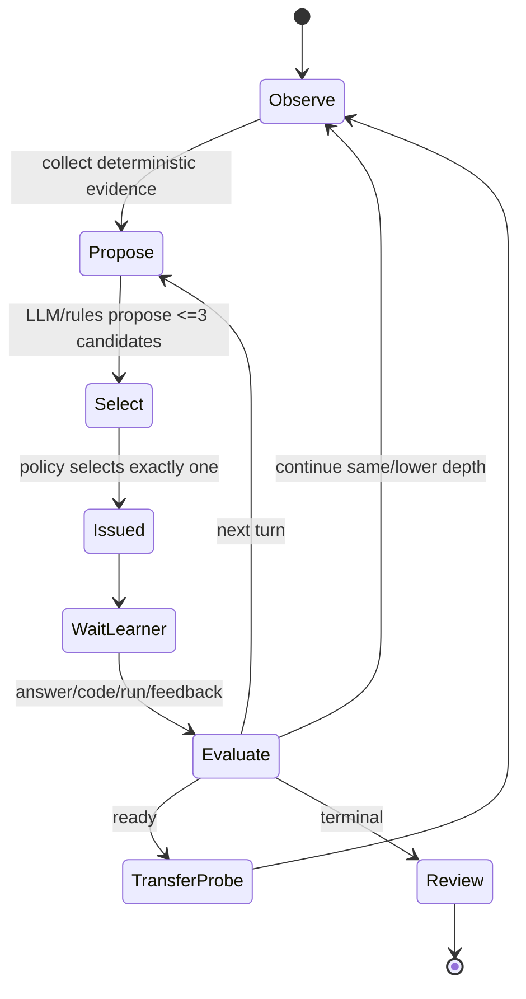

# 学习证据、Learner State v2 与教学策略设计规格

- 日期：2026-07-10
- 状态：Approved for implementation planning
- 关联 ADR：[ADR-0003](../../adr/0003-event-derived-learner-state-v2.md)

## 1. 核心决策

```text
不可变 LearnerEvidenceEvent
  -> 版本化、纯函数 Reducer
  -> 可丢弃 LearnerStateV2
  -> 单教学动作 Controller
  -> 两阶段 Recommendation
```

LLM 只提出技能标签、误区和动作候选；它永远不能直接晋级、掌握、解除禁用、加难或提交答案。

## 2. 不变量

1. 事件是唯一事实源，State 可删除并重放。
2. E0/E1 不增加掌握概率。
3. `disabled` 是安全 overlay 的吸收态，只有明确用户 re-enable event 可解除。
4. 用户纠偏使被指向 attribution 在重放中失效，不只是减一个分数。
5. 掌握必须有两个不同问题族的 E5 pass，至少一个延迟 ≥7 天。
6. 加难必须有最近 E5 pass，且先修技能可信下界达标。
7. 看过答案或发生 autocomplete answer risk 后的正确结果，正向掌握权重为 0。
8. 同一 independence key 不重复计证据。
9. 每个 turn 最多一个 `teaching_action_issued`。
10. 静态、动态、OJ 证据优先于 LLM attribution。
11. 推荐先硬过滤，再排序；排序无权放行被过滤候选。
12. 旧 Student Skill 结论不能作为 E2+ 继承。

## 3. 事件模型

### 3.1 Header

```ts
export type EvidenceLevel = "E0" | "E1" | "E2" | "E3" | "E4" | "E5";

export interface LearnerEvidenceEventHeader {
  schemaVersion: "learner-evidence-event/v1";
  eventId: string;              // UUIDv7
  learnerId: string;
  occurredAt: string;
  recordedAt: string;
  sequence: number;             // learner-scoped monotonic sequence
  uniquenessKey?: string;       // optional domain uniqueness, enforced atomically
  attempt?: {
    sessionId: string;
    attemptId: string;
    turnId?: string;
  };
  subject: {
    problemKey?: string;
    problemVersion?: string;
    problemFamily?: string;
    language?: string;
    artifactRef?: string;
    artifactHash?: string;
  };
  targets: Array<{
    skillId: string;
    taxonomyVersion: string;
    role: "primary" | "secondary";
    attribution: "deterministic" | "user" | "llm_candidate";
  }>;
  observation: {
    level: EvidenceLevel;
    modality: "interaction" | "static" | "dynamic" | "external" | "transfer" | "governance";
    outcome: "pass" | "fail" | "unknown";
    independenceKey: string;
    metrics?: {
      passed?: number;
      total?: number;
      durationMs?: number;
      score?: number;
    };
  };
  assistance: {
    hintUnits: number;
    answerRevealed: boolean;
    autocompleteExposure: "none" | "local_only" | "answer_risk";
  };
  transfer?: {
    isProbe: boolean;
    unseenProblem: boolean;
    surfaceDistance: number;     // 0..1, taxonomy/version-defined
    delayHours: number;
  };
  provenance: {
    producer: string;
    producerVersion: string;
    model?: string;
    promptHash?: string;
    analyzerVersion?: string;
    sourceEventIds?: string[];
  };
  privacy: {
    rawCodeStored: boolean;
    localOnly: true;
  };
  integrity: {
    prevHash: string;
    contentHash: string;
  };
}
```

代码默认存本地 content-addressed artifact；事件记录 hash、语言、静态事实和测试摘要。`contentHash` 对 canonical JSON 计算；`prevHash` 形成 learner-scoped 可检查链。完整性链用于发现损坏，不宣称对本机恶意管理员防篡改。

### 3.2 Payload union

```ts
export type LearnerEvidenceEvent = LearnerEvidenceEventHeader & (
  | { eventType: "attempt_started"; payload: AttemptStartedPayload }
  | { eventType: "document_bound"; payload: DocumentBoundPayload }
  | { eventType: "operation_started"; payload: OperationLifecyclePayload }
  | { eventType: "operation_completed"; payload: OperationLifecyclePayload }
  | { eventType: "operation_cancelled"; payload: OperationLifecyclePayload }
  | { eventType: "operation_failed"; payload: OperationFailedPayload }
  | { eventType: "submit_preview_prepared"; payload: SubmitPreviewPreparedPayload }
  | { eventType: "submission_commit_authorized"; payload: SubmissionAuthorizationPayload }
  | { eventType: "code_snapshot_recorded"; payload: CodeSnapshotPayload }
  | { eventType: "static_check_observed"; payload: StaticCheckPayload }
  | { eventType: "dynamic_test_observed"; payload: DynamicTestPayload }
  | { eventType: "oj_result_observed"; payload: OjResultPayload }
  | { eventType: "learner_question_asked"; payload: LearnerQuestionPayload }
  | { eventType: "hint_requested"; payload: HintRequestPayload }
  | { eventType: "checkpoint_answered"; payload: CheckpointAnswerPayload }
  | { eventType: "self_explanation_recorded"; payload: SelfExplanationPayload }
  | { eventType: "attempt_completed"; payload: AttemptCompletionPayload }
  | { eventType: "attempt_abandoned"; payload: AttemptAbandonedPayload }
  | { eventType: "answer_revealed"; payload: AnswerRevealedPayload }
  | { eventType: "llm_candidates_proposed"; payload: LlmCandidatesPayload }
  | { eventType: "teaching_action_issued"; payload: TeachingActionPayload }
  | { eventType: "teaching_action_feedback"; payload: TeachingActionFeedbackPayload }
  | { eventType: "transfer_probe_observed"; payload: TransferProbePayload }
  | { eventType: "user_correction_recorded"; payload: UserCorrectionPayload }
  | { eventType: "skill_governance_changed"; payload: SkillGovernancePayload }
  | { eventType: "recommendation_decided"; payload: RecommendationDecisionPayload }
  | { eventType: "recommendation_presented"; payload: RecommendationPresentationPayload }
  | { eventType: "recommendation_chosen"; payload: RecommendationChoicePayload }
  | { eventType: "recommendation_dismissed"; payload: RecommendationDispositionPayload }
  | { eventType: "recommendation_deferred"; payload: RecommendationDispositionPayload }
);
```

关键 payload：

```ts
export interface LlmCandidatesPayload {
  labels: string[];
  misconceptions: string[];
  actions: TeachingActionCandidate[];
  confidence?: number; // audit only; reducer mastery weight remains 0
}

export interface UserCorrectionPayload {
  targetEventId: string;
  decision: "invalidate_attribution" | "relabel";
  replacementSkillId?: string;
  note?: string;
}

export type SkillGovernancePayload =
  | {
      skillId: string;
      state: "disabled";
      governanceActionId: string;
      reason?: string;
      supersedesGovernanceEventId?: string;
    }
  | {
      skillId: string;
      state: "enabled";
      governanceActionId: string;
      clearsDisabledEventId: string;
      userIntentId: string;
      confirmedAt: string;
    };

export interface OperationLifecyclePayload {
  operationId: string;
  kind: "prepare" | "coach" | "run" | "submit" | "judge" | "review" | "recommend";
  requestId: string;
}

export interface SubmissionAuthorizationPayload {
  submissionOperationId: string;
  previewHash: string;
  confirmedAt: string;
  // Never stores confirmationProof, nonce, account secret, or code.
}

export interface RecommendationPresentationPayload {
  presentationId: string;
  impressionId: string;
  slateId: string;
  items: Array<{ decisionId: string; position: number; propensity: number }>;
  presentedAt: string;
  surface: "current_session" | "review_panel" | "problem_tree";
  visibleMs: number;
  visibleFraction: number;
}

export interface CheckpointAnswerPayload {
  checkpointId: string;
  promptHash: string;
  answerArtifactRef?: string;
  learnerDecision: "answered" | "still_confused" | "skipped";
  deterministicAssessment?: "pass" | "fail" | "unknown";
}
```

`attempt_*` 与 `operation_*` 是同一 append-only log 中的生命周期事实，不是 mastery 证据；它们使用 E0/unknown 且 targets 可为空。若 replay 发现 `operation_started` 没有 terminal lifecycle event，稳定投影进入 `recovering`，绝不在重启后假装操作仍在运行。`submission_commit_authorized` 只记录预览 hash 与稳定 operation id，不记录 proof。

### 3.3 Evidence mapping

| Event | 默认等级 | 掌握含义 |
| --- | --- | --- |
| `llm_candidates_proposed` | E0 | 无，只生成候选 |
| question/hint/self-report/completed UNKNOWN | E1 | 负担、偏好、待诊断，不加掌握 |
| static check | E2 | 确定性局部证据；pass 权重低于 fail |
| dynamic test/checkpoint with oracle | E3 | 可执行表现 |
| verified OJ/human correction | E4 | 高权重或治理 veto |
| transfer probe | E5 | 未见、距离、延迟、低帮助、E3/E4 验证 |

## 4. Learner State v2

```ts
export type SkillLearningStatus =
  | "unknown"
  | "candidate"
  | "practicing"
  | "transfer_ready"
  | "mastered"
  | "conflicted"
  | "stale"
  | "disabled";

export interface MasteryEstimate {
  alpha: number;
  beta: number;
  mean: number;
  credible95: { low: number; high: number };
  effectiveEvidence: number;
  independentEvidenceCount: number;
  lastEvidenceAt?: string;
  halfLifeDays: number;
}

export interface LearnerSkillState {
  skillId: string;
  taxonomyVersion: string;
  status: SkillLearningStatus;
  mastery: MasteryEstimate;
  positiveEvidenceCount: number;
  negativeEvidenceCount: number;
  transfer: {
    eligible: boolean;
    passedFamilies: string[];
    lastPassAt?: string;
    maxDelayHours: number;
  };
  unresolvedConflictEventIds: string[];
  disabledAtEventId?: string;
  disabledReason?: string;
}

export interface LearnerReplayContextV2 {
  evaluatedAsOf: string;
  reducerVersion: string;
  taxonomyVersion: string;
  policyVersion: string;
}

export interface LearnerStateV2 {
  schemaVersion: "learner-state/v2";
  learnerId: string;
  reducerVersion: string;
  taxonomyVersion: string;
  policyVersion: string;
  eventHead: { sequence: number; contentHash: string };
  evaluatedAsOf: string;
  disabledSkillIds: string[];
  skills: Record<string, LearnerSkillState>;
  misconceptions: Record<string, MasteryEstimate>;
  assistanceLoad: Record<string, { hintUnits: number; lastSeenAt: string }>;
  duePractice: Array<{ skillId: string; dueAt: string; reason: string }>;
  recentActions: Array<{ attemptId: string; turnId: string; action: PedagogicalMove }>;
  recommendationHistory: Array<{
    decisionId: string;
    problemKey: string;
    presentedAt?: string;
    disposition?: "chosen" | "dismissed" | "deferred";
  }>;
}
```

State 不保存原始题面、代码、教练全文、答案、模型叙述或重复 prompt 文本。稳定 state hash 的完整输入是 `eventHead + LearnerReplayContextV2`；同一事件流只有在 `evaluatedAsOf` 和三个版本都相同时才要求 hash 相同。

## 5. 概率更新

### 5.1 先验

- mastery：`Beta(alpha0=2, beta0=3)`，均值 0.40，保守但非零；
- misconception：`Beta(1,4)`；
- 参数不是“真理”，必须用 replay 校准并版本化。

### 5.2 遗忘

距上次有效证据 `Δt`，半衰期 `H`：

```text
d = 2 ^ (-Δt / H)
alpha_decay = alpha0 + d * (alpha_prev - alpha0)
beta_decay  = beta0  + d * (beta_prev  - beta0)
```

默认 `H=30 days`；首次有效 E5 后 `H=60 days`。遗忘将 posterior 拉回先验，并扩大可信区间。`stale` 是调度信号，不把旧掌握永久抹去。

时间语义必须 deterministic 且不允许负衰减：对同一技能按 event sequence 维护 `previousEffectiveAt`，当前 `effectiveAt = min(evaluatedAsOf, max(previousEffectiveAt, occurredAt))`，再令 `Δt = max(0, effectiveAt - previousEffectiveAt)`。发生时钟回拨或 future timestamp clamp 时增加 `clockAnomalyCount`/诊断事件，但绝不能让 `d > 1` 或放大 posterior；EventStore 的 recordedAt 另在 writer lease 内以不小于前一 recordedAt 的值封印。相同 replay context 下 clamp 结果必须一致。

### 5.3 权重

```text
w = min(1.25, q(level, outcome) * independence * assistance)
```

`q`：

| 证据 | pass | fail |
| --- | ---: | ---: |
| E0/E1 | 0 | 0 |
| E2 | 0.20 | 0.50 |
| E3 | 0.80 | 0.80 |
| E4 | 1.00 | 1.00 |
| E5 | 1.25 | 1.25 |

- 相同 independence key：0；
- 同题同缺陷 24h 内重试：0.25；
- 正确结果 assistance：`exp(-0.7 * hintUnits)`；错误结果 assistance=1；
- `answerRevealed=true` 或 `autocompleteExposure=answer_risk` 的正确结果 assistance=0；
- E5 在进入公式前验证 `isProbe && unseenProblem && surfaceDistance>=policy.minDistance && delayHours>=policy.minDelayHours`；不满足就按 provenance 降为 E3/E4，不存在额外未定义的 transfer 数值因子。

更新：

```text
alpha' = alpha_decay + w * y
beta'  = beta_decay  + w * (1-y)
mean   = alpha' / (alpha' + beta')
```

mastery 的 `y=1` 表示 pass，`y=0` 表示 fail。misconception posterior 不复用这个方向：只有明确以某 misconception 为 target 的证据才更新，`y_mis=1` 表示该误区被观察到，`y_mis=0` 表示同一 misconception 的确定性反证；普通 pass/fail 不自动推导误区存在。实现提供 mastery/misconception 两组参考向量测试。

95% 区间使用 Beta quantile，不用简单正态近似。每次 state 记录参数与 policy version，保证 replay 可解释。

### 5.4 状态门

| 目标状态 | 硬条件 |
| --- | --- |
| `candidate` | 至少一个 E0/E1 候选；不代表掌握 |
| `practicing` | 两个独立 E2+，其中至少一个 E3；未 disabled |
| `transfer_ready` | `credible95.low >= 0.65`，无未决冲突，安排探针 |
| `mastered` | `credible95.low >= 0.80`；两个不同 problem family 的 E5 pass；至少一个 delay ≥168h；无 answer risk |
| `conflicted` | E3+ 正反证据或用户纠偏与 attribution 冲突 |
| `stale` | 到期且近期无有效证据 |
| `disabled` | 存在当前有效的 user disabled governance tombstone；enabled 事件只有精确引用该 tombstone 才能清除 |

加难：目标技能下界 ≥0.65、最近 E5 pass、所有 prerequisite 下界 ≥0.70、最近无重复失败/answer risk。

`state="enabled"` 还必须满足 `provenance.producer="user_governance"`，`clearsDisabledEventId` 等于 reducer 当前 tombstone，且 userIntentId 未使用。迟到 enabled 若引用旧 tombstone，只记录 typed governance conflict，不改变当前 disabled 状态；模型、迁移推断和普通 rollback 均不能构造有效 re-enable。

## 6. 教学动作控制器

### 6.1 动作集合

```ts
export type PedagogicalMove =
  | "diagnostic_question"
  | "socratic_question"
  | "nudge"
  | "code_anchor"
  | "counterexample"
  | "worked_substep"
  | "subgoal"
  | "check_understanding"
  | "self_explanation"
  | "retrieval_probe"
  | "transfer_probe"
  | "hint_fade"
  | "lesson";

export interface TeachingActionCandidate {
  move: PedagogicalMove;
  targetSkillIds: string[];
  rationale: string;
  answerRisk: "none" | "low" | "high";
  expectedEvidence: EvidenceLevel;
}

export interface ValidatedLearnerFacingBlock {
  blockId: string;
  actionId: string;
  format: "text" | "markdown" | "code_fragment";
  content: string;
  validation: {
    receiptId: string;
    policyVersion: string;
    contentSha256: string;
    answerSimilarity: number;
    checkedAgainstArtifactHashes: string[];
    passedAt: string;
  };
}
```

`lesson` 只在明确 `attempt_abandoned` 或 `answer_revealed` 后允许。`worked_substep` 不得跨越当前子目标给出完整解。

模型原始流永不直达学生。Controller 选定 candidate 后，TeachingApplicationService 先生成完整结构化 blocks，并在发送第一个 block 前完成 schema、答案相似度、完整解/跨子目标、disabled target、prompt injection 与敏感字段检查。简单动作优先用受控模板。安全门通过私有构造器/opaque brand 生成 `ValidatedLearnerFacingBlock` 和一次性 validation receipt；`ValidatedBlockPublisher` 校验 receipt、contentSha256 与 policyVersion 后才映射成 UI view。只有该 publisher 可按块制造流式反馈；失败时发 typed error 或规则模板，不先展示再撤回。

### 6.2 状态机



EventStore 在跨进程 single-writer 临界区对 `uniquenessKey=attempt/{attemptId}/turn/{turnId}/teaching_action_issued` 建原子唯一约束。不同 requestId 的并发 peer 只能有一个成功 append；其余得到既有 action。流式 block 不作为多个动作；只有 completed action 写正式事件。取消/中断不更新 mastery。

### 6.3 选择优先级

1. 安全/答案泄漏过滤；
2. disabled/用户纠偏过滤；
3. 静态/动态/OJ 证据指向；
4. 是否已有未回答 checkpoint；
5. hint depth 与 assistance load；
6. 先诊断，后 nudge/code anchor/counterexample，再 worked substep；
7. 成功后 check/self-explanation/hint fade；
8. 满足门才 transfer probe。

LLM 返回最多 3 个 candidate，Controller 可选择规则生成动作或拒绝全部。拒绝原因写审计事件，不向 profile 发送整段模型叙述。

## 7. 两阶段推荐

### 7.1 硬过滤

候选满足全部：

- 不在 current/recent/completed/abandoned/revealed/delete exclusion window；
- 不以 disabled skill 为目标；
- 平台/题面/runner 能力可用且来源合规；
- prerequisite 下界满足；
- 重复失败后不跨级；
- 无 E5 不加难；
- 迁移题未见、表面距离达标、延迟达标；
- 答案已揭示的同构题不作迁移；
- 生成题有可执行 oracle、唯一答案与质量审计；
- 不会把题面/答案送入 autocomplete。

每个被过滤候选记录 machine-readable reason，便于差异报告。

### 7.2 多目标排序

```ts
export interface RecommendationDecision {
  schemaVersion: "recommendation-decision/v2";
  decisionId: string;
  learnerStateHeadHash: string;
  policyVersion: string;
  candidateProblemKey: string;
  eligible: boolean;
  hardFilterReasons: string[];
  score?: number;
  factors?: Record<
    | "need"
    | "zpd"
    | "transferInfo"
    | "spacing"
    | "diversity"
    | "sourceQuality"
    | "preference"
    | "exploration"
    | "hintBurden"
    | "risk"
    | "cost",
    number
  >;
  visibleReasons: string[];
  propensity?: number;
  decidedAt: string;
}
```

`recommendation_decided` 只表示计算完成，不等于用户看见。Application 为一次有意呈现 mint presentationId；UI 只有在窗口可见且目标表面 visibleFraction ≥0.5 持续 ≥1000ms 后请求写 `recommendation_presented`，记录唯一 impressionId、slate、surface、visibility、位置和每个 arm propensity。Host 用 `recommendation/{presentationId}` 原子去重，reload/重复 render 不增加曝光；新的有意重呈现必须 mint 新 presentationId。用户随后写 chosen/dismissed/deferred。奖励窗口和 outcome 只关联有效 impression；没有它的 deterministic 历史不能计入“1,000 个 propensity 曝光”门。

固定分数：

```text
S = .28 need + .20 ZPD + .15 transferInfo + .12 spacing
  + .10 diversity + .08 sourceQuality + .05 preference + .02 exploration
  - .10 hintBurden - .10 risk - .05 cost
```

因子均归一化到 0..1；权重与 policy version 一起存。默认 `exploration=0`。

### 7.3 安全 bandit

- 至少 1,000 个带 slate/position/propensity 的安全随机真实曝光前不启用；
- LinUCB 只重排已通过硬过滤的集合；
- exploration 对最终 score 的贡献上限 0.05；
- deterministic 历史没有 propensity，不能做无偏 replay；
- feature flag 可按 learner 全关；
- 朋友内测首轮默认 deterministic。

## 8. Token 与上下文预算

| 处理 | token |
| --- | ---: |
| 事件采集/reducer/硬过滤/固定排序 | 0 |
| 静态/动态证据 | 0 模型 token |
| 每教学轮 candidate 请求 | ≤1,500 input + 300 output |
| 每 attempt 默认付费请求 | ≤3 |
| Learner State prompt section | 中位数 ≤54 tokens；当前基线约 136 |

Prompt section 必须独立计数：system schema、problem、code、Teacher Pack、local evidence、learner state、history。历史只用事件摘要/最近必要 turn，不传完整 timeline。

## 9. 存储

目标文件：

```text
learnerEvidenceEvents.v1.jsonl     append-only facts
learnerEvidenceShadow/...          pre-cutover immutable capture namespace
learnerEvidenceIngress.v1.jsonl    fsynced write-ahead outbox, drained by captureId
learnerArtifacts/sha256/...        local content-addressed code/answers
learnerStateV2.json                disposable active projection
learnerStateCheckpoints/...        versioned replay checkpoints
learnerPolicy.json                 active reducer/controller/recommender pointers
legacyStudentSkillArchive/...      read-only v1 files + manifest + hashes
```

checkpoint 含 event offset/head hash、`evaluatedAsOf`、reducer version、taxonomy version、policy digest、state hash。事件 append 与 checkpoint 更新不要求双写原子；checkpoint 可丢弃重建。读取 checkpoint 时 replay context 任一字段不同就重算，不复用过期 posterior。

## 10. 迁移

1. 对 `studentProfile.json`、`studentSkill.json`、versions 写只读 archive manifest 和 SHA-256。
2. 创建独立 shadow v2 event log，不原地升级旧 AttemptEvent。每个会改变 v1 学习事实的动作必须 capture-first：先写 shadow event，或 fsync ingress outbox 后再更新 v1；两者都失败时阻断该产品动作，禁止出现“只写 v1 的新事实”。
3. 用户纠偏和 disabled 迁为唯一 `skill_governance_changed` event；旧 summary/skill 只能 E0；旧 AttemptEvent 默认 E1。
4. `verified_fixture` 只在模拟报告中作 E3，不冒充真人证据。
5. `UNKNOWN completed` 不迁为成功。
6. materialize 使用空 staging namespace 合并 frozen legacy archive、shadow watermark 和已 drain outbox；以 captureId/requestId/sourceLegacyRecordId 去重，保留原 eventId/occurredAt/provenance，重新封印 sequence/hash。active shadow 非空不是冲突。
7. 最终 cutover 在 MigrationCutoverBarrier + EventStore writer lease 内暂停学习事实命令、drain outbox、固定输入 digest，验证 staging replay 后原子切 pointer；失败时不切换并恢复 shadow writer。
8. feature flag 顺序：`capture -> shadowReduce -> shadowRecommend -> controllerPilot -> cutoverRehearsal -> readState`。
9. LRN 阶段只在 fixture/脱敏副本演练 pointer；INT-04/INT-13 通过后，INT-15 才对真实用户数据执行迁移并一次切主读。
10. 切换时冻结 v1 writer；v1 只读 reader/renderer 和 rollback-compatible VSIX 保留一个发布周期。

## 11. 一键回滚

回滚切换：active reducer、controller、recommender、state pointer、UI read model。它不删除事件、不覆盖 v1、不移除 disabled tombstone、不降低 autocomplete 安全策略。

回滚演练必须覆盖：

- v2 capture 仍可开、read 回 v1；
- v2 read 失败自动回最后已验证 checkpoint；
- 回旧 UI 后 disabled 仍 disabled；
- 新事件在重新启用 v2 后可重放；
- 两次切换 state hash 稳定。

## 12. 评估

### 12.1 Replay hard gates

- parser crash = 0；
- duplicate event effect = 0；
- disabled reactivation = 0；
- mastery without E5 = 0；
- difficulty increase without E5 = 0；
- multiple teaching actions per turn = 0；
- recommendation without reason = 0；
- autocomplete leakage = 0；
- same event stream + same `LearnerReplayContextV2` -> same state hash；不同 `evaluatedAsOf` 不比较为 replay mismatch。

### 12.2 Calibration

- Brier score、ECE、credible interval coverage；
- top mismatch pairs；
- E3 与 E4 冲突率；
- user correction overturn rate；
- profile section token distribution；
- parser retry/provider error/cost。

### 12.3 人类内测

至少 30 个任务用于系统门。只有未见迁移题和延迟保持数据才讨论学习相关结果。报告必须区分：模拟、fixture、真实用户行为、真实学习证据。

## 13. 反例门

1. 同题连点三次提示：同 independence key，只产生一个候选影响。
2. rollback 到禁用前：安全 overlay 保持 disabled。
3. `UNKNOWN` + 我已完成：E1，不算成功/加难。
4. 两道只换变量名题 AC：距离不足，不算 E5。
5. 看过答案后 AC：记录表现，正向 mastery 权重 0。
6. 样例全过、OJ WA：以 E4 为准并进入 conflicted/修复。
7. 问到递归但代码正确：E1，不自动创建误区。
8. LLM 高置信标签被动态反例否定：attribution 失效。
9. 静态不可达代码告警与真实失败冲突：不覆盖动态证据。
10. bandit 想探索更难题：硬过滤先拒绝。
