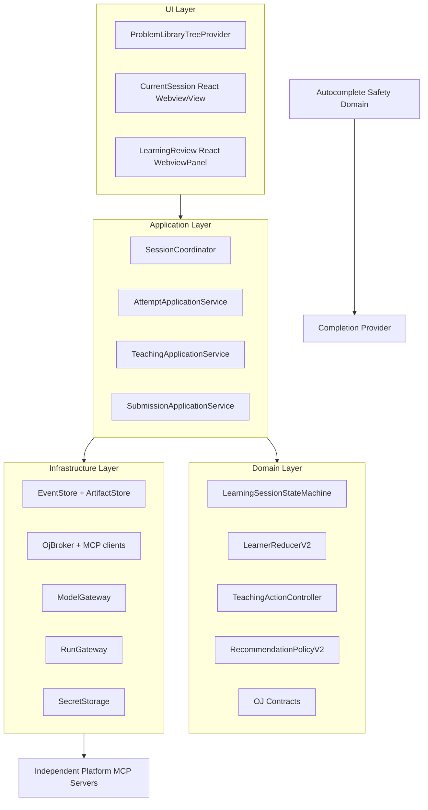
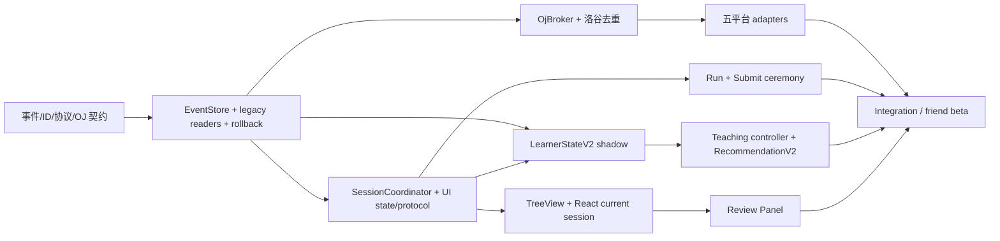

# 下一代算法学习工作台总设计规格

- 日期：2026-07-10
- 状态：Approved for implementation planning
- 目标用户：项目所有者与朋友内测
- 最低环境：VS Code 1.125.x；同时验证当前 stable

## 1. 产品定义

这是一个在 VS Code 内运行的状态驱动算法学习工作台。它围绕一次可恢复的 `Attempt` 组织题目、代码、教学动作、检查点、本地运行、OJ 证据、复盘和推荐。它不是单纯题库侧栏、自动解题器或自动提交机器人。

首批平台：洛谷、LeetCode、牛客、Codeforces、AtCoder。

## 2. 已锁定原则

1. 平台 I/O 由独立外部 MCP Server 权威实现，扩展只做类型化 Broker、领域映射和产品编排。
2. UI 是原生 TreeView + 当前会话 React WebviewView + 复盘 WebviewPanel。
3. 当前会话突出“现在做什么、为什么、之前发生什么”，动效只服务状态变化。
4. 原始学习事件是事实源；画像是可丢弃、可重放投影。
5. 激进替换旧策略，但有只读归档、feature flags、shadow、差异报告和一键回滚。
6. 每次真实 OJ 提交由用户显式确认，禁止后台连续提交和 commit 自动重试。
7. 自动补全是独立安全域，只读取本地学生代码、语言/路径标签和代码习惯；不读题面、Teacher Pack、教练记录、画像结论或答案。
8. 未证明学习效果时只报告系统指标、可用性或相关性改善。
9. MCP Apps 只允许作为脱敏工具结果的可选预览，不承载主学习会话、领域状态或提交确认。

## 3. 当前与目标差距

| 锁定要求 | 当前判定 | 目标 |
| --- | --- | --- |
| 五平台 OJ/MCP | 缺失；真实接入主要为洛谷 | 五平台能力可探测，能力不对称但诚实 |
| 状态驱动 UI | 部分；6685 行 Provider 隐式 DOM 状态 | 单一 Coordinator + projection + protocol v2 |
| 事件事实源 | 冲突；Profile/Skill/Attempt/Archive 多路写 | append-only facts，其他均投影 |
| LearnerStateV2 | 缺失 | E0–E5 + 可解释概率 + 迁移硬门 |
| 显式提交确认 | 冲突；“完成/AI 估计/归档”混合 | prepare/preview/confirm/commit/poll |
| 旧方案回滚 | 部分；仅 Skill snapshot | 全链路 pointer/flag 回滚，不覆盖旧文件 |
| Autocomplete 边界 | 部分偏强；完整 request 仍有风险 | 单一 Gatekeeper + 全请求体零泄漏门 |
| 发布卫生 | 静态较强，安装态 release 激活失败 | 可复现 VSIX + 全新 profile 黄金路径 |

可信证据见 [baseline-audit.md](../../next-gen/baseline-audit.md)。

## 4. 领域语言

| 术语 | 精确定义 |
| --- | --- |
| `OjProblemRef` | 平台、站点、原生 ID、canonical ID、URL 和来源；不等于完整题面 |
| `OjProblemDocument` | 有版本/hash/provenance 的题面、格式、样例和限制 |
| `LearningSession` | 用户的一段学习旅程，可包含多次 Attempt |
| `Attempt` | 对一道题、一个语言/文件绑定的一次独立练习；UUIDv7，不按 problemKey 复用 |
| `DocumentBinding` | URI、languageId、documentVersion、content hash；防止选题与代码漂移 |
| `LearnerEvidenceEvent` | 不可变、分级、可追溯的学习事实 |
| `LearnerStateV2` | 从事件重放生成的紧凑状态，不是事实 |
| `PedagogicalMove` | 每轮唯一教学动作 |
| `OJ capability` | 某 provider 对某操作的真实状态、风险、认证和来源 |
| `Run` | 本地或平台运行；不等于提交 |
| `Submit intent` | 尚未产生外部写的短期预览意图 |
| `Submission evidence` | 有 provenance 的平台/人工判题观察 |
| `AI estimate` | 模型对代码的分析，不是 OJ verdict |
| `Completion declaration` | 用户说“我完成了”的 E1 行为，不是 AC |
| `Review confirmation` | 用户确认复盘/纠偏；不自动把未知结果变成功 |

## 5. 目标分层



依赖只向内：UI 不 import storage/model/MCP；Domain 不 import VS Code、filesystem、fetch 或 MCP SDK；Infrastructure 实现 Domain/Application ports。

## 6. 目标目录与职责

目标目录在迁移结束时：

```text
src/
  domain/
    attempt/              Attempt ids, state machine, events, projections
    learner/              evidence schema, reducer, mastery, governance
    teaching/             pedagogical moves and controller policies
    recommendation/       hard filters, scoring, decisions
    oj/                   neutral contracts and policies
  application/
    attempts/             use cases and transaction boundaries
    teaching/             model candidate orchestration
    submissions/          preview/confirmation/commit/poll
    workbench/            SessionCoordinator and UI projector
  infrastructure/
    storage/              event/artifact/checkpoint/legacy repositories
    mcp/                  OjBroker, provider registry, MCP clients
    models/               existing provider clients behind ModelGateway
    runner/               language adapters and process controls
    vscode/               SecretStorage, URI/document, commands
  ui/
    host/                 Tree/View/Panel providers and message router
    webview/
      current-session/    React app
      learning-review/    React app
      shared/             protocol client, components, tokens, i18n
  autocomplete/           isolated ContextGatekeeper and provider path
```

迁移期间旧 `src/teaching`、`src/recommendation`、`src/sidebar` 等保留并由 adapters 调用；不做一次性路径大搬家。

## 7. 数据所有权

| 数据 | 权威所有者 | 存储 | 可重建 | 可发送远端 |
| --- | --- | --- | --- | --- |
| `OjProblemRef` / `OjProblemDocument` | ProblemCatalog | global storage/cache | 部分 | 公共来源最小字段 |
| Attempt lifecycle | LearnerEvidenceEvent | event log | 是 | 否 |
| Code content | ArtifactStore | 本地 CAS | 否 | 仅明确教学/运行/提交 route |
| LearnerStateV2 | LearnerReducer | state/checkpoint | 是 | 仅最小教学摘要 |
| Coach completed turns | Evidence/Attempt events | event log/artifact | 是 | 当前教学 route 必要片段 |
| Teacher Pack/answer | Teaching private store | 本地 | 可再生成 | 只给教学模型，不给 MCP/autocomplete |
| OJ credential | SecretStorage/local Server | OS/VS Code secret | 否 | 仅目标本地 Server/标准 OAuth |
| OJ submit intent | SubmissionIntentStore | Host 短期内存 | 否 | 只给同 provider commit |
| OJ submission operation | Local Server operation ledger | provider local durable store | 部分 | 只给同 provider poll/commit；无 proof/secret/code |
| UI draft/focus | Webview restore state | `vscode.setState` | 否 | 否 |
| Telemetry | Minimal local log | local runtime/global storage | 否 | 默认不上传 |

## 8. Attempt 与完成语义

### 8.1 ID

- `sessionId`：一次用户学习旅程，UUIDv7；
- `attemptId`：每次独立作答 UUIDv7；同题重做、跨语言、重新开始都新建；
- `problemKey`：`platform:site?:nativeId` 的索引，不作为 attempt id；
- `operationId/requestId`：异步操作与消息幂等；
- event `sequence`：按 learner 单调递增，不依赖系统时间排序。

时钟倒退只影响 timestamp，不影响 sequence。Remote/multi-root 使用 `vscode.Uri.toString()`，不假设本地 `fsPath`。

### 8.2 事实区分

| 事实 | 证据级 | 是否可归档 | 是否可加掌握 | 是否可触发提交 |
| --- | --- | --- | --- | --- |
| 用户“我完成了” | E1 | 可进入复盘，不能伪装 AC | 否 | 否 |
| AI estimate pass | E0/E1 | 可进入复盘 | 否 | 否 |
| 本地样例 pass | E3 | 可进入复盘/提交预览 | 有限 | 否 |
| 手工回填 verdict | 默认 E1；附可验证链接/人工确认可 E4 | 是 | 按 provenance | 否 |
| 官方 run result | E3/E4 | 是 | 是 | 否 |
| 官方 submit accepted | E4 | 是 | 是 | 已发生 |
| 迁移题低帮助 accepted | E5 | 是 | 掌握硬门 | 否 |
| 明确放弃/揭示答案 | E1 + answer exposure | 是 | 正向权重 0 | 否 |

归档是一种 session 状态，不等于成功。完成评分、画像更新和推荐都从事件/provenance 推导，不从按钮 label 推导。

## 9. 状态机

采用 UI 分册的 `LearningSessionState`：empty、preparing、coding、coaching.streaming、checkpoint、running、submit.confirming、judging、reviewing、recommending、recovering。Connectivity/capabilities 叠加，不创建一套平行状态机。

每次 transition：

1. 在 EventStore writer lease 内以 `attemptId + expectedRevision` 做 compare-and-append；Host 内存预检只能提前报错，不能作为最终 CAS；
2. 校验 capability/policy；
3. append semantic event；
4. reducer/projector 生成新 revision；
5. post typed host event/snapshot；
6. projection/checkpoint 写失败可重建，不回滚事实事件。

## 10. 平台联邦

详细设计见 [OJ MCP 分册](./2026-07-10-oj-mcp-federation-design.md)。总约束：

- Server 负责平台 auth/API/page normalization/rate limit；
- Broker 负责信任、schema、capability、routing、policy；
- Learning domain 负责 attempt/evidence/teaching/recommendation；
- UI 负责展示 capability 与确认；
- public remote/private local；
- Codeforces API 不伪装题面/提交；AtCoder/牛客如实报告 unsupported/policy blocked；
- `McpServerDefinitionProvider` 只暴露独立 R0/R1 Agent-facing entrypoint；private product entrypoint 不暴露；
- prepare 预分配 submission operation id，local ledger 保证 crash/response-lost 可查询且 upstream dispatch 最多一次；
- `commit_submission` 不给普通 Agent。

## 11. 教学与画像

详细设计见 [Learner State v2 分册](./2026-07-10-learner-state-v2-design.md)。总约束：

- E0/E1 不加 mastery；
- 静态/动态/OJ 优先；
- 一个 turn 一个 action；
- learner-facing 内容先整体通过答案/完整解安全门，再按验证 block 呈现；模型原始 token 不直达 Webview；
- 掌握/加难需要 E5；
- disabled 是 safety overlay；
- 推荐 hard filter -> deterministic rank；
- bandit 默认 off；
- profile prompt section 中位数目标 ≤54 tokens。

## 12. Autocomplete 安全域

### 12.1 唯一入口

所有 Inline、手动触发、侧栏预览（若保留）必须调用同一 `AutocompleteContextGatekeeper.buildRequest()`。UI/teaching/OJ modules 不可直接构造 completion request。

```ts
export interface AutocompleteSafeRequest {
  schemaVersion: "autocomplete-safe-request/v2";
  prefix: string;
  suffix: string;
  languageId: string;
  fileLabel: string;       // basename or non-sensitive label, not arbitrary path
  habits: string[];
  audit: {
    sourceDocumentHash: string;
    codeRegion: { start: number; end: number };
    excludedRegionCount: number;
    policyVersion: string;
  };
}
```

- 允许：学生代码 region、光标局部 prefix/suffix、language、脱敏 file label、显式代码习惯。
- 禁止：`OjProblemRef` / statement、Teacher Pack、answer、coach timeline、LearnerState/mastery、recommendation、OJ credential/verdict explanation、marker 外文本。

### 12.2 Marker 规则

- 有 start/end marker：光标必须在 region 内，否则不请求；
- 缺 marker：仅把整个真实代码文档当候选，仍运行 prose/comment secret scanner；
- 练习混合 Markdown/注释模板默认要求 marker；
- prefix/suffix 都按同一 region 切，不允许 cursor 之后越过 end marker；
- 完整 provider payload、headers、URL metadata、cache/log/preview 全部做 canary 断言。

### 12.3 架构门

- `src/autocomplete` 不 import `problemBank`、`teaching`、`learner`、`oj`、`ui`；
- `AutocompleteSafeRequest` 类型不含 activeProblem/profile；
- request trace 在发送前生成 field provenance；
- 泄漏测试失败阻断发布。

## 13. 安全与隐私

### 13.1 不可信输入

题面、MCP output、用户代码、模型输出和网页 HTML 全部是不可信内容。它们不能覆盖 system policy、构造 shell、注入 tool name、直接写画像或触发提交。

### 13.2 日志

日志字段 allowlist：event category、version、duration、token counts/sections、error code、hashed correlation、capability/cache state。默认不记录原始 query、题面、代码、stdout/stderr、个人事件、Teacher Pack、答案、secret、proof。

### 13.3 保留与删除

事件在一个 log generation 内 append-only。用户删除权优先：

1. 先 append local tombstone，投影立即隐藏/失效；
2. 删除对应 CAS artifact；
3. 显式“彻底删除/压缩”创建新 log generation，只复制保留事件并重建 hash chain；
4. 旧 generation 安全删除；manifest 只记录计数、时间和新 generation hash，不保留被删内容标识；
5. 重建所有投影/checkpoint。

提供本地导出、删除单 Attempt、删除全部学习数据、清除平台凭据。朋友内测日志默认本地，任何上传需另行同意与脱敏。

## 14. 存储与恢复

### 14.1 事实与投影

- 先 append event，再更新可丢 projection；
- event append 使用 temp + fsync/atomic append 能力或带 checksum 的 journal；
- 多个 VS Code Extension Host 共享 globalStorage 时使用跨进程 lease/CAS 临界区；sequence/hash/uniqueness/append/sidecar 原子协调；
- 启动时 lenient scan：有效前缀可读，损坏尾记录隔离并报告；
- checkpoint 带 head hash/version；不匹配则从较早 checkpoint replay；
- Profile/Skill/AttemptSession 不再多路权威写。

### 14.2 Feature flags

```text
workbench.v2.events.capture
workbench.v2.events.project
workbench.v2.ui.enabled
workbench.v2.learner.shadow
workbench.v2.learner.read
workbench.v2.recommendation.enabled
workbench.v2.ojBroker.enabled
workbench.v2.submit.enabled.<platform>
workbench.v2.exploration.enabled
```

Flags 有 schema/version，默认安全值；不能通过 flag 关闭 autocomplete boundary、disabled overlay 或 submit confirmation。

## 15. 模型与成本

- `ModelGateway` 将用途分为 candidate teaching、Teacher Pack、review、autocomplete；route 不共享隐式上下文。
- 每次调用记录 prompt section token/char estimates、model、duration、retry/parser error、cache；无原文。
- 教学每轮最多一次 candidate 调用；每 Attempt 默认最多 3 次；超限使用确定性动作。
- 模型候选和 learner-facing 文本分离；后者必须先完成结构化验证，UI 的“流式”是已验证 block 逐步呈现。
- 付费/live batch 默认 dry-run，必须有显式 token/USD 上限。
- 提示 token 目标不能牺牲必要证据或把信息移到不可观测隐藏字段。

## 16. UI

详细设计见 [UI 分册](./2026-07-10-state-driven-ui-design.md)。总约束：

- 原生集合导航；React 只承担需要定制的会话/复盘；
- 一个 NowAction；
- request correlation + revision + sequence；
- draft/focus/scroll anchor 恢复；
- 260/320/360/600、主题、reduced-motion、200% zoom；
- 设置、账号、provider、模型与诊断通过 VS Code Settings/Commands/QuickPick/Output 渐进披露，正常首屏不裸露内部配置；
- 一个显著主行动、最多两个直接可见次动作；视觉层级/密度人工评审和 axe serious/critical=0；
- 最终安装 VSIX 重跑真实 Extension Host 完整矩阵是硬门。

## 17. 发布与供应链

- 统一 release pipeline，不再允许“普通 package 成功”替代发布包。
- package manifest 从源码 import graph/显式 asset manifest 生成，不靠手工漏项白名单。
- 生成 SBOM、第三方许可证、commit、dirty 标识、Node/npm/VS Code、artifact SHA-256。
- `vsce ls` 与批准 snapshot 比较；禁止 docs、fixtures、tests、source maps、secrets、runtime data、raw events。
- 全新 user-data-dir 安装、启动、打开 Tree/View/Panel、运行黄金路径并扫描 Extension Host logs。
- 扩展按批准 artifact manifest 获取外部 Server：固定 source/version/commit/OS/arch/runtime/entrypoint/hash/attestation/SBOM，空 PATH/cache 可安装、启动、卸载和回退。
- 当前 release 缺 `teaching/workflow/actions` 是 P0 回归 fixture。

## 18. 迁移顺序



推荐主序：

1. 事件与契约基座；
2. MCP Broker/洛谷去重；
3. 新 UI 壳与状态机；
4. 画像 v2/教学控制器；
5. 五平台适配；
6. 运行与提交；
7. 推荐器；
8. 联调、迁移、朋友内测与发布。

不可并行关键路径：schema -> event migration/replay -> Attempt semantics -> UI projection -> 副本 cutover/rollback rehearsal -> installed RC -> 真实数据 apply/read cutover -> release golden path。平台 adapters、autocomplete gate 和测试基础设施可在契约稳定后并行。

capture-first 期间允许 active shadow log 非空：学习事实动作先写 v2 event 或 fsynced outbox，再更新 v1 compatibility projection；双持久化失败时阻断该产品动作。真实切换在 EventStore lease/MigrationCutoverBarrier 下把 frozen legacy、shadow watermark 和 drained outbox 合并到空 staging namespace，去重、重新封印 hash chain、replay 校验后原子切 pointer；失败不改 active pointer。

## 19. 回滚

回滚单位：UI surface、provider.platform.operation、learner reducer/controller/recommender、read pointer。回滚不删除新事件、不覆盖 v1、不移除 disabled、安全边界或提交确认。

发布前完成演练：

- v2 UI -> legacy UI；
- OjBroker Luogu -> legacy read-only client；
- learner v2 rehearsal read -> v1 read-only；
- recommendation v2 -> deterministic v1；
- failed migration -> backup + unchanged source；
- failed commit response -> poll only；
- failed release -> 与 RC 同 commit 构建并在 fresh profile 验证的 rollback-compatible VSIX；该包保持 v2 fact capture/outbox/SafetyOverlay，只切旧 UI/v1 read-only，不能恢复旧 v1 writer；
- rollback 后重新启用 v2，同一 replay context 下 state hash 与事件 head 一致。

## 20. 验收指标

### MCP/OJ

- 五平台 capability 探测准确；
- 断网/限流/auth/challenge/schema drift 可恢复；
- 未确认真实提交为 0；重复提交为 0；
- prepare operation id、持久化 ledger 和 crash 注入证明 upstream dispatch 最多一次；
- Agent-facing installed tools/list 只有 R0/R1；provider artifact 可从空 PATH/cache 验证安装与回退；
- secret/private context 跨域泄漏为 0。

### UI

- 目标矩阵零横向溢出/遮挡；
- 请求期间草稿/焦点/滚动不丢；
- reload/hide/reopen 恢复同一 attempt；
- 主行动两次操作内可达；
- 首屏设置/内部参数裸露为 0；axe serious/critical 为 0；视觉层级与密度人工评审通过；
- 最终安装 VSIX 的完整 Extension Host 矩阵通过。

### 学习策略

- profile section 中位数较基线下降 ≥60%；
- disabled reactivation = 0；
- mastery/difficulty-up without E5 = 0；
- recommendation without reason = 0；
- answer/autocomplete leakage = 0；
- replay relevant metrics 超过基线；人类不足时不声称学习增益。

### 隐私/补全

- credential/code/Teacher Pack/answer/personal events 不进发行包和不相关 MCP；
- autocomplete 完整请求体 prefix/suffix/metadata/cache/log/preview canary 泄漏 = 0；
- 删除/导出/清凭据流程可用。

### 发布

- 副本与真实用户 migration 均幂等、旧文件 byte-identical、rollback-compatible VSIX 可用；
- VSIX 内容干净、版本正确、artifact hash 可复现；
- 五平台代表性路径覆盖导题；具备能力的平台再覆盖运行/提交；
- 完成一次导题 -> 编码 -> 教学 -> 检查点 -> 运行 -> 判题证据 -> 复盘 -> 画像 -> 推荐黄金路径。

## 21. 非目标与延期边界

- 云端账号同步、多设备合并；
- 多租户远端私有 MCP；
- 无人监督批量提交；
- 所有平台功能对称；
- 用深度 KT 替代可解释主模型；
- 自动发布生成题为正式 OJ 题；
- 因 30 个任务就声称因果学习提升；
- 兼容 VS Code 1.124 及更旧版本。
