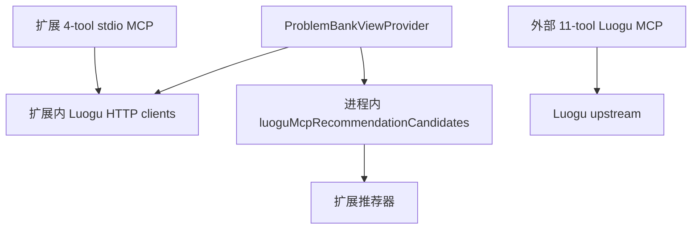
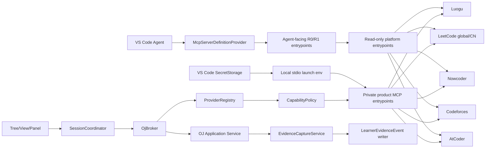

# OJ MCP 联邦与统一 Broker 设计规格

- 日期：2026-07-10
- 状态：Approved for implementation planning
- 关联 ADR：[ADR-0001](../../adr/0001-external-oj-mcp-federation.md)、[ADR-0004](../../adr/0004-explicit-confirmation-for-oj-submit.md)

## 1. 目标

为洛谷、LeetCode、牛客、Codeforces、AtCoder 提供一个可发现、可替换、可回滚、按能力降级的 OJ 接入层，同时保证：

- 平台实现不在扩展与 Server 两边重复；
- UI 的确定性流程不依赖模型选择工具；
- 每项能力都报告来源、风险、认证、健康和合规状态；
- 凭据不进入 Webview、模型上下文、工具参数或普通日志；
- 真实提交必须经过预览和每次显式确认；
- 外部写入结果不确定时只查询，不自动重试；
- 平台不可用不影响本地编辑、事件记录和其他平台。

## 2. 非目标

- 不承诺五个平台首版都有搜索、平台运行和真实提交。
- 不把 AI 估计命名为官方判题。
- 不建立公共 LeetCode/牛客抓取代理。
- 不在扩展中实现站点 HTML parser。
- 不让第三方 Server 直接读取 Learner State、Teacher Pack、教练记录或答案。
- 不把 MCP Registry 条目当作自动信任。
- 不用 MCP Apps 取代主学习工作台；若 provider 提供 App，只能展示通过 Broker 脱敏后的可选只读结果预览，不能持有会话状态或确认外部写。
- 不在本规格中选择云端多租户部署。

## 3. 当前问题



三条洛谷路径没有统一 schema、错误、缓存或版本。外部 Server 修复上游变化时，扩展仍可能继续走旧 client；扩展推荐器和 Server 又各自维护痛点映射。

## 4. 目标架构



### 4.1 直接调用与 Agent 暴露

- `SessionCoordinator -> OjBroker`：导题、能力探测、运行、提交预览等确定性产品流程。
- `McpServerDefinitionProvider`：只暴露经批准的 Agent-facing read-only entrypoint。VS Code provider 的控制粒度是整台 Server，不假设它能过滤某个 `tools/list` 项。
- Agent-facing 进程只注册 R0/R1 工具，不注入 OJ secret、代码读取权限或 confirmation HMAC key。产品 Broker 使用不同的 private entrypoint 承担经策略批准的 R2–R4；`commit_submission` 永不出现在 Agent 实际发现的 `tools/list`。
- UI 不发送 MCP tool name；只发送领域 intent，Broker 决定 provider 与 tool mapping。

## 5. 中立领域契约

唯一源位于扩展未来的 `src/oj/contracts/v1.ts`，同时生成 JSON Schema。Server 可复制生成的 schema artifact，不 import 扩展业务代码。

```ts
export type OjPlatformId =
  | "luogu"
  | "leetcode"
  | "nowcoder"
  | "codeforces"
  | "atcoder";

export type OjCapabilityName =
  | "searchProblems"
  | "fetchProblem"
  | "importProblem"
  | "fetchProfile"
  | "listSubmissions"
  | "localRun"
  | "platformRun"
  | "prepareSubmission"
  | "commitSubmission"
  | "pollSubmission";

export type OjCapabilityStatus =
  | "available"
  | "auth_required"
  | "unsupported"
  | "disabled_by_policy"
  | "degraded";

export type OjOperationRisk =
  | "R0_public_read"
  | "R1_private_read"
  | "R2_local_execute"
  | "R3_prepare_write"
  | "R4_real_submit";

export interface OjSourceRef {
  kind:
    | "official_api"
    | "official_open_platform"
    | "page_adapter"
    | "browser_companion"
    | "community_adapter"
    | "manual";
  adapterId: string;
  adapterVersion: string;
  fetchedAt: string;
  sourceUrl: string;
  etag?: string;
  rawRef?: string;
  confidence: "authoritative" | "derived" | "user_supplied";
}

export interface OjProblemRef {
  schemaVersion: "oj.problem-ref/v1";
  platform: OjPlatformId;
  site?: "global" | "cn";
  nativeId: string;
  canonicalId: string;
  url: string;
  contest?: { nativeId: string; index?: string };
  source: OjSourceRef;
}

export interface OjProblemSummary {
  schemaVersion: "oj.problem-summary/v1";
  ref: OjProblemRef;
  title: string;
  difficulty?: { scale: string; value?: number; label?: string };
  tags: Array<{ namespace: "platform" | "canonical"; id?: string; slug: string; name: string }>;
  contestLabel?: string;
  acceptance?: { accepted?: number; submissions?: number; ratio?: number };
  source: OjSourceRef;
}

export interface OjTextBlock {
  text: string;
  format: "markdown" | "html" | "text";
  locale: string;
  truncated: boolean;
  originalChars?: number;
  sha256: string;
}

export interface OjProblemDocument {
  schemaVersion: "oj.problem-document/v1";
  ref: OjProblemRef;
  title: string;
  locale: string;
  access: "public" | "auth_required" | "premium" | "contest_only" | "unknown";
  difficulty?: { scale: string; value?: number; label?: string };
  tags: Array<{
    namespace: "platform" | "canonical";
    id?: string;
    slug: string;
    name: string;
  }>;
  content: {
    statement: OjTextBlock;
    input?: OjTextBlock;
    output?: OjTextBlock;
    notes?: OjTextBlock;
  };
  constraints: string[];
  samples: Array<{
    ordinal: number;
    input: string;
    output: string;
    explanation?: string;
  }>;
  limits: { timeMs?: number; memoryBytes?: number };
  io: {
    mode: "stdin_stdout" | "function" | "file" | "interactive";
    inputFile?: string;
    outputFile?: string;
  };
  starterCode: Array<{
    languageKey: string;
    platformLanguageId: string;
    code: string;
  }>;
  source: OjSourceRef;
}

export interface OjCapability {
  name: OjCapabilityName;
  status: OjCapabilityStatus;
  toolName?: string;
  transport: "remote_http" | "local_stdio";
  auth: "none" | "oauth2" | "api_key" | "session_cookie" | "browser";
  risk: OjOperationRisk;
  compliance: "official" | "unofficial" | "restricted" | "unknown";
  reason?: string;
  checkedAt: string;
}

export interface OjCapabilities {
  schemaVersion: "oj.capabilities/v1";
  providerId: string;
  providerVersion: string;
  platform: OjPlatformId;
  protocolVersion: string;
  operations: Record<OjCapabilityName, OjCapability>;
  languages: Array<{
    languageKey: string;
    platformLanguageId: string;
    displayName: string;
  }>;
  source: OjSourceRef;
}
```

### 5.0 搜索与导入契约

```ts
export interface OjSearchRequest {
  schemaVersion: "oj.search-request/v1";
  requestId: string;
  platform: OjPlatformId;
  query: string;
  locale?: string;
  cursor?: string;
  limit: number;
}

export interface OjSearchResult {
  schemaVersion: "oj.search-result/v1";
  requestId: string;
  items: OjProblemSummary[];
  nextCursor?: string;
  source: OjSourceRef;
}

export interface OjImportWindowRequest {
  schemaVersion: "oj.import-window-request/v1";
  requestId: string;
  allowedPlatforms: OjPlatformId[];
  expiresInMs: number; // 1..60000
}

export interface OjImportWindow {
  schemaVersion: "oj.import-window/v1";
  windowId: string;
  expiresAt: string;
  state: "waiting" | "received" | "expired" | "cancelled";
}

export interface OjImportPreview {
  schemaVersion: "oj.import-preview/v1";
  windowId: string;
  document: OjProblemDocument;
  receivedAt: string;
}
```

loopback address 与 nonce 只留在 Host/本地 import Server，不返回 Agent 或 Webview。用户看到 `OjImportPreview` 后确认才进入 ProblemCatalog；拒绝、过期和 replay 不保存。`openImportWindow` 是 typed Broker 操作，也是 private local entrypoint 的 `oj_open_import_window`，不作为普通 Agent tool。

### 5.1 运行契约

```ts
export interface OjCodeArtifact {
  languageKey: string;
  platformLanguageId?: string;
  source: string;
  sha256: string;
  bytes: number;
  fileName?: string;
  sourceUri?: string;
  documentVersion?: number;
  capturedAt: string;
  sourceWasDirty: boolean;
}

export interface OjRunRequest {
  schemaVersion: "oj.run-request/v1";
  requestId: string;
  attemptId: string;
  problem: OjProblemRef;
  mode: "local" | "platform";
  code: OjCodeArtifact;
  sampleOrdinals?: number[];
  limits: {
    wallTimeMs: number;
    outputBytes: number;
    network: "deny";
  };
}

export type OjVerdict =
  | "queued"
  | "judging"
  | "accepted"
  | "wrong_answer"
  | "compile_error"
  | "runtime_error"
  | "time_limit"
  | "memory_limit"
  | "output_limit"
  | "idleness_limit"
  | "security_violation"
  | "partial"
  | "skipped"
  | "unknown";

export interface OjRunCaseResult {
  ordinal: number;
  verdict: OjVerdict;
  timeMs?: number;
  memoryBytes?: number;
  stdout?: string;
  stderr?: string;
  expectedOutputSha256?: string;
  actualOutputSha256?: string;
}

export interface OjRunResult {
  schemaVersion: "oj.run-result/v1";
  requestId: string;
  jobId: string;
  attemptId: string;
  mode: "local" | "platform";
  state: "queued" | "running" | "completed" | "failed" | "cancelled";
  verdict: OjVerdict;
  codeSha256: string;
  cases: OjRunCaseResult[];
  startedAt: string;
  completedAt?: string;
  source: OjSourceRef;
}
```

`WA/CE/TLE` 是成功获得的领域结果，不是 MCP 工具错误。只有无法执行/无法获取结果时返回 `OjError`。

### 5.2 提交契约

```ts
export interface OjPrepareSubmissionRequest {
  schemaVersion: "oj.prepare-submission/v1";
  requestId: string;
  attemptId: string;
  providerId: string;
  problem: OjProblemRef;
  accountId: string;
  languageKey: string;
  platformLanguageId: string;
  code: OjCodeArtifact;
  recentRunId?: string;
}

export interface OjSubmitPreview {
  schemaVersion: "oj.submit-preview/v1";
  intentId: string;
  submissionOperationId: string;
  expiresAt: string;
  attemptId: string;
  providerId: string;
  problem: OjProblemRef;
  account: { accountId: string; displayName: string; site?: "global" | "cn" };
  languageKey: string;
  platformLanguageId: string;
  codeArtifactId: string;
  fileLabel: string;
  sourceWasDirty: boolean;
  codeSha256: string;
  codeBytes: number;
  localRunSummary?: {
    runId: string;
    verdict: OjVerdict;
    codeSha256: string;
  };
  warnings: string[];
  actionLabel: string;
}

export interface OjSubmitCommitRequest {
  schemaVersion: "oj.submit-commit/v1";
  requestId: string;
  intentId: string;
  submissionOperationId: string;
  codeArtifactId: string;
  confirmationProof: string;
  codeSha256: string;
}

export interface OjSubmitResult {
  schemaVersion: "oj.submit-result/v1";
  requestId: string;
  intentId: string;
  submissionOperationId: string;
  jobId?: string;
  platformSubmissionId?: string;
  submissionUrl?: string;
  state: "queued" | "judging" | "completed" | "outcome_unknown";
  verdict: OjVerdict;
  codeSha256: string;
  submittedAt?: string;
  lastCheckedAt: string;
  source: OjSourceRef;
}

export interface OjSubmissionEvidence {
  schemaVersion: "oj.submission-evidence/v1";
  evidenceId: string;
  attemptId: string;
  submissionOperationId: string;
  problem: OjProblemRef;
  platformSubmissionId?: string;
  submissionUrl?: string;
  verdict: OjVerdict;
  codeSha256: string;
  observedAt: string;
  terminal: boolean;
  source: OjSourceRef;
}
```

`prepare` 只允许 local private stdio。Host 从绑定的 VS Code TextDocument 直接抓取内存快照，因此未保存文件和 Remote URI 也有精确字节；Server 先校验 source/bytes/hash，再写入权限收紧、TTL、按 operation 隔离的 `SubmissionCodeVault`，返回 opaque `codeArtifactId`。ledger 只保存 artifact id/hash/bytes，不保存代码；`fileLabel` 仅供预览，commit 禁止按 fileUri 或磁盘路径重新读取。proof 绑定 artifact id/hash，commit 再从 vault 读取并复算 hash，确保发送的就是被确认字节。过期、取消或 dispatch claim 后按保留策略销毁代码；代码、artifact path 和内容不进日志或 remote MCP。

`prepare` 在任何外部写之前预分配稳定 `submissionOperationId`，并由 local Server 的持久化 operation ledger 保存 `prepared`。commit 在调用任何上游适配器前原子消费 nonce/requestId，并 fsync 为 `dispatch_claimed`；从这个持久点开始，任何重启都禁止再次调用 adapter。只有“claim 尚未持久化”的崩溃能确定未发送并安全重试；claim 已持久化后的崩溃，无论实际 socket 是否已写，都保守进入 `outcome_unknown` 并只查询/提示检查平台历史。若上游支持 idempotency key/client reference，使用 submissionOperationId 对账，但不把它假设成五平台通用能力。

`confirmationProof` 只由扩展 Host 在用户完成原生确认 ceremony 后生成，绑定 intent、submission operation、code artifact、账号、平台、题号、语言、hash、过期时间和一次性 nonce。它不进入模型上下文，不被 Webview 持久化。Server 重启会使尚未 commit 的 proof 失效，但已进入 dispatch_claimed 的 operation ledger 仍可按 id 查询。

### 5.3 健康与错误

```ts
export interface OjProviderHealth {
  schemaVersion: "oj.provider-health/v1";
  providerId: string;
  platform: OjPlatformId;
  checkedAt: string;
  overall: "healthy" | "degraded" | "unavailable" | "auth_required";
  layers: {
    transport: "pass" | "fail";
    protocol: "pass" | "fail";
    schema: "pass" | "drift" | "unknown";
    auth: "not_required" | "valid" | "expired" | "missing" | "challenge";
    upstream: "pass" | "timeout" | "rate_limited" | "blocked" | "fail";
  };
  latencyMs?: number;
  retryAfterMs?: number;
  message: string;
}

export type OjErrorCode =
  | "request.invalid"
  | "capability.unsupported"
  | "policy.blocked"
  | "auth.required"
  | "auth.invalid"
  | "auth.forbidden"
  | "challenge.required"
  | "resource.not_found"
  | "rate_limited"
  | "network.timeout"
  | "upstream.unavailable"
  | "upstream.schema_changed"
  | "language.unsupported"
  | "runner.unavailable"
  | "runner.sandbox_required"
  | "confirmation.required"
  | "confirmation.expired"
  | "confirmation.mismatch"
  | "submission.closed"
  | "submission.rejected"
  | "submission.outcome_unknown"
  | "internal";

export interface OjError {
  schemaVersion: "oj.error/v1";
  code: OjErrorCode;
  layer: "broker" | "transport" | "protocol" | "auth" | "upstream" | "runner" | "policy";
  message: string;
  retryPolicy: "never" | "safe_read" | "poll_only" | "after_user_action";
  userAction: "none" | "retry" | "sign_in" | "solve_challenge" | "change_language" | "open_logs";
  platform?: OjPlatformId;
  providerId?: string;
  httpStatus?: number;
  upstreamCode?: string;
  requestId?: string;
  jobId?: string;
  retryAfterMs?: number;
}
```

## 6. MCP 2025-11-25 映射

所有新/加固 Server 使用当前 SDK 1.29.0 能力，不以“升级版本号”替代协议工作。

### 6.1 Canonical tools

| Tool | 风险 | MCP annotations | `execution.taskSupport` | Agent 默认 |
| --- | --- | --- | --- | --- |
| `oj_capabilities` | R0 | `readOnlyHint=true, openWorldHint=false` | forbidden | 允许 |
| `oj_health` | R0 | `readOnlyHint=true, openWorldHint=true` | forbidden | 允许 |
| `oj_search_problems` | R0 | `readOnlyHint=true, openWorldHint=true` | forbidden | 允许 |
| `oj_get_problem` | R0/R1 | `readOnlyHint=true, openWorldHint=true` | forbidden | 按 auth 决定 |
| `oj_list_submissions` | R1 | `readOnlyHint=true, openWorldHint=true` | optional | 默认不允许模型 |
| `oj_open_import_window` | R2 | `readOnlyHint=false, destructiveHint=false` | forbidden | 不暴露 |
| `oj_run_code` | R2 | `readOnlyHint=false, destructiveHint=true` | optional | Agent-facing 入口不注册 |
| `oj_prepare_submission` | R3 | `readOnlyHint=false, destructiveHint=false, idempotentHint=true` | forbidden | 不暴露 |
| `oj_commit_submission` | R4 | `readOnlyHint=false, destructiveHint=true, idempotentHint=false, openWorldHint=true` | forbidden | **Agent-facing 入口不注册** |
| `oj_get_submission` | R1 | `readOnlyHint=true, openWorldHint=true` | optional | 可按 operation 授权 |

每个 tool 必须有 `inputSchema`、`outputSchema`、`structuredContent`。业务错误使用 `isError: true` 并返回结构化 `OjError`；未知工具/畸形 JSON-RPC 才使用 protocol error。[MCP tools specification](https://modelcontextprotocol.io/specification/2025-11-25/server/tools)

Tasks 在 2025-11-25 仍需互操作验证。首版以领域 `submissionOperationId + get_submission` 为权威；只有 Server/VS Code 双端 conformance 通过后才标 `execution.taskSupport: optional`。[MCP tasks](https://modelcontextprotocol.io/specification/2025-11-25/basic/utilities/tasks)

### 6.2 发现与信任

顺序固定：

1. 产品仓库静态 provider allowlist；
2. 精确 package version/commit/artifact hash；
3. 可选 Registry `server.json` 元数据；
4. `initialize` 协议协商；
5. `tools/list` 与预期 schema hash 校验；
6. `oj_capabilities` 领域探测；
7. `OjCapabilityPolicy` 计算最终可见能力。

`tools/list_changed` 出现新写工具、schema hash 变化或风险 annotation 降级时，provider 进入 quarantine，不能自动启用。

Server 不是开发机绝对路径依赖。每个 provider 发布 `OjProviderArtifactManifest`：source URL/repository、exact version/commit、OS/arch/runtime、entrypoint、files/content SHA-256、签名或 attestation、license/SBOM、最小扩展版本、install directory 和 rollback artifact。扩展在用户确认后下载到自身 globalStorage、校验全部内容再原子激活；禁止 `npm install -g`、`@latest`、PATH 猜测和未校验 postinstall。空 PATH/空 provider cache 的全新 profile 必须能安装、启动、卸载和回退。

### 6.3 鉴权

- Remote HTTP 私有端遵循 OAuth 2.1 与 protected-resource metadata；scope 按 private-read/run/submit 分离。[MCP authorization](https://modelcontextprotocol.io/specification/2025-11-25/basic/authorization)
- 当前 Luogu Worker 只允许 R0 public tools。任何 remote-private 是新的 provider，必须通过 OAuth 2.1、RFC 9728 metadata、resource/audience binding、HTTPS、Origin 403、redirect/SSRF 和 token-passthrough 测试；临时 bearer 不算合格过渡。
- stdio Server 凭据只通过 launch env 或 OS credential handle 注入；禁止 CLI 参数。
- OJ cookie、API key、password、CAPTCHA 不使用普通 tool/form 参数让模型转交。
- 登录/挑战通过外部浏览器或 URL elicitation 完成；Server 只返回状态。[MCP elicitation](https://modelcontextprotocol.io/specification/2025-11-25/client/elicitation)
- VS Code SecretStorage key 必须包含 provider + platform + site + accountId，防止 LeetCode global/CN 混用。

## 7. Broker 设计

```ts
export interface OjBroker {
  discover(platform?: OjPlatformId): Promise<OjCapabilities[]>;
  health(providerId: string): Promise<OjProviderHealth>;
  search(input: OjSearchRequest): Promise<OjSearchResult>;
  openImportWindow(input: OjImportWindowRequest): Promise<OjImportWindow>;
  getImportPreview(windowId: string): Promise<OjImportPreview | undefined>;
  acceptImport(windowId: string): Promise<OjProblemDocument>;
  getProblem(ref: OjProblemRef): Promise<OjProblemDocument>;
  run(input: OjRunRequest): Promise<OjRunResult>;
  prepareSubmission(input: OjPrepareSubmissionRequest): Promise<OjSubmitPreview>;
  commitSubmission(input: OjSubmitCommitRequest): Promise<OjSubmitResult>;
  getSubmission(providerId: string, submissionOperationId: string): Promise<OjSubmitResult>;
}
```

### 7.1 内部组件

| 组件 | 职责 |
| --- | --- |
| `ProviderRegistry` | 静态定义、版本/hash、transport、tool mapping、生命周期 |
| `OjProviderInstaller` | manifest 获取、artifact/hash/signature/SBOM 校验、原子安装/回退 |
| `OjProviderLauncher` | 已校验绝对入口、无 shell、最小 env、隔离 HOME/TMP/cache、进程树与权限档案 |
| `McpPlatformClient` | initialize、tools/list、callTool、schema parse、AbortSignal |
| `OjCapabilityPolicy` | 风险、合规、auth、用户设置、Agent/UI 调用者联合裁决 |
| `OjContractCodec` | Zod/JSON Schema parse、版本升级、provenance 强制 |
| `OjHealthMonitor` | 分层探测、退避、circuit breaker、可观察状态 |
| `OjCache` | 只缓存公共读；key 含 provider/version/ref/locale；保留 source |
| `SubmissionIntentStore` | 短 TTL、一次性、hash-bound intent；只在 Host |
| `SubmissionOperationLedger` | Server 本地持久化 prepared/dispatch_claimed/upstream_acknowledged/outcome；claim fsync 后永不第二次调用 adapter |
| `SubmissionCodeVault` | 保存 Host 确认时的精确内存代码快照；opaque artifact id、严格 ACL/TTL/hash，绝不按原 URI 重读 |
| `OjTelemetry` | 最小结构化指标，不记录代码/题面/凭据/原始个人事件 |

### 7.2 路由

路由按 `platform.operation`，不做跨平台/跨账号 fallback。

- 公共读：remote HTTP healthy -> local stdio -> legacy read-only client（洛谷迁移期）。
- 私有读：只在同一账户/同一 provider 的 local stdio；失败不转远端。
- local run：通用 `RunGateway`；平台 Server 只在 platform run 明确可用时接管。
- prepare/commit：同一 provider、同一 intent/operation namespace；不 fallback。provider 重启使未消费 proof 失效，但不得丢已持久化 operation ledger。
- commit timeout/response lost：按 prepare 时已知的 `submissionOperationId` 调用 `getSubmission`；绝不再次 commit。`dispatch_claimed` 不声称“已发送”或“未发送”，只能报告可能已发送。

## 8. 安全模型

### 8.1 信任域

| 域 | 可见数据 |
| --- | --- |
| Webview | ViewModel、`OjProblemRef`、截断题面、run/submission 摘要；无凭据、Teacher Pack、完整 profile |
| Extension Host | 领域状态、SecretStorage handle、代码读取、confirmation ceremony |
| Remote public MCP | query、公共 `OjProblemRef`；无代码、账号、学习事件 |
| Local private MCP | 最小账号 handle、`OjProblemRef`、必要代码；无 Learner State/Teacher Pack |
| Model | 教学 route 明确给出的题面/代码/证据；不见 OJ secret 与 confirmation proof |

### 8.2 运行

- Webview 只能发送 runner/language/sample IDs，不能发送 shell command。
- Host 只通过 `OjProviderLauncher`/RunGateway 的 argv array 启动已校验绝对入口；无 shell；cwd 固定临时 attempt 目录；最小 env、独立 HOME/TMP/cache、网络默认 deny、进程树限制。
- `trusted_workspace_run` 只允许用户当前绑定且 hash 已确认的学生文件，由用户显式触发；即使 OS 强隔离不可用，也必须具备临时 cwd/env/time/output/process-tree 边界并明确标注 bounded-not-sandboxed。
- 任何下载、模型生成、参考答案或第三方 artifact 属于 `untrusted_artifact_run`，必须有可验证 AppContainer/WSL/container 等 OS 隔离；没有就返回 `runner.sandbox_required`/`disabled_by_policy`，不能用警告放行。
- private/write provider 必须是固定、签名/哈希校验、已审计 artifact。Windows 无进程隔离时，未审 community package 的认证/运行/提交能力阻断，而不是仅靠 SecretStorage env 宣称安全。
- stdout/stderr/time/memory/file count 限制；取消必须终止进程树。

### 8.3 提交

提交完整 ceremony 见 ADR-0004。硬规则：

- 每一次真实提交都需要新的 preview 与用户显式确认；
- 显示平台、站点、账号、题号、语言、文件、hash、bytes、最近 run 与警告；
- 代码改变、账号改变、intent 过期、provider 重启均使确认失效；
- `commit_submission` 不注册为普通 command palette/Agent action；
- 后台连续提交、会话授权、自动重试均不在首版范围。

## 9. 平台适配

### 9.1 洛谷

- 加固外部 v0.2.1；移除 Server 产品排序，保留 canonical tag/topic mapping。
- 扩展旧 clients 进入 shadow adapter；按字段对拍 title/content/samples/tags/difficulty/source。
- upstream timeout 时 health 为 degraded；缓存公共题面可读但标记 `staleAt`。

### 9.2 LeetCode

- 固定 fork `jinzcdev`；global/CN 分 provider/site/account。
- 上游 direct submit 改为内部未注册函数，只能由 canonical prepare/commit 调用。
- 首批真实提交只在 mock server；个人 live submit 需独立人工 PoC 和条款复核。

### 9.3 Codeforces

- 官方 API remote read；统一 limiter 不快于官方要求。
- Companion 导题；来源组合不得丢 provenance。
- 提交保持 manual；submission status 只能同步已知 ID/用户记录。

### 9.4 AtCoder

- Companion + `oj` 本地执行。
- CAPTCHA/challenge 返回 `challenge.required`，不能当 not found。
- 真实提交 `disabled_by_policy`。

### 9.5 牛客

- Companion 单次导入 + 通用 local runner。
- 最薄 Server 仅实现 health/capabilities/import normalization；search/auth/submit 如实 unsupported。

## 10. 隔离 PoC 套件

固定代表题：洛谷 `P1001`、LeetCode `two-sum`、牛客 HJ1 `https://www.nowcoder.com/practice/052e554f33e4422099a2af9faad2c7b5`、Codeforces `4/A`、AtCoder `abc086_a`。

每个平台必须独立覆盖：

1. initialize 与 protocol 版本；
2. schema-hashed tools/list；
3. capabilities 与 policy；
4. health 分层；
5. 搜索（若支持）；
6. 导题与 provenance；
7. locale/HTML/Markdown/sample normalization；
8. 缓存 hit/stale/offline；
9. auth missing/expired/forbidden/challenge；
10. 429 + Retry-After；
11. upstream timeout/500；
12. schema drift/login HTML；
13. language unsupported；
14. local run compile/AC/WA/TLE/output limit/cancel；
15. platform run mock；
16. submission prepare；
17. preview hash mismatch/expiry；
18. commit mock success；
19. prepare 预分配 operation id；claim fsync 前、claim 后 socket 前、上游收到后、MCP response lost 四个注入点都有保守恢复语义，且 upstream adapter invocation 最多一次；
20. Agent-facing 实际 `tools/list` 不含 run/prepare/commit；
21. tools/list_changed 增加 write tool -> quarantine。

CI 只运行 fixture、mock、conformance 和无凭据 live-read smoke。真实提交测试没有默认 npm script。

## 11. 缓存与遥测

### 11.1 缓存

- 只缓存 R0 公共读；R1 默认不持久化。
- cache key：provider id/version + canonical ref/query + locale + schema version。
- value 必含 source、fetchedAt、etag/hash、expiresAt。
- auth/challenge/schema error 不缓存为 not-found。
- 题面更新生成新 document version，不原地改变已归档 Attempt 引用。

### 11.2 遥测

允许字段：provider/platform/tool category、risk、duration、result category、retry count、cache state、schema version、error code、hashed request correlation。

禁止字段：query 原文（除非用户本地调试显式开关）、题面、代码、stdout/stderr 原文、账号、cookie、token、Teacher Pack、Learner Evidence、confirmation proof。

## 12. 迁移与回滚

1. 引入 `oj-contract/v1` 与 legacy `ProblemRecord` reader，不改旧文件。
2. Broker feature flag 默认 off；UI 仍走旧路径。
3. 加固外部洛谷 Server；固定版本与 schema hash。
4. shadow compare 只读，不影响用户结果。
5. 按 search -> detail -> set/topic -> recommendation candidate 切洛谷；每项可独立回滚。
6. 接 Codeforces read、AtCoder/牛客 Companion import、LeetCode local fork。
7. local runner 稳定后再开放 prepare；commit 保持 mock。
8. 平台逐一安全审批 commit；不以“五平台一致”为发布条件。
9. 一个完整稳定发布周期后，且 shadow/回滚证据通过，删除内置 MCP/clients；旧数据 reader 与 rollback-compatible VSIX 按迁移策略继续保留。

回滚键为 `provider.platform.operation`。读操作可降级；认证、运行、提交不得跨 provider fallback。

## 13. 验收

- 五平台 capability 探测与实际注册工具一致。
- 断网、限流、认证过期、challenge、schema drift 有可恢复 UI。
- Server transport health 不掩盖 upstream failure。
- 任何真实 commit 都有未过期、hash-bound、一次性 confirmation proof。
- outcome unknown 没有第二次提交。
- `submissionOperationId` 在 prepare 时已知，Server crash/response lost 后仍可查询，operation ledger 证明 upstream dispatch 最多一次。
- Secret/code/Teacher Pack/Learner Event 不进入不相关 MCP。
- Agent-facing installed `tools/list` 仅含批准的 R0/R1；private entrypoint 和 secret/HMAC 不暴露。
- 空 PATH/空 cache 全新 profile 可按 manifest 安装、校验、启动、卸载和回退 provider artifact。
- Legacy 洛谷与新 Server 的固定 fixture 差异报告可解释。
- 一个平台关闭/卸载不破坏其他平台或本地学习会话。
- VS Code 1.125.x 与当前 stable 的 `McpServerDefinitionProvider` 安装态验证通过。
- live submit 是逐 provider 条件证据；没有平台通过安全/条款审批时，发行版保持全部 live commit 关闭也可验收。
