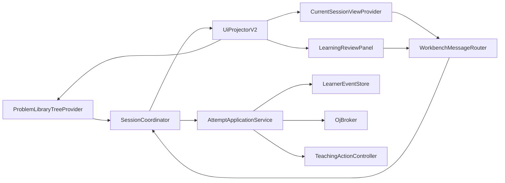
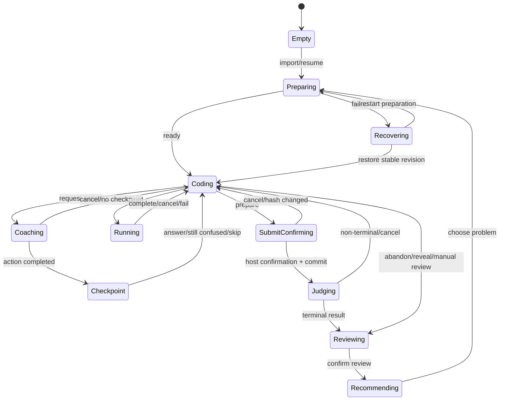

# 状态驱动学习工作台 UI 设计规格

- 日期：2026-07-10
- 状态：Approved for implementation planning
- 关联：[UI 线框与裁决](../../next-gen/ui-wireframes.md)、[ADR-0002](../../adr/0002-hybrid-vscode-ui-shell.md)

## 1. 体验目标

用户在任何时刻都能回答：

1. 当前在做哪道题、哪次 attempt、哪个文件版本；
2. 系统现在处于什么状态；
3. 当前唯一建议行动是什么，为什么；
4. 哪些能力可用/离线/需要登录/被 policy 禁用；
5. 之前发生了什么，失败后从哪里恢复；
6. AI 估计、手工 verdict 与官方 OJ 证据有何区别；
7. 在不暴露内部设置和调试结构的前提下，异常时去哪里修复。

## 2. 非目标

- 不制作营销 landing page。
- 不把 VS Code 原生题库列表、Settings、Output、Diagnostics 全部复制进 Webview。
- 不用无意义渐变、光球、装饰性持续动画或巨型卡片。
- 不让 UI 按钮各自维护隐式领域状态。
- 不用“保留 Webview 上下文”掩盖恢复缺失。
- 不在当前会话首屏展示完整画像、内部遥测或所有设置。
- 不把账号、模型、MCP、策略开关和诊断做成长驻卡片或平级 Tab。
- 不让 Webview 直接调用 MCP、模型、文件系统或 SecretStorage。
- 不把 MCP Apps 嵌入或替代 Current Session；工具结果预览即使存在，也只是可关闭、无领域状态的辅助表面。

## 3. 信息架构

### 3.1 原生 TreeView：题库与历史

`ProblemLibraryTreeProvider` 分组：

```text
进行中
待练
推荐
历史
平台状态
```

TreeItem 只表达集合导航：题号/短标题、平台图标、会话阶段 decoration、错误/离线 badge。导入、刷新、打开官方页面、归档等放在 title/context menu。长题面、聊天、配置和画像不进入 TreeItem。

空集合使用 `viewsWelcome` 提供“导入 Markdown”“搜索题目”“等待 Competitive Companion 一次导入”“恢复最近会话”。

### 3.2 WebviewView：当前会话

组件顺序固定：

```text
SessionHeader
CapabilityBanner (only when degraded/offline/auth required)
NowAction
NextQueue (collapsed by default)
AttemptTimeline
Composer / state-specific input
```

原则：`ONE NOW / NEXT / BEFORE`。除终态外，投影必须恰好有一个 `NowAction`。高风险提交的 NowAction 是“查看并确认”，不是“提交”。

### 3.3 WebviewPanel：复盘与证据

Tabs：摘要、证据时间线、画像变化、推荐解释、数据/回滚。Panel 只在用户打开时存在；关闭不影响会话。复盘主按钮与危险回滚分开，禁止卡片套卡片。

### 3.4 设置、账号与诊断

这些内容不属于学习会话信息架构：

| 内容 | 权威表面 | 当前会话允许显示 |
| --- | --- | --- |
| 扩展设置 | VS Code Settings，过滤 `@ext:kaiserunix.student-autocomplete-lab` | 仅动作不可用的用户化原因 |
| 平台账号 | Command Palette + QuickPick/native auth | 脱敏账号名、登录动作，不显示 Cookie/key |
| Provider/MCP | `管理 OJ 提供方` 命令 + 按需状态 Panel | 正常态一个聚合图标；异常态显示受影响能力 |
| 模型与预算 | VS Code Settings | 可用/不可用与预算耗尽，不显示 endpoint/temperature |
| Feature flags | 受控内部设置/开发命令 | 朋友版完全隐藏 |
| 技术日志 | Output/Diagnostics | 错误态一个“查看诊断”动作 |

View title actions 固定为熟悉图标：刷新、导入、管理账号、设置；都带 tooltip。主 React root 不渲染设置表单。`CapabilityBanner` 只在 degraded/offline/auth-required 时出现，正常态不以 badge 墙持续展示内部健康。

视觉层级固定为“题目/阶段 -> 当前行动 -> 当前反馈 -> 时间线”。主行动最多一个、直接可见次动作最多两个；其余进入菜单或按需详情。技术 ID、hash、schema、provider version、token 和策略因子默认只在详情/复盘/诊断出现。

## 4. 宿主架构



### 4.1 所有权

| 组件 | 负责 | 禁止 |
| --- | --- | --- |
| `SessionCoordinator` | 当前 attempt、状态转换、revision、operation registry、跨表面同步 | HTML、MCP tool name、prompt 拼接 |
| `AttemptApplicationService` | intent 验证、事件 append、文件绑定、调用 ports | VS Code UI |
| `UiProjectorV2` | 从领域 state/events 生成最小 ViewModel、NowAction/NextQueue | 写事件、模型选择 |
| `WorkbenchMessageRouter` | Zod parse、request correlation、AbortController、postMessage | 业务判断 |
| Providers/Panel | VS Code 注册、生命周期、资源 URI、焦点桥 | 直接读 JSONL/模型/平台 client |
| React | 渲染、局部 UI reducer、草稿/展开/focus/scroll anchor | 领域状态与长期 thread |

## 5. 学习会话状态

```ts
export interface LearningSessionBase {
  attemptId: string;
  sessionId: string;
  revision: number;
  problemKey: string;
  enteredAt: string;
}

export type LearningSessionState =
  | { phase: "empty"; revision: number; reason: "first_run" | "no_selection" }
  | (LearningSessionBase & {
      phase: "preparing";
      checklist: PreparationStep[];
      activeStepId: string;
    })
  | (LearningSessionBase & {
      phase: "coding";
      binding: DocumentBinding;
      lastVerifiedHash?: string;
    })
  | (LearningSessionBase & {
      phase: "coaching.streaming";
      operation: ActiveOperation;
      action: PedagogicalMove;
    })
  | (LearningSessionBase & {
      phase: "checkpoint";
      checkpoint: CheckpointView;
    })
  | (LearningSessionBase & {
      phase: "running";
      operation: ActiveOperation;
      run: RunProgressView;
    })
  | (LearningSessionBase & {
      phase: "submit.confirming";
      preview: OjSubmitPreviewView;
    })
  | (LearningSessionBase & {
      phase: "judging";
      operation: ActiveOperation;
      submission: SubmissionProgressView;
    })
  | (LearningSessionBase & {
      phase: "reviewing";
      reviewId: string;
      evidenceHeadHash: string;
    })
  | (LearningSessionBase & {
      phase: "recommending";
      decisionIds: string[];
    })
  | (LearningSessionBase & {
      phase: "recovering";
      failedOperation?: OperationFailureView;
      stableRevision: number;
    });

export interface DocumentBinding {
  uri: string;
  languageId: string;
  documentVersion: number;
  contentSha256: string;
  workspaceFolderUri?: string;
}

export interface ActiveOperation {
  operationId: string;
  requestId: string;
  kind: "coach" | "run" | "submit" | "judge" | "review" | "recommend";
  startedAt: string;
  cancellable: boolean;
}
```

Connectivity 不是 phase，而是叠加 capability state。离线时保留当前 phase，只禁用远程动作并派生新的 NowAction。

### 5.1 合法转换



非法转换返回 typed protocol error，不由 UI 猜测修复。

## 6. UI 投影

```ts
export interface UiStateV2 {
  schemaVersion: "ui-state/v2";
  protocolVersion: 2;
  revision: number;
  activeAttemptId?: string;
  session: LearningSessionState;
  problem?: {
    key: string;
    platform: OjPlatformId | "manual";
    nativeId: string;
    title: string;
    sourceLabel: string;
  };
  binding?: DocumentBinding;
  capabilities: UiCapabilityState[];
  nowAction?: UiAction;
  nextActions: UiAction[];
  timeline: TimelineItemView[];
  operation?: ActiveOperation;
  restore: {
    stableRevision: number;
    canRetry: boolean;
    canReturnToCode: boolean;
  };
}

export interface UiAction {
  id: string;
  kind: string;
  label: string;
  icon: string;
  command: WorkbenchCommandV2["type"];
  enabled: boolean;
  disabledReason?: string;
  risk: "normal" | "attention" | "destructive" | "external_write";
  rationale: string;
}
```

投影中不包含 Secret、Teacher Pack、答案、完整 Learner State、完整代码、MCP raw output 或模型 prompt。

## 7. 消息协议 v2

### 7.1 Envelope

```ts
interface CommandEnvelopeBaseV2 {
  protocolVersion: 2;
  requestId: string;
  peerId: string;
}

export type UnboundWorkbenchCommandV2 =
  | { type: "workbench.bootstrap" }
  | { type: "problem.select"; problemKey: string }
  | { type: "attempt.select"; attemptId: string }
  | { type: "attempt.start"; problemKey: string; languageId?: string };

export type AttemptBoundWorkbenchCommandV2 =
  | { type: "document.bind"; uri: string }
  | { type: "coach.request"; learnerText: string; requestedDepth?: 1 | 2 }
  | { type: "operation.cancel"; operationId: string }
  | { type: "checkpoint.answer"; checkpointId: string; answer: string }
  | { type: "checkpoint.defer"; checkpointId: string; reason: "still_confused" | "skip" }
  | { type: "run.samples"; sampleOrdinals?: number[] }
  | { type: "attempt.declareComplete" }
  | { type: "attempt.abandon"; reason?: string }
  | { type: "answer.reveal.request"; reason: "stuck" | "give_up" | "review" }
  | { type: "submission.prepare" }
  | { type: "submission.reviewAndConfirm"; intentId: string }
  | { type: "review.open"; reviewId?: string }
  | { type: "review.applyCorrection"; targetEventId: string; decision: string; note?: string }
  | { type: "review.confirm"; reviewId: string }
  | { type: "recommendation.request" }
  | {
      type: "recommendation.visible";
      presentationId: string;
      visibility: { surface: "current_session" | "review_panel" | "problem_tree"; visibleMs: number; visibleFraction: number };
    }
  | { type: "recommendation.choose"; decisionId: string }
  | { type: "recommendation.dismiss"; decisionId: string; reason?: string }
  | { type: "recommendation.defer"; decisionId: string }
  | { type: "operation.retry"; failedOperationId: string }
  | { type: "details.request"; itemId: string; section: string };

export type WorkbenchCommandV2 =
  | UnboundWorkbenchCommandV2
  | AttemptBoundWorkbenchCommandV2;

export type WebviewCommandEnvelopeV2 =
  | (CommandEnvelopeBaseV2 & {
      command: UnboundWorkbenchCommandV2;
      attemptId?: never;
      expectedRevision?: never;
    })
  | (CommandEnvelopeBaseV2 & {
      command: AttemptBoundWorkbenchCommandV2;
      attemptId: string;
      expectedRevision: number;
    });
```

只有 bootstrap/problem.select/attempt.select/attempt.start 可省略 envelope 的 attempt/revision；`attempt.select` 必须使用精确 attemptId，problemKey 只能选择目录项或创建新 Attempt。任何 attempt-bound command 缺少 `attemptId` 或 `expectedRevision` 都在 schema 层拒绝；stale revision 返回 typed conflict 和最新 snapshot，不执行副作用。最终校验不是 Host 内存中的先查后写：Coordinator 必须调用 EventStore 的 attempt-scoped compare-and-append，在同一跨进程 lease 临界区比较 expectedRevision 并 append；两个窗口从同一 revision 发出不同 request 时只能一个成功。`answer.reveal.request` 只打开 Host 原生确认，Webview 无确认命令。Webview 不发送 previous turn、代码、Teacher Pack、profile patch、MCP tool name、provider config 或 confirmation proof。Host 从 attempt/document binding 重建上下文。

```ts
export interface ValidatedLearnerFacingBlockView {
  blockId: string;
  actionId: string;
  format: "text" | "markdown" | "code_fragment";
  content: string;
  validationReceipt: {
    receiptId: string;
    policyVersion: string;
    contentSha256: string;
    passedAt: string;
  };
}

export type HostEventV2 =
  | { type: "state.snapshot"; state: UiStateV2 }
  | { type: "events.appended"; revision: number; items: TimelineItemView[] }
  | { type: "operation.started"; operation: ActiveOperation }
  | { type: "coach.block"; operationId: string; sequence: number; block: ValidatedLearnerFacingBlockView }
  | { type: "operation.progress"; operationId: string; sequence: number; progress: OperationProgressView }
  | { type: "operation.completed"; operationId: string; revision: number }
  | { type: "operation.failed"; operationId: string; error: WorkbenchErrorView }
  | { type: "operation.cancelled"; operationId: string; revision: number }
  | { type: "capabilities.changed"; capabilities: UiCapabilityState[] }
  | { type: "focus.restore"; focusKey: string };

export interface HostEventEnvelopeV2<T extends HostEventV2 = HostEventV2> {
  protocolVersion: 2;
  eventId: string;
  peerId?: string;
  attemptId?: string;
  revision: number;
  correlation?: {
    requestId: string;
    phase: "progress" | "terminal";
    sequence?: number;
  };
  event: T;
}
```

### 7.2 并发规则

- Host 维护 `pendingByRequestId` 和 `operationById`；每个 accepted command 必须产生恰好一个带 `correlation.phase="terminal"` 的终态 event，只有它解除对应 busy。
- 只有流式/progress event 使用 `correlation.sequence`，且必须单调；重复丢弃，缺号等待短窗口后转 error/recovery。
- attempt/revision 不匹配的迟到事件不渲染，可写本地诊断计数。
- `state.snapshot` 是最终权威；delta 只是 provisional UI。
- Webview duplicate requestId 返回既有结果/状态，不重复执行。
- `coach.block` 的 runtime schema 拒绝 string/raw delta；MessageRouter 只能从 `ValidatedBlockPublisher` 取得带可核验 receipt 的 view，不能 import model stream client。receipt/content hash 不匹配时发 `operation.failed`，不降级为裸文本。
- `recommendation.visible` 只有在 projection 中存在同一 presentationId、窗口可见、visibleFraction ≥0.5 且 visibleMs ≥1000 时被接受；Host 使用 `recommendation/{presentationId}` uniqueness key，reload/重复 observer 不增加曝光。
- 每 peer 有唯一 id；View/Panel 同时打开时都消费同一 revision，不各自写领域状态。

## 8. React 应用

首版固定依赖：

| 包 | 版本 |
| --- | --- |
| `react` / `react-dom` | `19.2.7` |
| `vite` | `8.1.4` |
| `@vitejs/plugin-react` | `6.0.3` |
| `lucide-react` | `1.24.0` |
| `@testing-library/react` | `16.3.2` |
| `@testing-library/user-event` | `14.6.1` |
| `jsdom` | `29.1.1` |
| `axe-core` / `@axe-core/playwright` | `4.12.1` |

领域/UI 状态用 React `useReducer`，不引入额外全局 store。所有版本由 lockfile 精确固定，升级独立进行。

### 8.1 组件树

```text
CurrentSessionApp
  ErrorBoundary
  SessionHeader
  CapabilityBanner
  NowAction
  NextQueue
  AttemptTimeline
    LearnerTurn
    CoachTurn / StreamingCoachTurn
    CheckpointItem
    RunResultItem
    SubmissionItem
    ReviewSummaryItem
  StateInput
    Composer | CheckpointInput | SubmissionReviewLauncher
  InspectorDrawer
```

```text
LearningReviewApp
  ReviewHeader
  ReviewTabs
  EvidenceTimeline
  LearnerStateDiff
  CorrectionControls
  RecommendationExplanation
  RollbackDialogLauncher
```

不允许卡片嵌卡片。Timeline item 使用分隔线/row；只有独立重复项或确认 modal 可使用轻量容器，radius ≤8px。

### 8.2 流式 Markdown

- UI 只接收已经通过教学安全门的 `ValidatedLearnerFacingBlockView`；禁止把模型原始 token delta 直接发给 Webview。纯 UI 阶段只使用签名 fixture/测试 publisher，生产 publisher 由 LRN-08 接线后才启用。
- TeachingApplicationService 先缓冲并验证完整结构化 block 集，再按完整句/块发布，以保留动态反馈但不承担“发出后撤回”的答案泄漏风险。
- streaming 阶段按安全纯文本/完整 block 渲染；不解析半截 code fence/link/html。
- completed 后交给统一 sanitizer/Markdown renderer。
- 不启用 raw HTML；链接经过 scheme allowlist，默认外部打开确认遵循 VS Code API。
- delta 更新局部 item，不替换 timeline/root。

## 9. 响应式

Webview root 使用 `container-type: inline-size`。

| 宽度 | 行为 |
| ---: | --- |
| ≤279 | 6px padding；单列；状态短名；一个全宽主按钮；次动作菜单；title 最多 2 行 |
| 280–339 | 8px；单列；2 个短次动作；checkpoint 纵排 |
| 340–479 | 10px；元数据可 2 列；时间线仍单列 |
| ≥480 | NextQueue 与 timeline 可双列；主阅读列至少 320px；深层复盘仍建议 Panel |

硬断言：无水平 scroll；所有 icon button 32×32 视觉、最小 40×40 hit target；主 action 高度 ≥44；动态 badge/hover 不改变父布局。

## 10. 主题与动效

- 只使用 `--vscode-*` 语义变量与少量 alias；状态不可只靠颜色。
- High Contrast/forced-colors 使用 `--vscode-contrastBorder` 和系统颜色，关闭 `color-mix` 语义。
- Codicon 用于 VS Code 熟悉动作；Lucide 用于缺少 Codicon 的领域动作，所有陌生图标有 tooltip/accessible name。
- 动效 120–180ms，仅 opacity/transform/height reveal；无装饰循环。
- `prefers-reduced-motion: reduce` 或 VS Code reduced-motion class 时关闭 transition、smooth scroll、pulse、spin、blinking cursor。
- 进度在 reduced motion 下使用静态文本和 `aria-busy`。

## 11. 键盘与焦点

- TreeView 使用原生键盘。
- `Ctrl+Enter`：发送普通 composer/checkpoint；在 external write 阶段只打开 review，不提交。
- `Esc`：关闭 drawer -> 取消确认 -> 停止 operation，按层级执行一次一个动作。
- 打开 drawer/modal 前记录 `focusKey`；关闭后恢复触发控件。
- 返回代码命令恢复绑定编辑器与原 selection。
- 新 timeline event 通过节流 `aria-live=polite` 宣告，不抢焦点。
- React rerender 不主动 focus；错误仅在用户提交后聚焦首个可恢复动作。
- 200% zoom 与屏幕阅读器模式列入截图/交互门。

## 12. 恢复

`vscode.setState`：

```ts
interface WebviewRestoreStateV2 {
  schemaVersion: "webview-restore/v2";
  peerKind: "current-session" | "learning-review";
  attemptId?: string;
  draftByAttempt: Record<string, string>;
  focusKey?: string;
  scrollEventId?: string;
  openInspector?: string;
  expandedItemIds: string[];
}
```

不保存领域 revision、完整 timeline 或 secret。重开先 bootstrap Host snapshot，再应用 UI restore；若 attempt 不存在，清理对应草稿并显示可解释恢复状态。

## 13. 错误与离线

Capability 不是单个 online boolean，至少分：catalog、problem detail、AI、local runner、platform run、submission、cache。

错误 UI 必须回答：失败动作、影响范围、数据是否已写、是否可重试、用户下一步。技术栈/原始错误放 Output 或详情，不把 secret/raw response 展示到 Webview。

提交 outcome unknown 显示“结果未知，正在查询/可手动打开平台”，绝不显示普通“重试提交”。

## 14. 迁移

1. 先建立 `SessionCoordinator`、state machine、UiProjector 和 protocol v2；旧 Webview 通过 adapter 消费 snapshot。
2. 把 host handlers 从 Provider 移入 application services，保持现有 UI 行为。
3. 上线 TreeView，旧题目 Tab 转只读入口后删除。
4. 建 React current-session，与旧 Webview feature flag 二选一；不同时写状态。
5. 建 Review Panel，迁移画像/复盘/推荐解释。
6. 删除 Webview 本地 coachThreads、loose events、内嵌 HTML/CSS/JS。
7. Provider 缩到注册/转发壳，依赖规则禁止跨层 import。

每阶段能回旧 surface，但共用新 Coordinator/projection；避免长期维护两套领域状态。

## 15. 测试

### 15.1 纯函数

- 每个合法/非法 state transition；
- exactly-one NowAction；
- offline capability 派生；
- stale revision/duplicate/late/out-of-order；
- projection 不含敏感字段。

### 15.2 协议

- Zod schema roundtrip；
- 每 command 有 handler 和 terminal event；
- cancel 贯穿 AbortSignal；
- View/Panel 多 peer 同 revision；
- v1 adapter 与 v2 不混写。

### 15.3 组件

- Testing Library/user-event 覆盖键盘、focus、aria-live、draft、confirm launcher、error recovery；
- axe-core 覆盖可自动检测的 role/name/contrast/landmark 问题；零 serious/critical violation；
- streaming block buffering；
- long zh/en strings；
- no nested interactive control；
- 正常态不渲染设置表单、provider/model/feature flag/telemetry；异常态只显示用户可行动摘要。

### 15.4 浏览器截图

Playwright 固定矩阵：`260/320/360/600 × zh/en × light/dark/high-contrast × normal/reduced-motion`。断言 scroll width、bounding box、主 action 可见、无 overlap，并运行 `@axe-core/playwright`；截图人工审核层级、密度、视觉一致性和内部设置裸露，不只审核像素差。

### 15.5 Extension Host

- Tree selection、View hide/rebuild、Panel serializer；
- active editor drift 与 document hash；
- workspace trust/remote URI；
- stream 切题/cancel/reload；
- local run、submission preview cancel；
- VSIX 全新安装激活；
- 最终安装 VSIX 后重跑关键交互和完整宽度/主题/reduced-motion 截图矩阵，而非只打开视图；
- VS Code 1.125.x 与 current stable。

## 16. 验收

- 目标宽度无横向溢出/遮挡；260px 标签不截断关键含义。
- 请求期间草稿、滚动和焦点不丢。
- 刷新/隐藏/重开恢复当前 attempt。
- 主行动两次操作内可达，危险动作有独立确认。
- 首屏没有设置表单、账号凭据、provider/model 参数、feature flags 或内部遥测；设置与诊断通过原生渐进披露到达。
- 正常态在 5 秒视觉评审中能明确识别当前题、阶段和主行动；若配置或状态卡先夺取注意力则失败。
- 错误可恢复，不自动重放外部写。
- 主题、键盘、200% zoom、reduced-motion 全部通过。
- UI 证据包含真实 Extension Host，不以源码字符串为主要证据。
